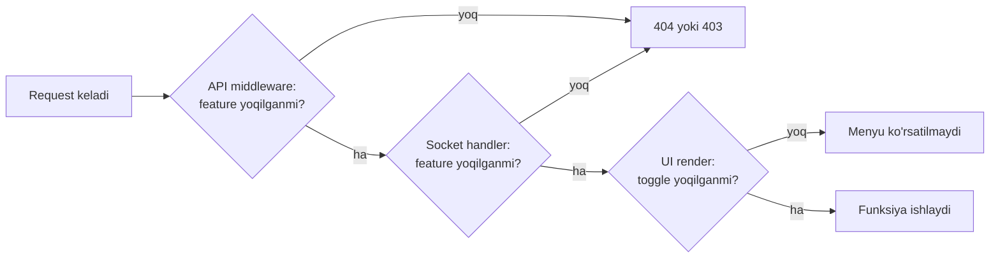

# Choziluvchanlik printsipi (Extensibility Principle)

> [!important] Asosiy qoida
> Tizimda hech qanday funksiya **majburiy emas**. Har bir funksiya — restoran sozlamasidagi bitta toggle. Toggle o'chsa funksiya yo'qoldi, toggle yonsa funksiya silliq qo'shildi.

## Nima uchun bu muhim

Restoranlar bir xil emas:

- Kichik kafe — faqat POS + naqd tolov yetadi
- Markazlashgan restoran — sklad + keldi-ketti + QR order + Kaspi tolov + keshbek
- Tungi klub — stol tariflari + waiter % xizmat haqqi + QR pay

Bitta tizim ikkalasiga ham mos kelishi kerak — lekin **hech qaysisini ortiqcha narsalar bilan og'irlashtirmasdan**.

## Qoidalar

### 1. Hard-wire qilish taqiqlanadi

Yomon:
```javascript
// order.routes.js da to'g'ridan-to'g'ri sklad chaqirish
const order = await orderModel.create(data);
await stockModel.decrement(order.foods); // YOMON — har doim ishlaydi
```

Yaxshi:
```javascript
const order = await orderModel.create(data);
await emit('order.created', order); // event chiqaradi
// sklad moduli (agar yoqilgan bo'lsa) shu eventga obuna bo'ladi
```

### 2. Har bir tool — alohida modul

- O'z routelari (`/api/sklad/*`)
- O'z socket eventlari (`sklad.stock_changed`)
- O'z modellari (`stock`, `stock_movement`, `ingredient`)
- O'z UI komponentlari
- O'z lifecycle hooklari (onEnable, onDisable)

### 3. Toggle 3 qatlamda tekshiriladi



### 4. Modullar bir-biriga zo'rlik bilan bog'liq emas

- Sklad o'chiq bo'lsa — order beraveriladi, hech narsa singan emas
- Keshbek o'chiq bo'lsa — check QR'siz chiqadi, qolgan hammasi ishlaydi
- QR pay o'chiq — naqd va karta ishlaydi

Bog'liqlik bo'lsa — declarative: "Kaspi toggle yoqish uchun avval `tolov` core moduli kerak". Qarang: [[../03-tool-strategiyasi/modullar-orasidagi-bogliqlik]]

### 5. Toggle o'chirilsa ham ma'lumot yo'qolmaydi

- Sklad o'chsa — sklad ma'lumotlari bazada qoladi
- Qaytadan yoqilsa — eski ma'lumot tiklanadi
- Faqat **mantiq va UI** o'chadi, **data** qolaveradi

### 6. Default minimal

Yangi restoran yaratilganda barcha toggle **off** holatda. Restoran admin'i kerakli ones'larini yoqadi.

Faqat ikki narsa default **on**:
- POS order berish
- Naqd tolov

Qolgan hammasi — opt-in.

## Implementatsiya darajalari

Har bir tool quyidagi qatlamlarda integratsiya qilinishi mumkin:

| Daraja | Misol | Murakkablik |
|---|---|---|
| **UI-only** | Yangi dashboard widget | Past |
| **Data model qo'shilishi** | Sklad: `ingredient`, `stock` modellari | O'rta |
| **Core hook** | Order yaratilganda sklad kamayadi | O'rta-yuqori |
| **Tashqi servis** | Kaspi Pay, WhatsApp bot | Yuqori |
| **Yangi rejim** | Possiz cook+waiter rejimi | Eng yuqori |

Har bir daraja uchun [[../03-tool-strategiyasi/tool-qoshish-shabloni]] da aniq qadamlar bor.

## Bog'liq

- [[loyiha-mohiyati]]
- [[../03-tool-strategiyasi/feature-toggle-tizimi]]
- [[../03-tool-strategiyasi/tool-lifecycle]]
