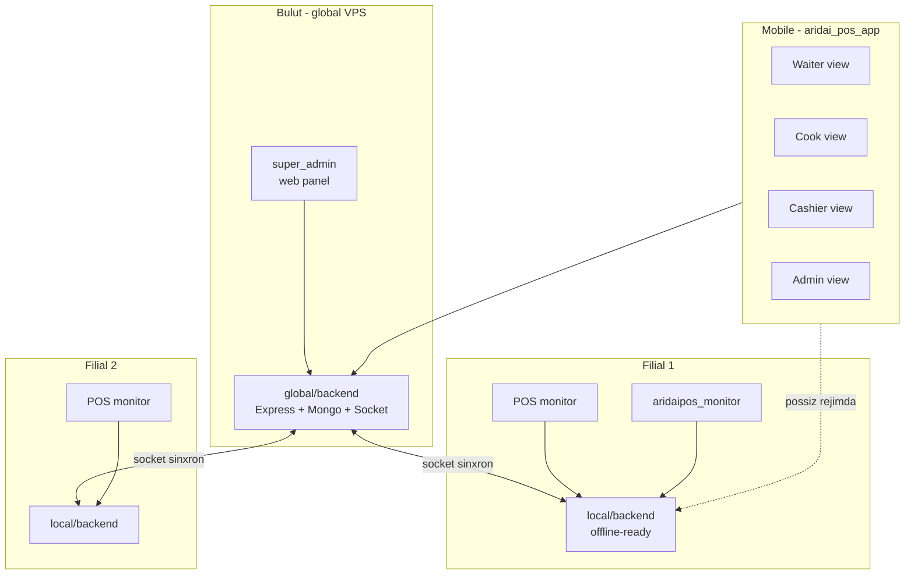

# Loyiha mohiyati

## Qisqacha

**AridaiPos_v2** — ko'p-ijarali (multi-tenant), modulli, online/offline ishlay oladigan restoran POS tizimi. Tizim admini har bir restoran uchun alohida sozlama qo'yib, kerakli funksiyalarni toggle orqali yoqishi mumkin.

## Foydalanuvchilar

| Aktor | Kim | Qayerdan ishlatadi |
|---|---|---|
| Tizim admini | AridaiPos egasi | Web admin panel (`super_admin`) |
| Restoran egasi | Restoran sotib oluvchi | Web admin (cheklangan) + mobile |
| Filial admini | Filial boshqaruvchisi | POS monitor + mobile |
| Waiter | Ofitsiant | Mobile (aridai_pos_app, waiter ko'rinishi) |
| Cook | Oshpaz | Mobile (aridai_pos_app, cook ko'rinishi) |
| Cashier | Kassir | POS monitor + mobile (cashier ko'rinishi) |
| Mijoz | Restoran mijozi | QR orqali brauzer (web) yoki WhatsApp bot |

## Komponentlar

## Markaziy printsiplar

1. **Modulli** — har bir funksiya (sklad, keshbek, QR, ...) toggle orqali yoqib-o'chiriladi. Qarang: [[choziluvchanlik-printsipi]]
2. **Offline-ready** — internet uzilsa ham filial ishlaydi. Qarang: [[../02-arxitektura/3-rejim]]
3. **Real-time** — socket orqali sekundlik sinxron. Qarang: [[../02-arxitektura/socket-sinxronizatsiya]]
4. **Xavfsiz multi-tenant** — restoran/filial ma'lumotlari sizib ketmaydi. Qarang: [[../02-arxitektura/multi-tenant-xavfsizlik]]

## Stack (joriy va rejalashtirilgan)

| Qatlam | Joriy | Maqsad |
|---|---|---|
| Global backend | Node.js + Express 5 + Mongoose | + Socket.io + Redis (pub/sub) |
| Local backend + POS UI | Yo'q | **Electron + lokal MongoDB** ([[../02-arxitektura/local-backend-stack\|stack qarori]]) |
| Web admin | Yo'q | React/Next.js |
| Mobile (barcha rollar) | Yo'q | Flutter, role-based UI |
| Mijoz QR | Yo'q | Light web (Vite/React) |
| WhatsApp bot | Yo'q | Node.js |

## Joriy holat

- [x] global/backend asosiy REST API (10 model, auth, upload)
- [ ] Socket layer
- [ ] Feature toggle tizimi
- [ ] Local backend (umuman yo'q)
- [ ] Sync engine
- [ ] Mobile ilova
- [ ] Web admin
- [ ] Xavfsizlik tuzatishlar (restoranAuth.middleware muammoli)

Keyingi ishlar: [[../06-changelog]] ga qarang.

## Bog'liq

- [[choziluvchanlik-printsipi]]
- [[../02-arxitektura/global-va-local]]
- [[../03-tool-strategiyasi/feature-toggle-tizimi]]
