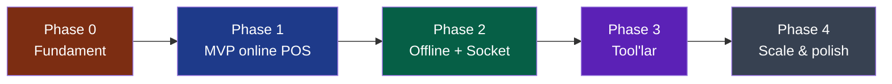
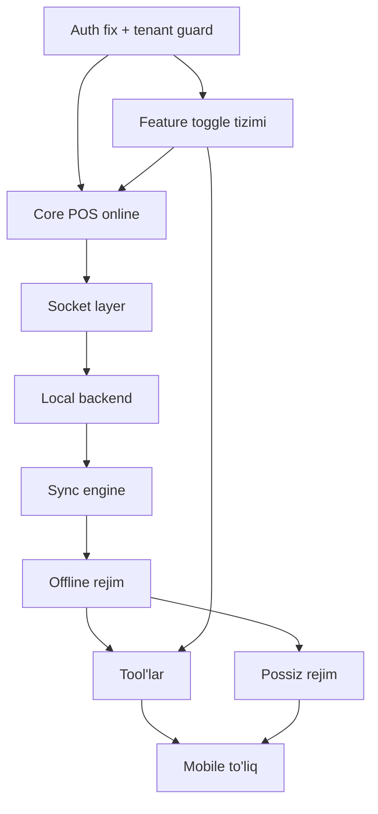

# Roadmap va MVP rejasi

> [!important] Asosiy printsip
> **Avval core'ni online'da isbotla, keyin offline, keyin tool'lar.** Offline + sync — eng murakkab qism. Uni core ishlamasdan boshlamaslik kerak.

## Bosqichlar umumiy ko'rinishi

---

## Phase 0 — Fundament (infra hardening)

> Maqsad: mavjud global/backend'ni vizyonga tayyorlash. Hech qanday yangi feature emas — faqat poydevor.

| Ish | Hujjat | Prioritet |
|---|---|---|
| `restoranAuth.middleware` JWT tuzatish | [[../02-arxitektura/xavfsizlik/restoran-auth-tuzatish]] | 🔴 kritik |
| `tenantGuard` har endpoint'ga | [[../02-arxitektura/xavfsizlik/tenant-izolyatsiyasi]] | 🔴 kritik |
| RBAC middleware + role enum kengaytirish | [[../02-arxitektura/xavfsizlik/role-based-access]] | 🔴 |
| `auth-strategiyasi` (tokenVersion, refresh) | [[../02-arxitektura/xavfsizlik/auth-strategiyasi]] | 🔴 |
| Feature toggle registry + `requireFeature` | [[../03-tool-strategiyasi/feature-toggle-tizimi]] | 🟠 |
| Sync metadata fields + plugin | [[../05-data-model/sync-metadata]] | 🟠 |
| `restaurantId` denormalize barcha model'ga | [[../05-data-model/_MOC]] | 🟠 |
| Snapshot subdoc'lar (order: waiter/service/discount) | [[../05-data-model/snapshot-strategiyasi]] | 🟠 |
| `currency`, `receiptNumber`, `businessDay` | [[../07-nozik-nuqtalar/_MOC]] | 🟠 |
| audit_log collection | [[../02-arxitektura/xavfsizlik/audit-log]] | 🟡 |
| rate limiting | [[../02-arxitektura/xavfsizlik/rate-limiting]] | 🟡 |

**Natija:** Xavfsiz, multi-tenant, toggle-ready global backend. Hali socket yo'q, offline yo'q.

---

## Phase 1 — MVP (minimal online POS)

> Maqsad: **bitta restoran, bitta filial, faqat online** to'liq ishlaydigan POS. Offline yo'q, tool'lar yo'q. Core'ni isbotlash.

### Backend (global)
- Restaurant/branch/user CRUD (hardened)
- Menu: category + food CRUD
- Tables CRUD
- Shift: open/close lifecycle ([[../05-data-model/biznes-mantiq/shift-lifecycle]])
- Order: full lifecycle ([[../05-data-model/biznes-mantiq/order-lifecycle]])
- Payment: cash, card, transfer ([[../05-data-model/biznes-mantiq/tolov-oqimi]])
- Total calculation ([[../05-data-model/biznes-mantiq/total-hisoblash]])
- Receipt numbering ([[../07-nozik-nuqtalar/chek-raqamlash]])
- Cancel/refund ([[../05-data-model/biznes-mantiq/cancel-refund]])

### Frontend
- **Web admin** (basic): restoran/filial/user/menu/table setup, hisobot ko'rish — [[../08-frontend/web-admin]]
- **POS Electron** (basic): online'da global'ga ulanadi (hali lokal backend yo'q), order/payment/shift — [[../08-frontend/pos-electron]]
- Chek printer integratsiyasi ([[../07-nozik-nuqtalar/hardware-nozikliklari]])

### Bu Phase'da YO'Q
- ❌ Offline rejim
- ❌ Local backend (Electron to'g'ridan-to'g'ri global'ga ulanadi)
- ❌ Socket (REST yetadi MVP'da, lekin socket Phase 2'da)
- ❌ Mobile app
- ❌ Hech qanday tool (sklad, keshbek, ...)

> [!note] MVP'da POS qanday ishlaydi
> Phase 1'da POS Electron **to'g'ridan-to'g'ri global VPS REST API**'ga ulanadi (internet kerak). Lokal MongoDB hali yo'q. Bu — soddalashtirilgan boshlanish. Phase 2'da lokal backend qo'shiladi.

**Natija:** Bitta restoran online POS bilan ishlay oladi — order, tolov, chek, smena, hisobot. Demo qilsa bo'ladi.

---

## Phase 2 — Offline + Socket (eng qiyin)

> Maqsad: local backend, socket sinxron, offline rejim. Bu — loyihaning yuragi.

### Socket layer
- Socket.io global'ga qo'shish ([[../02-arxitektura/socket-sinxronizatsiya]])
- Auth, room'lar, event guard'lar ([[../02-arxitektura/xavfsizlik/socket-xavfsizligi]])
- Idempotency, heartbeat

### Local backend (Electron + MongoDB)
- Electron + lokal MongoDB (single-node replica set) ([[../02-arxitektura/local-backend-stack]])
- Installer (.exe) — MongoDB o'rnatish, branchToken
- Boshlang'ich sync ([[../02-arxitektura/sinxronizatsiya/boshlangich-sync]])
- POS endi **lokal backend**'ga ulanadi (global'ga emas)

### Sync engine
- Outbox pattern ([[../05-data-model/sync-metadata]])
- Online → Offline ([[../02-arxitektura/sinxronizatsiya/online-to-offline-otish]])
- Offline → Online ([[../02-arxitektura/sinxronizatsiya/offline-to-online-otish]])
- Conflict resolution ([[../02-arxitektura/conflict-resolution]])
- Sync prioritizatsiya ([[../02-arxitektura/sinxronizatsiya/sync-prioritizatsiyasi]])
- Sync monitoring ([[../02-arxitektura/sinxronizatsiya/sync-monitoring]])

### Mode management
- Online/Offline rejim toggle ([[../04-toollar/online-offline-rejim]])
- Mode state machine ([[../02-arxitektura/rejimlar/rejim-otish-qoidalari]])

### Mobile (waiter — online)
- Flutter mobile app boshlanishi ([[../08-frontend/mobile-flutter]])
- Waiter ko'rinishi (online'da order berish)
- Filial offline'da bloklanish ([[../02-arxitektura/rejimlar/offline-rejim]])

**Natija:** Filial offline ishlay oladi, internet qaytganda sync. Eng qiyin qism tugadi.

---

## Phase 3 — Tool'lar (feature toggles)

> Maqsad: toggle'lar birin-ketin. Har biri [[../03-tool-strategiyasi/tool-qoshish-shabloni|shablon]] bo'yicha.

Tartib (bog'liqlik bo'yicha — [[../03-tool-strategiyasi/modullar-orasidagi-bogliqlik]]):

1. **Sklad** ([[../04-toollar/sklad]]) — order'ga eng oddiy hook
2. **QR Order** ([[../04-toollar/qr-order]]) — mijoz QR + customer web ([[../08-frontend/mijoz-qr-web]])
3. **QR Pay / Kaspi** ([[../04-toollar/qr-pay-kaspi]]) — webhook, tashqi servis
4. **Keshbek** ([[../04-toollar/keshbek-tizimi]]) — WhatsApp bot + SMS
5. **Keldi-ketti** ([[../04-toollar/keldi-ketti]]) — davomat + maosh
6. **Possiz rejim** ([[../04-toollar/cook-waiter-possiz-rejim]]) — mobile cook+cashier, push notification

### Mobile kengaytirish
- Cook ko'rinishi, cashier ko'rinishi, admin ko'rinishi
- Push notification ([[../02-arxitektura/notification-tizimi]])

**Natija:** To'liq funksional tizim, har restoran kerakli tool'larni yoqadi.

---

## Phase 4 — Scale & polish

> Maqsad: kengaytirish va sayqallash.

- Multi-POS bir filialda ([[../02-arxitektura/local-backend-stack#Multi-POS bir filialda]])
- Hisobotlar va analitika ([[../02-arxitektura/hisobotlar-analitika]])
- Fiskal / KKM ([[../07-nozik-nuqtalar/fiskal-soliq]])
- Advanced tool'lar (reservation, delivery, loyalty, KDS — [[../04-toollar/_MOC#Kelajak g'oyalari]])
- Performance optimization, archiving ([[../07-nozik-nuqtalar/data-osishi-arxivlash]])

---

## Bog'liqlik grafi (nima nimadan oldin)

## Prinsip: har Phase oxirida ishlaydigan mahsulot

Har Phase — **deploy qilsa bo'ladigan** holat:
- Phase 1: online POS demo
- Phase 2: offline-capable POS
- Phase 3: full-featured POS
- Phase 4: production-grade scale

## Bog'liq

- [[loyiha-mohiyati]]
- [[choziluvchanlik-printsipi]]
- [[../03-tool-strategiyasi/modullar-orasidagi-bogliqlik]]
- [[glossariy]]
