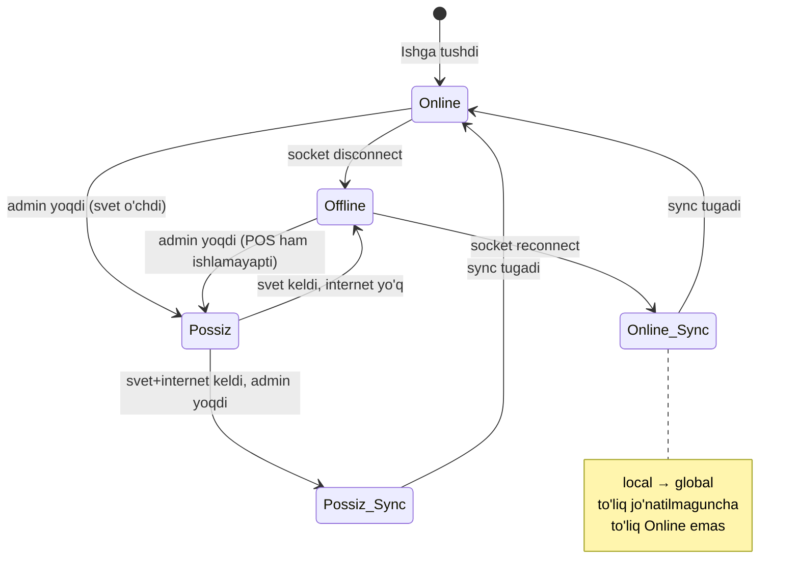

# 3 ta ishlash rejimi

Filial ayni paytda **bitta** rejimda bo'ladi.

## Taqqoslash jadvali

| Aspekt | 🟢 Online | 🟡 Offline | 🔴 Possiz (cook+waiter) |
|---|---|---|---|
| **Trigger** | Default | Socket uzulgan | Admin telefondan yoqadi |
| **Sabab** | Internet bor, sveti bor | Internet yo'q, sveti bor | Sveti yo'q (POS ishlamaydi) |
| **Order kim beradi** | POS + waiter mobile | **Faqat POS** | **Faqat waiter mobile** |
| **Tolov kim oladi** | POS + cashier | **Faqat POS** | **Cashier mobile** (PDF check) |
| **Chek apparati** | Ha | Ha | **Yo'q** (PDF) |
| **VPS bilan ulanish** | Real-time socket | Yo'q | Yo'q (yoki cheklangan) |
| **Cook bilan aloqa** | Lokal socket | Lokal socket | **Mobile push notification** |
| **Yangi mijoz QR** | Ishlaydi | Lokalda ishlaydi (agar yoqilgan) | Ishlamaydi |

## Rejimlar oqimi



## Rejim 1: Online 🟢

**Texnik holat:**
- Local backend ↔ Global VPS socket faol
- Heartbeat (ping/pong) muvaffaqiyatli
- Sync queue bo'sh

**Qanday ishlaydi:**
- POS yozadi → local yozadi → socket orqali VPS ga ham yozadi
- Mobile (waiter/cook/cashier) global VPS ga ulanadi
- Real-time event broadcast

**O'tish shartlari:**
- → **Offline**: socket N sekundga ulanmasa (default 5s) yoki ping fail
- → **Possiz**: admin qo'lda yoqsa

## Rejim 2: Offline 🟡

**Texnik holat:**
- Socket uzilgan
- Local backend mustaqil ishlaydi
- Yozuvlar lokal MongoDB'ga `syncStatus: 'pending'` bayroq bilan tushadi

**Qanday ishlaydi:**
- POS ishlaydi (order, tolov)
- Waiter mobile **YO'Q** — bloklanadi, "filial offline" xabar
- Mijoz QR — agar lokal webserver yoqilgan bo'lsa ishlaydi, lekin order POS tasdiqlash kutadi
- Chek apparati ishlaydi
- Cook mobile — agar lokal socket bo'lsa, ishlaydi

> [!warning] Nima uchun waiter mobile offline'da ishlamaydi?
> Waiter mobile global VPS bilan ulanadi. Local backend mobile uchun emas. Bu — xavfsizlik (waiter telefonida local backend IP ko'rinmasin) va soddalik. Possiz rejimda esa boshqa yo'l: local backend mobile uchun maxsus endpoint ochadi.

**O'tish shartlari:**
- → **Online**: socket qaytadan ulanib sync tugasa
- → **Possiz**: svet o'chsa, admin yoqsa

## Rejim 3: Possiz (cook+waiter) 🔴

**Texnik holat:**
- POS monitor o'chiq (svet yo'q)
- Local backend telefondan UPS/akkumulyator orqali ishlayotgan bo'lishi mumkin
- YOKI: barcha aloqa peer-to-peer telefon orasida (kelajakdagi versiya)

**Qanday ishlaydi:**
1. Waiter mobile'da order yaratadi
2. Cook'ga **push notification** keladi
3. Cook ovqatni tayyorlaydi, "tayyor" deb belgilaydi
4. Waiter'ga "tayyor" push keladi
5. Mijoz tolayman desa cashier oldiga boradi
6. Cashier mobile'da check'ni vizual ko'rsatadi
7. Cashier "tolandi" deb belgilaydi
8. Mijoz hohlasa PDF check'ni yuklab oladi (QR yoki link orqali)

**Cheklov:**
- Chek apparatga **bosilmaydi** (svet yo'q)
- Sklad real-time kamaymasligi mumkin (kelajakda hal bo'ladi)
- Sinxron texnologik vositalar ishlamaydi

**O'tish shartlari:**
- → **Online**: svet+internet keldi, admin "POS rejimga qaytarish" tugmasini bosdi
  - Avval: possiz rejimda yaratilgan barcha order va tolovlar global VPS ga sync bo'ladi
  - Keyin: to'liq online yoqiladi
  - **Diqqat**: possiz rejimda yaratilgan orderlar **check apparatga retroaktiv bosilmaydi**

## Rejim qaror logikasi (state machine)

Hozirgi rejim — `branch.currentMode` da saqlanadi. Qiymat: `online | offline | possiz`.

```javascript
// Pseudo-kod
class ModeManager {
  async tick() {
    if (await this.adminForceMode) return this.adminForceMode;

    const socketOk = await this.checkSocket();
    if (socketOk) {
      if (await this.syncQueueEmpty()) return 'online';
      return 'online_syncing'; // o'tish bosqichi
    }

    if (this.posOnline()) return 'offline';
    return 'possiz';
  }
}
```

## Toggle bilan bog'liqligi

Bu uchta rejim ham — toggle orqali boshqariladi:

- [[../04-toollar/online-offline-rejim]] = offline rejimni umuman yoqish/o'chirish
- [[../04-toollar/cook-waiter-possiz-rejim]] = possiz rejimni yoqish/o'chirish

Agar `offline-rejim` toggle **o'chiq** bo'lsa — internet uzulganda POS ham yozmaydi, "iltimos internet ulanishini kuting" deb chiqaradi.

Agar `possiz-rejim` toggle **o'chiq** bo'lsa — admin'ning telefonida bu tugma ko'rinmaydi.

## Deep dive

Bu yuqori darajadagi overview. Har rejim haqida chuqurroq:
- [[rejimlar/_MOC|Rejimlar MOC]]
- [[rejimlar/online-rejim|🟢 Online rejim — texnik holat, oqim, performance]]
- [[rejimlar/offline-rejim|🟡 Offline rejim — trigger, cheklov, race condition]]
- [[rejimlar/possiz-rejim|🔴 Possiz rejim — peer-to-peer, koordinator, PDF check]]
- [[rejimlar/rejim-otish-qoidalari|State machine va race conditions]]

## Bog'liq

- [[global-va-local]]
- [[socket-sinxronizatsiya]]
- [[sinxronizatsiya/offline-to-online-otish]]
- [[../04-toollar/online-offline-rejim]]
- [[../04-toollar/cook-waiter-possiz-rejim]]
