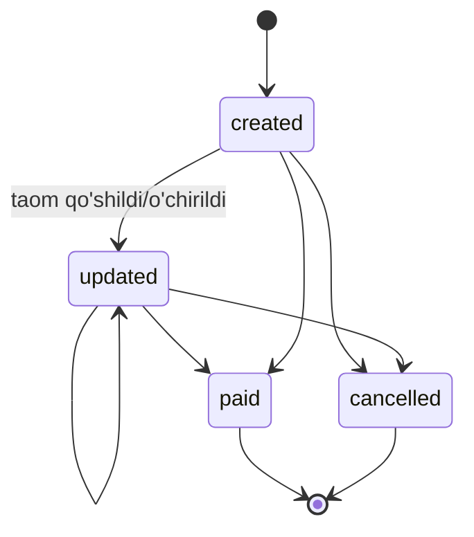

# Konflikt yechimi (Conflict Resolution)

## Asosiy muammo

Offline rejimida local backend ham yozadi, global VPS bir tomondan boshqa mijozlar uchun yozishi mumkin. Reconnect'da ikkita haqiqat bor — qaysi biri to'g'ri?

> [!important] Qoida
> Filial offline bo'lgan paytda **shu filial ma'lumotlarining birlamchi haqiqati — local backend**. Global VPS'da o'zgarish bo'lsa ham, local'ga zo'rlik bilan ko'chirilmaydi — avval local jo'natadi, keyin merge.

## Asbob: UUID + version

Har bir entity'ning:
- `_id` — MongoDB ObjectId (yoki UUID v4 — kelajakda)
- `clientId` — local'da generatsiya qilingan **UUID** (offline'da yaratilganda)
- `version` — Lamport-like timestamp (har o'zgarishda +1, branch+monotonic)
- `lastModifiedAt` — wall clock (faqat hisobot uchun, conflict hal qilmaydi)
- `lastModifiedBy` — `{userId, origin: 'local'|'global'}`
- `branchId`, `restaurantId` — guard

## Strategiya: yo'naltirilgan merge

### Order entity uchun (eng murakkab)

Order'ning hayot davri:



### Merge qoidalari

#### Holat 1: Local'da yangi order yaratilgan
- Global'da bunday order yo'q
- Hech qanday konflikt
- Global qabul qiladi, `_id` esa local UUID'dan kelib chiqadi (yoki local UUID = global _id qilamiz)

#### Holat 2: Offline'da yaratilgan, offline'da o'zgartirilgan
- Local'da bitta "create" + bir nechta "update" event'lari
- Global'ga to'liq oqim jo'natiladi (`order.created` → `order.updated` → ...)
- Global ularni navbat bilan apply qiladi

#### Holat 3: Online'da yaratilgan, offline'da o'zgartirilgan
- Local'da order bor (oldindan kelgan), endi local'da update bo'ldi
- Online'da boshqa joydan (admin web) ham update bo'lgan bo'lishi mumkin
- **Per-field merge**:
  - `foods[]` — additive merge (offline'da qo'shilgan elementlar global'ga qo'shiladi)
  - `paymentStatus` — last-writer-wins, lekin `paid` ga o'tgan bo'lsa qayta `pending` qilib bo'lmaydi
  - `isCancel` — agar local true bo'lsa, global false bo'lsa — local g'olib (lekin global'ga warning)

#### Holat 4: Ikki tomonda ham yangi
- Order offline'da yaratildi, IDsiz hali jo'natilmagan
- Shu vaqtda global'da boshqa joyda order yaratildi
- Ikkalasini ham qabul qilamiz — boshqa-boshqa orderlar

#### Holat 5: Konflikt (real)
- Local: order paid, naqd bilan
- Global: order paid, karta bilan (admin web orqali shu paytda tolagan)
- Bu yerda **wall clock + actor priority**: cashier > admin web; agar bir xil bo'lsa kechroq tolov yutadi
- Lekin **ikkala yozuv ham audit log'ga qoladi** — pul masalasi, izsiz qolmasligi kerak

## Tomb qutilar (Tombstones)

Offline'da o'chirilgan entity. Hech qachon `DELETE FROM` qilmaymiz, balki:

```javascript
{ _id, deleted: true, deletedAt, deletedBy, version: N+1 }
```

Global qaytadan local'ga "yo'q, bor" deb pushlamasligi uchun.

## Implementatsiya: outbox pattern

Local backend'da:

```
TABLE outbox (
  id UUID PRIMARY KEY,
  event_type TEXT,
  entity_id TEXT,
  payload JSON,
  created_at INTEGER,
  sent_at INTEGER NULL,
  acked_at INTEGER NULL,
  retry_count INTEGER DEFAULT 0
)
```

Har bir lokal yozuv → `outbox`'ga ham event tushadi. Background worker `sent_at IS NULL` larni `socket.emit` qilib turadi, ack kelsa belgilaydi.

Global VPS'da xuddi shunday — global'da bo'lgan o'zgarishlar `inbox/outbox` orqali har bir filialga jo'natiladi.

## Tartib muhim: order joriy chiqarishi

Local offline'da:
1. order.created (16:00:00)
2. order.updated (16:05:00) — taom qo'shildi
3. order.paid (16:10:00)

Reconnect bo'lgach **xuddi shu tartibda** global'ga jo'natiladi. Tartib buzilsa — global "paid order topilmadi" deb xato qaytaradi.

Buni ta'minlash:
- `outbox` `created_at ASC` tartibda jo'natiladi
- Bir entity uchun bir vaqtda faqat bitta event in-flight

## Offline → Online sync algoritmasi

```
1. socket.connect() muvaffaqiyatli
2. local backend `mode = 'online_syncing'` belgilaydi
3. POS UI'da "sinxronizatsiya..." banneri
4. POS'ga yangi order yozishni davom ettirsa bo'ladi (faqat outbox'ga tushadi)
5. Outbox'dan batch (100 ta) olib socket.emit
6. Global ack qaytaradi, batch belgilanadi
7. Outbox bo'shaguncha qaytaraveriladi
8. Outbox bo'sh → `sync.complete` jo'natiladi global'ga
9. Global "boshqa filialdagi o'zgarishlar" ni qaytaradi (bo'lsa)
10. Local barchasini apply qiladi
11. `mode = 'online'` belgilanadi, banner yopiladi
```

Bu paytda **global → local broadcast'lar 8-qadamgacha sustlashtiriladi** (queue'ga qo'yiladi). Bu lokalning haqiqati buzilmasligi uchun.

Qarang: [[sinxronizatsiya/offline-to-online-otish]]

## Misol: "Order online'da yaratildi, offline'da to'landi"

**Vaqt 14:00 — Online**
- Cashier POS'da order yaratdi: `{ _id: 'A', version: 1, paymentStatus: 'pending' }`
- Global'ga sync bo'ldi

**Vaqt 14:30 — Internet uzildi, Offline**
- POS'da order to'landi: lokal'da `{ _id: 'A', version: 2, paymentStatus: 'paid', paymentMethod: 'cash' }`
- Outbox'ga `order.paid` event tushdi

**Vaqt 15:00 — Internet keldi, Online_Sync**
- Outbox bo'shatildi
- Global qabul qildi: `order.paid {id:'A', version:2}`
- Global'da order versiyasi 1 edi → 2 ga yangilanadi
- Boshqa mijozlar `order.paid` broadcast'ini eshitishadi

Konflikt yo'q, oddiy oqim. **Lekin agar shu paytda admin web'dan order o'chirilgan bo'lsa** — global'da `version:2, deleted:true`, local kelgan `version:2, paymentStatus:paid` — endi konflikt. Yechim:
- Wall clock: cashier 15:00 da to'lagan, admin 14:45 da o'chirgan
- Lekin cashier'ning ma'lumoti yangiroq (15:00 > 14:45) — cashier yutadi
- Lekin admin'ga **xabar boradi** ("siz o'chirgan order to'langan deb belgilandi, audit ko'ring")

## Bog'liq

- [[socket-sinxronizatsiya]]
- [[sinxronizatsiya/offline-to-online-otish]]
- [[multi-tenant-xavfsizlik]]
