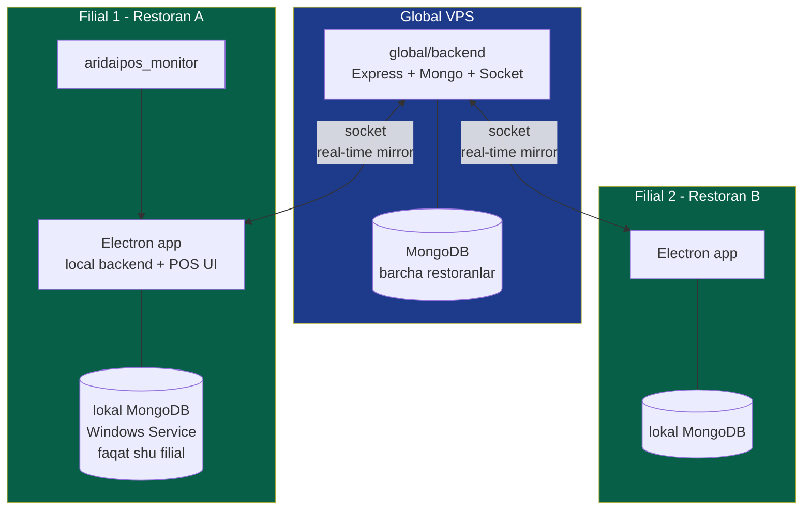

# Global VPS vs Local backend

## Konsepsiya

| | Global | Local |
|---|---|---|
| **Joylashuv** | Bulutda (VPS, masalan AWS/DigitalOcean) | Filial ichidagi POS PC yoki mini-server |
| **Egasi** | AridaiPos tizimi (bizning) | Bitta filial |
| **Soni** | 1 ta | Har bir filial uchun 1 ta |
| **Ma'lumot** | Barcha restoranlar | Faqat shu filial |
| **Maqsadi** | Markaziy haqiqat manbai (source of truth) | Offline ishga tushib turish + lokal POS xizmati |
| **Mijozlari** | Local backendlar, web admin, mobile (online) | POS monitor, mobile (possiz rejimda), local printer |

## Arxitektura diagrammasi



## Vazifalar taqsimoti

### Global VPS qiladi
- Restoran/filial yaratish va sozlash (feature toggle)
- Multi-tenant data isolation
- Web admin panelga xizmat qilish
- Mobile ilovaga **online rejimda** xizmat qilish
- Tashqi servislar bilan ulanish (Kaspi API, WhatsApp Cloud API, SMS gateway)
- Backup, analitika, hisobotlar
- Local backendlar bilan socket ulanish saqlash
- Conflict resolution dirijyor — qaysi local birinchi sinxronlanadi

### Local backend qiladi
- POS monitor uchun lokal REST + socket
- Mobile possiz rejimda — lokal API
- Internet uzulganda yolg'iz ishlash
- Lokal DB ga yozish (offline mode)
- Qaytadan online bo'lganda VPS bilan **avval o'zi jo'natadi**, keyin so'raydi
- Local printer (chek apparat) bilan ishlash
- Local QR webserver (mijoz QR'ni skanerlaganda)

## Ma'lumot oqimi

### Online rejimda: write
```
POS monitor → local backend (yozadi) → socket → global VPS (yozadi)
                                                     ↓ broadcast
                                              boshqa shu filial mijozlari
```

### Online rejimda: read
- POS monitor — lokaldan o'qiydi (tez)
- Mobile (filial ichida) — globaldan o'qiydi (lekin agar local mirror to'liq bo'lsa, kelajakda lokaldan ham bo'lishi mumkin)

### Offline rejimda
```
POS UI (Electron renderer) → local backend (Electron main) → lokal MongoDB (yozadi, "sync_pending" bayroq)
            ↓
       Socket urinadi → fail → mode='offline' belgilanadi
```

### Reconnect — qarang [[sinxronizatsiya/offline-to-online-otish|Offline→Online o'tish]]

## Local backend texnologiyasi

**Tasdiqlangan stack:** Electron + lokal MongoDB. To'liq tafsilot va asosi: [[local-backend-stack]]

Qisqacha:
- **Electron** — POS UI + local backend bitta paketda
- **MongoDB Community 7.x** — Windows Service sifatida o'rnatiladi, `bindIp: 127.0.0.1`
- **Installer (.exe)** — MongoDB'ni avtomatik o'rnatadi va sozlaydi
- **Administrator huquqi** — exe Administrator sifatida ochilishi kerak
- Global bilan bir xil schema → sync mantiqi sodda

Qarang: [[local-backend-stack#Komponentlar (server PC'da)]] va [[local-backend-stack#Installer (.exe) bajaradigan ishlar]]

## Ma'lumot egaligi qoidasi

> [!important] Eng muhim qoida
> Filial ma'lumotlarining **birlamchi egasi** — shu filialning local backend'i. Global VPS — **mirror**, lekin haqiqat manbai filial offline bo'lsa lokaldir.

Bu qoida [[sinxronizatsiya/offline-to-online-otish|Offline→Online o'tish]] ni boshqaradi: local avval jo'natadi, global qabul qiladi.

## Bog'liq

- [[local-backend-stack]] — stack qarori va installer
- [[3-rejim]]
- [[socket-sinxronizatsiya]]
- [[conflict-resolution]]
- [[multi-tenant-xavfsizlik]]
