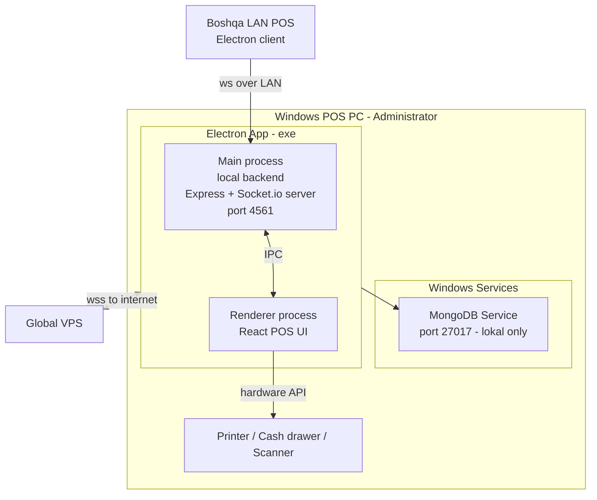

# Local backend stack — Electron + MongoDB

> [!important] Qaror
> Local backend: **Electron** (POS UI + Node.js local backend bitta paketda) + **lokal MongoDB** (Windows Service sifatida). Installer (.exe) MongoDB'ni avtomatik o'rnatadi va sozlaydi. Foydalanuvchi exe'ni **Administrator sifatida** ochishi kerak.

## Nima uchun bu kombinatsiya

| Mezon | Electron + MongoDB | Alt: Node + SQLite | Alt: Tauri + ... |
|---|---|---|---|
| Global bilan bir xil schema | ✅ Aynan mos | ❌ Translatsiya kerak | ❌ |
| Aggregation pipeline | ✅ Bor | ❌ Cheklangan | — |
| Web texnologiyalari UI | ✅ React/Vue | ✅ | ✅ (lekin yangi) |
| Sync engine sodda | ✅ Bir xil model | ❌ Konvertatsiya | — |
| Resurs sarfi | 🟡 Og'ir (300-500MB RAM) | 🟢 Yengil | 🟢 |
| Windows .exe paketlash | ✅ electron-builder | 🟡 pkg yoki nexe | 🟡 |
| Driver/hardware kirish | ✅ Node-native modules | ✅ | 🟡 |
| Yetuklik (mature) | ✅ | ✅ | 🟡 |

**Asosiy fikr:** global'da MongoDB ishlatilgani uchun lokalni ham MongoDB qilish — **sync mantiqi sodda**. Bir xil mongoose schema, bir xil query, BSON encode/decode bir martagi.

## Komponentlar (server PC'da)



## Installer (.exe) bajaradigan ishlar

1. **Admin tekshirish** — UAC orqali ko'tariladi
2. **MongoDB o'rnatish** — bundled MSI yoki internet'dan yuklab olish
   - Versiya: **MongoDB Community 7.x** (LTS)
   - Lokatsiya: `C:\Program Files\AridaiPos\mongodb\`
   - Data: `C:\ProgramData\AridaiPos\mongodb\data\`
   - Log: `C:\ProgramData\AridaiPos\mongodb\log\`
3. **MongoDB konfiguratsiya** — `mongod.cfg` generatsiya:
   - `port: 27017`
   - `bindIp: 127.0.0.1` (faqat lokal — boshqa PC'lardan kirib bo'lmaydi)
   - `auth: enabled` (local lekin baribir parol bilan)
   - `wiredTiger.cacheSizeGB: 1` (oddiy POS uchun yetadi)
4. **Windows Service ro'yxatdan o'tkazish:**
   - `MongoDB AridaiPos` — auto-start
   - `AridaiPos Local Backend` — agar local backend Electron'dan ajratilsa
5. **Firewall rule** — LAN ulanishlar uchun port ochish (kelajakda multi-POS)
6. **Electron app o'rnatish** — `C:\Program Files\AridaiPos\app\`
7. **Shortcut'lar** — desktop + start menu, "Run as administrator" bayrog'i bilan
8. **Default credential generatsiya:**
   - MongoDB root user (random parol, lokal config'ga yoziladi)
   - `branchToken` so'rash (admin Web orqali olib keladi va kiritadi)
9. **Birinchi ishga tushishda** — global VPS'dan filial ma'lumotlarini sync qilish

## Foydalanuvchi qadamlari (oddiy ko'rinish)

1. `aridaipos-setup.exe` ni yuklab oling
2. O'ng tugma → "Run as administrator"
3. UAC dialog → Yes
4. Setup ochildi:
   - Til tanlash
   - Litsenziya
   - Lokatsiya (default OK)
   - "Filial tokenini kiriting" (web admin'dan oladi)
   - Install
5. ~5-10 daqiqa o'rnatish
6. "Finish" → desktop'da AridaiPos belgisi
7. Belgini bosing → birinchi ochilishda sync (1-2 daqiqa)
8. POS tayyor

## Nima uchun Administrator huquqi kerak

| Sabab | Nima uchun |
|---|---|
| MongoDB Service o'rnatish | Service Manager'ga yozish admin huquqi |
| Program Files'ga yozish | Standart joy |
| Hardware kirish (printer, cash drawer) | Ba'zi drayverlar admin'ni talab qiladi |
| Firewall rule | Network Security uchun admin |
| Windows Service auto-start | Service'larni ro'yxatga olish |

> [!note] O'rnatishdan keyin
> Foydalanuvchi har safar exe'ni admin sifatida ochishga majbur emas. Faqat installer admin. Keyinchalik oddiy foydalanuvchi sifatida ochsa bo'ladi — chunki MongoDB allaqachon Windows Service sifatida ishlayotgan bo'ladi.
>
> **LEKIN** — agar hardware (chek printer, cash drawer) bilan ishlash admin huquqini talab qilsa, app shortcut'ida "Always run as administrator" bayrog'i bo'lishi kerak. Shu sababli odat sifatida — har doim admin'da ochish tavsiya etiladi.

## Fayl tuzilmasi (POS PC'da)

```
C:\Program Files\AridaiPos\
├── mongodb\                    ← MongoDB binarlari
├── app\                        ← Electron app
│   ├── AridaiPos.exe
│   ├── resources\
│   └── ...
└── uninstall.exe

C:\ProgramData\AridaiPos\
├── mongodb\
│   ├── data\                   ← Mongo data fayllari
│   └── log\
├── config\
│   ├── local.json              ← branchId, branchToken, server PC IP
│   ├── mongodb-credentials.json (read-only)
│   └── feature-flags-cache.json
├── logs\
│   ├── electron.log
│   ├── backend.log
│   └── sync.log
└── backups\                    ← lokal backup'lar
```

## Local backend joylashuvi: Electron main yoki alohida Service?

Ikki variant ko'rib chiqiladi:

### Variant A — Electron main process ichida (TAKLIF)

Local backend (Express + Socket.io) Electron app'ning main process'ida ishlaydi.

**Plyuslar:**
- Bitta exe — bitta paket, bitta deploy
- IPC orqali tezkor (renderer ↔ main bevosita)
- Boshqarish oson

**Minuslar:**
- POS app yopilsa — local backend ham yopiladi
- Multi-POS scenario'da boshqa PC'lar shu PC backend'iga ulanish uchun — birinchi PC'da app ochiq bo'lishi kerak
- Yangi ko'rinishni ko'rsatish (auto-update) backend'ni qayta ishga tushiradi

### Variant B — Alohida Windows Service

Local backend mustaqil Node.js Windows Service.

**Plyuslar:**
- POS app yopiq bo'lsa ham ishlaydi (svet qaytdi → sync davom etadi)
- Multi-POS uchun mos
- Update — POS app va backend alohida yangilanadi

**Minuslar:**
- Murakkab installer (ikkita service ro'yxatga olish)
- IPC HTTP/socket orqali (slightly slower)
- Debug qiyinroq

> [!todo] OCHIQ QAROR
> Hozircha **Variant A** bilan boshlanadi (sodda). Multi-POS scenario yaqinlashganda **Variant B** ga ko'chiriladi. Kod uchun bu — local backend'ni endigi Electron main'da modul sifatida yozish, kelajakda mustaqil Node binary'ga ajratish oson bo'lsin.

## Multi-POS bir filialda

> [!important] Qaror (2026-05-29): bitta local server, qolgan POS'lar client. To'liq dizayn: [[multi-pos]]

Qisqacha: bir filialda 2+ POS bo'lsa — **faqat bitta** local server (Variant A). Bitta POS server (MongoDB+backend+UI), qolganlari LAN orqali ulangan client (faqat UI). **Ikkita alohida server emas** (aks holda duplikat chek raqami, ikki smena, chalkash stock).

```
Filial A:
  ├── POS #1 (server)   ← MongoDB + local backend + UI (+ UPS tavsiya)
  ├── POS #2 (client)   ← faqat UI, server'ga LAN orqali ulanadi
  └── Oshxona printer   ← tarmoqda (umumiy)
```

- Server: `posRole: 'server'`, branchToken (global bilan)
- Client: `posRole: 'client'`, `localServerIp: '192.168.1.10'`
- MongoDB `127.0.0.1` (client local backend orqali ulanadi, Mongo'ga to'g'ridan emas)
- Atomik counter (chek/stock) serverda → duplikat yo'q
- Har POS o'z chek printeri

Batafsil (SPOF, kassa, printer, test): [[multi-pos]]

## Auto-start

- MongoDB Service — `start type: automatic` (Windows boot bilan)
- AridaiPos.exe — startup folder yoki Task Scheduler orqali avtomatik ochilish ixtiyoriy
- Kassir har kuni qo'lda ochishi mumkin (rekomendatsiya — chunki admin huquqi)

## Update mexanizmi

- `electron-updater` — global VPS'da release manifest'i (oxirgi versiya, hash, URL)
- App ochilganda yangi versiya tekshirilad
- Yuklab olish — fonda
- Foydalanuvchi "Yangilash" bossa qayta ishga tushadi
- MongoDB update — alohida (rare event, manual migration script)

## Backup strategiyasi

- **Lokal backup:** har kuni `mongodump` → `C:\ProgramData\AridaiPos\backups\YYYY-MM-DD.gz`
- 14 kun saqlash, undan eski avtomatik o'chadi
- **Bulutga backup:** ixtiyoriy (kelajakda) — global VPS'dagi mirror yetarli bo'lishi kerak
- Backup tugmasi — admin panel'da "Endi backup oling"

## Resurs talablari (kichik POS PC)

| Komponent | RAM | Disk |
|---|---|---|
| MongoDB (cacheSize 1GB) | 1.5 GB | 5-20 GB (1 yillik data) |
| Electron app | 300-500 MB | 200 MB |
| Windows | 2 GB | — |
| **Minimum jami** | **4 GB RAM** | **40 GB SSD** |
| Tavsiya | 8 GB RAM | 120 GB SSD |

## Xavfsizlik

- MongoDB `bindIp: 127.0.0.1` — tashqi tarmoq Mongo'ga to'g'ridan-to'g'ri ulanmaydi
- MongoDB `auth: enabled` — local-only bo'lsa ham parol bilan
- Local backend HTTP — token bilan (POS Electron ichida hardcoded local token)
- Local socket — LAN client'lar uchun branch-specific token
- Windows firewall — faqat 4561 portni LAN'ga ochish (kelajakda)
- `branchToken` (global VPS bilan ulanish uchun) — `local.json` da, fayl permissions: `Administrators only`

## Crash recovery

- MongoDB WiredTiger journal — yozuv yo'qotilmaydi
- Outbox collection (Mongo ichida) — sync_status='pending' yozuvlar restart'dan keyin ham qoladi
- Electron crash — Mongo va Mongo'dagi data davom etadi
- PC qayta yuklash — MongoDB Service avtomatik ishga tushadi, Electron foydalanuvchi tomonidan

## Open qarorlar (kelajakda hal qilinadi)

- [ ] MongoDB versiyasi: 7.x community vs replicaSet (1 node) — replicaSet change stream uchun foydali
- [ ] Local backend: Electron main yoki alohida Service (Variant A vs B)
- [ ] Multi-POS LAN topologiyasi
- [ ] Backup: cloud (S3, R2) ham kerakmi?
- [ ] App tilini installer'da tanlash (uz/ru/en)
- [ ] Uninstall — data o'chiriladimi yoki saqlanadimi?
- [ ] Auto-start: foydalanuvchi tanlovi yoki majburiy
- [ ] Hardware integratsiyalari (printer drayver paketlash)

## Bog'liq

- [[global-va-local]]
- [[socket-sinxronizatsiya]]
- [[conflict-resolution]]
- [[sinxronizatsiya/offline-to-online-otish]]
- [[../04-toollar/online-offline-rejim]]
