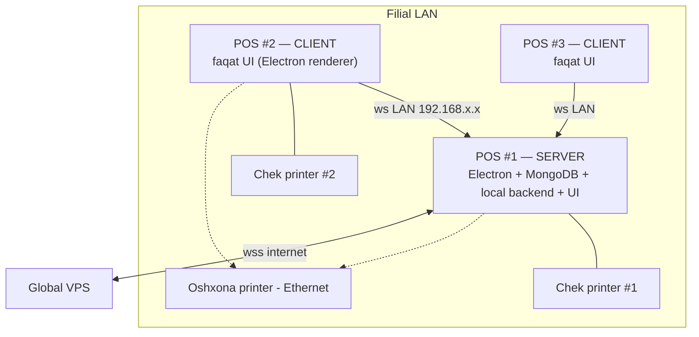

# Multi-POS (bir filialda bir nechta POS monitor)

> [!important] Qaror (foydalanuvchi, 2026-05-29): bitta local server, qolgan POS'lar unga ulanadi
> Bir filialda 2+ POS monitor bo'lsa — **faqat bitta local server** (Variant A). Qolgan POS'lar unga LAN orqali client sifatida ulanadi. **Ikkita alohida server ISHLATILMAYDI.**

## Muammo

Real holat: bitta filialda 2 POS monitor, ikkalasidan ham order beriladi va tolov qabul qilinadi. Qanday qilib ular bir xil ma'lumotni bo'lishadi?

## Nima uchun ikkita alohida server BO'LMAYDI

Local server = filialning "miyasi" (orderlar, stollar, chek raqamlari, smena, stock). Ikkita miya bo'lsa:

| Muammo | Natija |
|---|---|
| Ikki alohida baza | POS #1 "stol 5 band" deydi, POS #2 bilmaydi → ikkala POS bir stolga order |
| Ikki chek counter | Ikkalasi 1 dan boshlaydi → `YUN-...0001` duplikat |
| Ikki smena | Ikkita kassa hisobi, chalkashlik |
| Ikki stock/stop-list counter | Somsa limiti noto'g'ri sanaladi |
| Ikki global ulanish | Sync urishadi, konflikt |

Shuning uchun: **bitta filial = bitta local server + bitta MongoDB.**

## Yechim: Server-Client (Variant A)



- **POS #1 (server):** MongoDB + local backend (Express/Socket) + o'z UI
- **POS #2, #3 (client):** faqat UI, POS #1 ga LAN orqali ulanadi (o'z bazasi yo'q)
- Ikkala ekran bir xil ma'lumot (bitta bazadan)

## Texnik ish printsipi

1. **Server POS** local backend LAN'da tinglaydi (`0.0.0.0:4561`)
2. **Client POS** server IP'ga ulanadi (`ws://192.168.1.10:4561`)
3. MongoDB faqat **localhost**'da (server mashinasida) — client to'g'ridan-to'g'ri Mongo'ga emas, **local backend orqali** ([[xavfsizlik/socket-xavfsizligi]])
4. **Real-time:** server local backend barcha ulangan POS'ga socket broadcast (POS #1 order ochsa → POS #2 darhol ko'radi)
5. **Atomik counters** (chek raqami, stock soldToday) — serverda → duplikat yo'q ([[../07-nozik-nuqtalar/chek-raqamlash]], [[../07-nozik-nuqtalar/stop-list-limit]])
6. **Bitta global sync** — faqat server backend global bilan ulanadi ([[sinxronizatsiya/offline-to-online-otish]])

## Konfiguratsiya

```javascript
// Har POS o'rnatishda
{
  posRole: 'server' | 'client',
  localServerIp: null,          // server uchun null (o'zi); client uchun '192.168.1.10'
  localServerPort: 4561,
}
```

- Server POS: `posRole: 'server'`, branchToken bor (global bilan ulanadi)
- Client POS: `posRole: 'client'`, `localServerIp` server IP'si

## Client server'ni qanday topadi

- **Statik LAN IP** (tavsiya) — server POS'ga statik IP (192.168.1.10), client'ga sozlanadi
- Yoki mDNS auto-discovery (kelajak)
- POS uchun statik IP eng ishonchli

## Chek printer (qaror: har POS o'z printeri)

- Har POS terminalga **o'z USB chek printeri** ([[../07-nozik-nuqtalar/hardware-nozikliklari]])
- Har POS mustaqil chek bosadi (POS #2 da tolov → POS #2 printeridan)
- **Oshxona printeri** — tarmoqqa (Ethernet) ulanib umumiy
- Server backend qaysi printerga yuborishni biladi (qaysi POS so'radi)

## Smena va kassa (oddiy)

- **Smena bitta** (filial uchun), serverda
- Lekin har POS o'z **pul yashigi**ni alohida sanaydi (kassa nazorati)
- Smena yopilganda har POS drawer'i alohida hisoblanadi, filialga jamlanadi
- Bu — fraud nazorati ([[xavfsizlik/firibgarlik-nazorati]]) bilan mos (discrepancy per-drawer aniqlanadi)

> [!note] Hozircha sodda
> v1'da: smena bitta, drawer'lar alohida sanaladi. Murakkab per-terminal session — kelajak (kerak bo'lsa).

## ⚠️ Single Point of Failure (SPOF)

> [!warning] Server POS o'chsa — filial to'xtaydi
> POS #1 (server) o'chsa/buzilsa, client POS'lar ham ishlamaydi (miya o'chdi).

**Yumshatuvlar:**
- Server POS'ni **UPS** (zaxira batareya)ga ulash (tavsiya)
- Server POS — eng ishonchli mashina (boshqalardan kuchliroq)
- Muhim/katta filiallar uchun: **alohida mini-server** (NUC) — POS'lardan mustaqil, doim yoniq (kelajak optsiya)
- Failover (client → server promotion) — juda murakkab, hozircha yo'q

## Offline bilan munosabati

- **Server POS** global bilan offline/online ([[3-rejim]]) — odatdagicha
- **Client POS** server bilan LAN aloqasini yo'qotsa → ishlay olmaydi (banner: "Server bilan aloqa yo'q")
- LAN ichki — odatda ishonchli (internet uzilsa ham LAN ishlaydi)
- Server offline (internetsiz) bo'lsa ham — client'lar serverga ulanaveradi, filial ichida ishlaydi (faqat global sync kutadi)

## Possiz rejim bilan

Possiz (svet yo'q — [[rejimlar/possiz-rejim]]) — POS'lar umuman ishlamaydi (svet yo'q). Mobile'larga o'tiladi. Multi-POS bu yerda ahamiyatsiz.

## v1 vs kelajak

| | v1 (hozir) | Kelajak |
|---|---|---|
| Server | Bitta POS (Variant A) | + alohida mini-server optsiya (Variant B) |
| Discovery | Statik IP | mDNS auto |
| SPOF | UPS tavsiya | Failover/promotion |
| Kassa | Smena bitta, drawer alohida | Per-terminal session |

## Test rejasi

- [ ] Bitta server + bitta client ulanish (LAN)
- [ ] POS #1 order ochdi → POS #2 darhol ko'radi (real-time)
- [ ] Chek raqami duplikat emas (ikkala POS dan)
- [ ] Stock/stop-list counter umumiy (ikkala POS dan sanaladi)
- [ ] Stol band — ikkala POS da ko'rinadi
- [ ] Har POS o'z printeriga bosadi
- [ ] Server o'chsa → client banner ("server yo'q")
- [ ] Server offline (internet) → client'lar baribir ishlaydi (filial ichida)

## Bog'liq

- [[local-backend-stack]]
- [[../07-nozik-nuqtalar/chek-raqamlash]] — atomik counter (multi-POS uchun muhim)
- [[../07-nozik-nuqtalar/stop-list-limit]] — umumiy counter
- [[xavfsizlik/firibgarlik-nazorati]] — kassa discrepancy
- [[../07-nozik-nuqtalar/hardware-nozikliklari]] — printer
