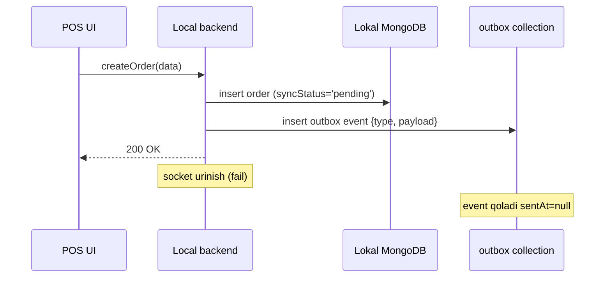

# 🟡 Offline rejim

## Texnik holat

Filial **offline** deyiladi qachonki:

1. Local backend ↔ Global VPS socket **CLOSED** yoki ping fail
2. Reconnect attempt davom etayotgan bo'lishi mumkin (background'da)
3. Lokal MongoDB ishlaydi
4. POS UI ishlaydi
5. Lokal printer, cash drawer ishlaydi
6. (toggle yoqilgan bo'lsa) lokal Wi-Fi orqali peer-to-peer mumkin

## Trigger holatlari

Online'dan offline'ga o'tish — quyidagilardan biri:

| Trigger | Detect time | Tafsilot |
|---|---|---|
| Socket disconnect event | Darhol | TCP yiqildi |
| Heartbeat fail (3 ping miss) | ~9s | Network o'lgan, ammo TCP hali bilmaydi |
| Manual force | Darhol | Admin "Offline rejimga o'tish" bossa (debug) |
| DNS resolve fail | ~2s | global VPS hostname topilmadi |

## POS UI xatti-harakati

### Avtomatik o'zgarishlar
- Status bar: 🟢 → 🟡 Offline
- Yuqori panelda banner: **"⚠️ Offline rejim — yozuvlar sinxron emas"**
- Sync indicator: pending event soni real-time ko'rsatiladi
- Tolov turlaridan **"Kaspi QR" disabled** (`requires: online`)
- Boshqa hammasi ishlaydi

### Yozish oqimi


### O'qish oqimi
- Hozirgi smena va kunlik orderlar — lokal'da
- Eski hisobotlar (oxirgi sync paytidagi data) — lokal cache'da
- Real-time menyu o'zgarishlar yo'q (sync paytida olib kelinadi)

## Waiter mobile bloklanishi

Bu nazariy jihatdan murakkab:
- Waiter mobile global VPS bilan ulanadi (online API ishlatadi)
- Filial offline bo'lsa — waiter mobile bilmaydi
- Yechim: VPS waiter mobile'ga "shu filial offline" status'ni jo'natadi
  - Heartbeat asosida: agar branch local backend 30s'dan ko'p offline bo'lsa, branch status = 'offline'
  - Waiter mobile filial status'ni har 10s'da so'raydi
- Filial offline'da waiter mobile order berish form'ini disabled qiladi:

```
┌────────────────────────────────────┐
│  📵 Filial offline rejimda          │
│                                    │
│  Hozir POS monitor orqali order    │
│  bering. Internet qaytgach mobile  │
│  yana ishlay boshlaydi.            │
└────────────────────────────────────┘
```

> [!note] Nima uchun waiter mobile lokal backend'ga ulanmaydi?
> 1. Waiter telefoni filial Wi-Fi'da bo'lmaslik mumkin (3G/4G'da)
> 2. Lokal backend IP'sini har waiter telefoniga sozlash murakkab
> 3. Xavfsizlik: lokal backend lokal tarmoq ichida, tashqaridan ko'rinmasligi kerak
>
> Possiz rejimda esa boshqacha: lokal Wi-Fi peer-to-peer va admin telefonidagi mini-server orqali.

## Lokal yozish cheklovlari

Offline'da hamma narsa yoziladi, lekin ba'zilarini ehtiyot bilan:

| Operatsiya | Holati | Sabab |
|---|---|---|
| Order yaratish | ✅ Ishlaydi | Outbox'ga tushadi |
| Order tolash (naqd, karta) | ✅ Ishlaydi | Lokal'da yoziladi |
| Order tolash (Kaspi QR) | ❌ Bloklangan | Webhook keling olinmaydi |
| Order bekor qilish | ✅ Ishlaydi | |
| Menyu o'zgartirish (admin) | ⚠️ Ogohlantirish | Boshqa filiallarga yetib bormaydi, "boshqa filial admin parallel o'zgartirsa konflikt" |
| Yangi user yaratish | ⚠️ Cheklangan | JWT generatsiya — global'da ishlaydi, lokal'da boshqacha kalit kerak. v1'da blocklanadi |
| Smena ochish/yopish | ✅ Ishlaydi | Lokal'da |
| Shift yopish (pending tolov bilan) | ❌ Bloklangan | Foydalanuvchi qoidasi (qarang [[../../04-toollar/online-offline-rejim]]) |

## Race conditions

### Race 1: Offline rejim aniqlanayotganda POS yangi order yozyapti
- Network sekunlik dropout
- POS write boshlandi → socket hali "open" deb hisoblaydi
- Mid-write socket "closed" bo'ldi
- Yechim: lokal write atomik (lokal Mongo'ga). Mode label keyin yangilanadi. Buyruq baribir muvaffaqiyatli.

### Race 2: Reconnect paytida offline write
- Socket reconnect: handshake ketmoqda
- Bu paytda POS yangi order yozdi
- Order outbox'ga tushdi
- Handshake muvaffaqiyatli → "online_syncing" rejim
- Outbox bo'shashi paytida yangi yozuv ham keladi → tabiiy ravishda jo'natiladi

### Race 3: Mode flip-flop (5s on, 5s off)
- Internet noaniq, ulanadi-uzuladi
- Har safar mode o'zgartirishni qilish — UI bezovta
- Yechim: hysteresis. "Online" deyish uchun 30s davomida stabil bo'lishi kerak. "Offline" — darhol.

## Watchdog (foreground monitor)

Lokal backend'da background loop:
- Har 3s: ping global VPS
- Har 10s: outbox holatini tekshirish
- Har 1m: lokal Mongo health (disk space, RAM)
- Har 5m: backup snapshot (rolling)

Watchdog xato topsa — `system.alert` event POS UI'ga.

## Foydalanuvchi tajribasi

Status bar:
```
┌──────────────────────────────────────────────────────────────────────────┐
│ 🟡 Offline   📥 outbox: 14 ta event    🖨️ printer: tayyor                │
└──────────────────────────────────────────────────────────────────────────┘
```

Banner:
```
┌──────────────────────────────────────────────────────────────────────────┐
│ ⚠️ Filial offline rejimda. Yozuvlar lokal'da saqlanyapti.                │
│    Internet ulanishi qaytsa avtomatik sinxron qilinadi.                  │
│                                                                          │
│    Outbox: 14 event kutmoqda  ·  Oxirgi sync: 5 daqiqa oldin             │
└──────────────────────────────────────────────────────────────────────────┘
```

## Outbox monitoring

Admin'ga (lokal POS PC'da) "Sync sozlamalari" sahifasi:
- Outbox event'lar ro'yxati
- "Sync now" tugmasi (majburiy)
- Eskirgan event'larni ko'rish (retry > 5)
- Konfliktlar (kelajakda)

## Bog'liq

- [[_MOC]]
- [[online-rejim]]
- [[possiz-rejim]]
- [[../sinxronizatsiya/offline-to-online-otish]]
- [[../conflict-resolution]]
