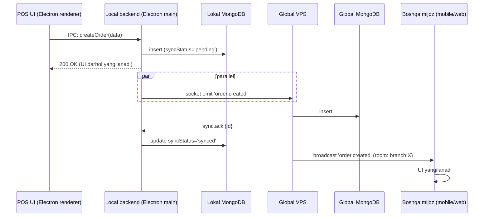

# 🟢 Online rejim

## Texnik holat

Filial **online** deyiladi qachonki:

1. Local backend ↔ Global VPS socket **OPEN** holatda
2. Oxirgi heartbeat (ping/pong) muvaffaqiyatli, 3 sekunddan kam vaqt ichida
3. Outbox bo'sh (yoki sync_status='pending' yozuvlar yo'q)
4. Admin majburiy possiz rejimda emas

Bu shartlardan birortasi buzilsa — boshqa rejimga o'tish boshlanadi.

## Ma'lumot oqimi (CRUD)

### Yozish (write)


**Asosiy printsip:** POS UI lokal yozuv tugaganidan **darhol** OK qabul qiladi. Global VPS bilan sinxron — fonda. Lekin sinxron tezligi sekundlardan ham past (latency 50-200ms).

### O'qish (read)
- POS UI har doim lokal MongoDB'dan o'qiydi (ms-darajadagi tezlik)
- Mobile (online) har doim global VPS'dan o'qiydi (chunki mobile filial tarmog'idan tashqarida bo'lishi mumkin)
- Web admin har doim global VPS'dan

## Real-time event broadcasts

Online'da har bir o'zgarish — broadcast event'larga aylanadi:

| Event | Kim eshitadi (room) |
|---|---|
| `order.created` | `branch:X` (POS, cook mobile, cashier mobile, admin web) |
| `order.cooking_started` | `branch:X` (cook → boshqalarga) |
| `order.ready` | `branch:X` + `user:waiterID` (waiter'ga push) |
| `order.paid` | `branch:X` |
| `stock.changed` | `branch:X` + `role:admin:branch:X` |
| `stock.low_alert` | `role:admin:branch:X` |
| `presence.user_online` | `branch:X` (kim hozir tizimda) |

## Performance maqsadlari

| Operatsiya | Maqsad latency |
|---|---|
| POS → lokal MongoDB yozish | < 10 ms |
| Lokal → POS broadcast | < 20 ms |
| Local → Global sync (ack) | < 500 ms (good network) |
| Global → mobile broadcast | < 300 ms |
| Mobile order list refresh | < 1 sec |
| Toomli read query (last 100 orders) | < 200 ms |

## Resurs ishlatishi

- Lokal MongoDB cache 1 GB (wiredTiger cacheSizeGB: 1)
- Electron main process: 100-200 MB RAM
- Electron renderer: 200-300 MB RAM
- Socket ulanish: 1 ta open WS connection per POS
- Heartbeat: har 3 sekundda 1 ta paket (~50 bayt)

## Degradation senariolari (online'da xato holatlar)

### Senariy 1: Global VPS sekinlashdi (latency > 2s)
- Heartbeat hali ishlaydi
- POS UI yozadi, lokal'ga tushadi
- Sync delayed → outbox to'la boshlaydi
- 5+ event delay'da bo'lsa banner: "Sync sekinlashdi, lekin POS ishlayapti"
- 30s davomida ack bo'lmasa → `offline` rejimga o'tiladi

### Senariy 2: Tashqi servis (Kaspi API) yiqildi
- Online rejim davom etadi
- Faqat Kaspi-bog'liq operatsiyalar fail bo'ladi
- Cashier qrPay tugmasi "Vaqtinchalik ishlamayapti" deb chiqaradi
- Naqd va karta tolovlari ishlaydi

### Senariy 3: Push notification servis (FCM) yiqildi
- Order yaratish ishlaydi
- Cook'ga push borabermaydi (FCM xato)
- Lokal lokal socket orqali baribir yetadi (agar cook lokal Wi-Fi'da)
- Mobile cook ko'rmaslik xavfi bor → "no-notification" log + retry queue

## Online'da degraded mode

Yarim-degraded holatlar uchun yangi rejim emas, balki banner + feature degradation:

```javascript
// Connectivity status
{
  socket: 'ok' | 'degraded' | 'down',
  syncLag: { eventsBehind: 5, oldestPendingMs: 12000 },
  externalServices: {
    kaspi: 'ok' | 'down',
    fcm: 'ok' | 'down',
    whatsapp: 'ok' | 'down',
    sms: 'ok' | 'down',
  }
}
```

POS UI status bar — har servis uchun rangli indikator (yashil/sariq/qizil).

## Foydalanuvchi tajribasi

Status bar (POS monitor'ning yuqorida):

```
┌──────────────────────────────────────────────────────────────────────────┐
│ 🟢 Online   📡 sync: hozir    🖨️ printer: tayyor    📲 mobile: 3 ulangan │
└──────────────────────────────────────────────────────────────────────────┘
```

Degraded'da:
```
┌──────────────────────────────────────────────────────────────────────────┐
│ 🟢 Online   ⚠️ sync sekin (12s lag)   🖨️ printer: tayyor                 │
└──────────────────────────────────────────────────────────────────────────┘
```

## Bog'liq

- [[_MOC]]
- [[offline-rejim]]
- [[../socket-sinxronizatsiya]]
- [[../local-backend-stack]]
