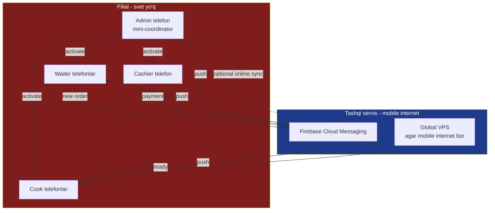
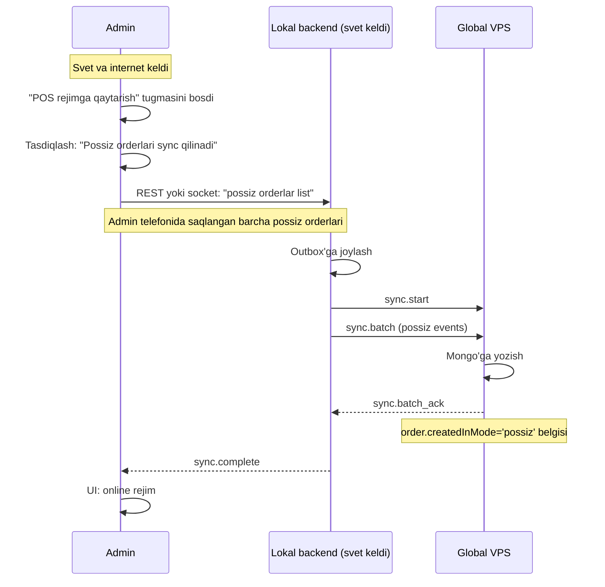

# 🔴 Possiz (cook+waiter) rejim

## Texnik holat

Filial **possiz** deyiladi qachonki:

1. Admin telefondan majburiy yoqdi ("Possiz rejimga o'tish")
2. POS PC ishlamayotgan bo'lishi mumkin (svet yo'q)
3. Lokal MongoDB ishlamayotgan bo'lishi mumkin
4. Mobile ilovalar — yagona ish quroli
5. Aloqa: lokal Wi-Fi peer-to-peer + push notification

Bu rejim — **vaqtinchalik**. Svet va internet kelganida `online`ga qaytariladi.

## Trigger

Possiz rejim **avtomatik yoqilmaydi**. Faqat admin qo'lda yoqadi.

Sabablari:
- Svet o'chgan
- Internet ham yo'q, POS ham ishlamayapti
- Cook bilan waiter o'rtasida og'zaki aloqa yetarli emas

Admin ko'rsatma berishi kerak — bu qiyin qaror, chunki:
- Cash drawer fizik ochilmaydi (svet yo'q)
- Chek apparat ishlamaydi
- POS monitorga buyurtma kiritib bo'lmaydi

## Arxitektura



## Koordinator: admin telefoni

Possiz'da bitta mobile **koordinator** sifatida ishlaydi — bu admin telefoni. U:
- Boshqalar uchun "sessiya" yaratadi
- Buyurtmalar ro'yxatini saqlaydi (lokal SQLite mobile'da)
- Sync mas'uli — internet kelsa lokal saqlangan ma'lumotlarni global'ga jo'natadi

Bu admin telefoni o'zgartirilishi mumkin — agar admin batareyasi tugasa, boshqa adminga "koordinatorlikni o'tkazish" tugmasi.

## Aloqa kanali

### Variant A: Mobile internet (4G/5G) bor
- Push notification FCM orqali
- Mobile ilovalar bevosita global VPS bilan ulanadi
- Real-time emas, lekin ishonchli

### Variant B: Internet ham yo'q
- Lokal Wi-Fi router ishlayotgan bo'lsa (UPS'da) — lokal socket
- Yo'q bo'lsa — Bluetooth peer (kelajakda)
- Yoki: SMS fallback (kelajakda)

> [!note] v1'da
> Faqat **Variant A** qo'llab-quvvatlanadi. Mobile internet bor deb taxmin qilinadi (telefonlar 4G data'ga ega).

## Mobile UI o'zgarishlari

### Waiter
**Online'da:** order list, order details
**Possiz'da:** asosiy ekran — "Yangi order berish" forma. Cookga jo'natilgan order'lar list pastda.

```
┌──────────────────────────────────────┐
│ 🔴 POSSIZ REJIM                       │
├──────────────────────────────────────┤
│  [+ Yangi order]                      │
│                                       │
│  Mening orderlarim (3)                │
│  ─────────────────────                │
│  📦 Stol 5 — Osh, Mantı               │
│     Tayyorlanmoqda  · 10:32           │
│                                       │
│  ✅ Stol 12 — Lag'mon, choy          │
│     Tayyor! Olib boring · 10:25       │
│                                       │
│  💰 Stol 3 — Beshbarmoq              │
│     Tolov kutilmoqda · 10:18          │
└──────────────────────────────────────┘
```

### Cook
**Possiz'da:** kelgan orderlar bo'yicha list. Har order'da "Tayyorlash" → "Tayyor" tugmalari.

```
┌──────────────────────────────────────┐
│ 🔴 POSSIZ REJIM (cook)                │
├──────────────────────────────────────┤
│  Yangi orderlar (2)                   │
│  ─────────────────────                │
│  ⏱ Stol 5 — Osh x2, Mantı x1         │
│     Waiter: Alisher · 10:32           │
│     [Tayyorlashni boshlash]           │
│                                       │
│  ⏱ Stol 7 — Beshbarmoq x1            │
│     Waiter: Dilshod · 10:30           │
│     [Tayyorlashni boshlash]           │
│                                       │
│  Tayyorlanyapti (1)                   │
│  ─────────────────────                │
│  🍳 Stol 12 — Lag'mon                 │
│     [Tayyor!]                         │
└──────────────────────────────────────┘
```

### Cashier
**Possiz'da:** tolov kutayotgan orderlar list. Har birida "PDF chek" + "Tolov olindi" tugmalari.

```
┌──────────────────────────────────────┐
│ 🔴 POSSIZ REJIM (cashier)             │
├──────────────────────────────────────┤
│  Tolov kutilmoqda (1)                 │
│  ─────────────────────                │
│  💰 Stol 3 — Beshbarmoq               │
│     Jami: 45,000 so'm                 │
│     [Chek ko'rsatish]                 │
│     [Tolovni qabul qildim]            │
│                                       │
│  Bugun olingan tolovlar (12)          │
│  ─────────────────────                │
│  ...                                  │
└──────────────────────────────────────┘
```

## PDF check generatsiya

Possiz'da chek apparat yo'q. O'rniga:
1. Cashier "Chek ko'rsatish" bosadi
2. Mobile ilova ichida PDF generatsiya bo'ladi (lokal, offline)
3. Mijozga ekran ko'rsatiladi
4. Mijoz hohlasa: QR-link → PDF download (mijoz telefoniga)
5. Yoki: WhatsApp orqali ulashish (FCM mavjud bo'lsa)

PDF template:
- Restoran logosi
- Filial nomi va manzili
- Order ID
- Taomlar ro'yxati + narxlar
- Jami summa
- Tolov turi (naqd / karta / transfer)
- Sanasi va vaqti
- **"Possiz rejimda berilgan" yozuvi** (rasmiyatni belgilash uchun)
- Keshbek QR (agar yoqilgan bo'lsa)

## Order saqlash strategiyasi

Har mobile o'z lokal SQLite'ga yozadi (telefon ilovasi ichida):
- Waiter: o'zi yaratgan orderlar
- Cook: ko'rgan orderlar
- Cashier: tolagan orderlar
- Admin (koordinator): hamma orderlar

**Master source:** koordinator (admin telefoni). Boshqa rollar — ehtiyot uchun saqlaydilar.

Sync paytida koordinator'dan ma'lumot olinadi.

## Possiz → Online qaytarish



**Diqqat:** possiz'da yaratilgan order'lar chek apparatga **retroaktiv bosilmaydi** — chunki ular allaqachon PDF/oddiy chek qabul qilgan. `order.checkPrinted = false` qoladi.

## Cheklovlar va xavflar

| Cheklov | Sabab | Yumshatuv |
|---|---|---|
| Real-time stock ko'rinmaydi | Mobile'da lokal data yo'q | Cook "bor/yo'q" ni qo'lda baholaydi |
| Konflikt risk yuqori | Bir nechta mobile'lar parallel ishlaydi | Koordinator (admin) markazlashgan |
| Sync paytida konflikt | Possiz orderlari online order'lar bilan urinadi | UUID + version yo'l |
| Telefon batareyasi | Barcha koordinator funksiyalari | Power bank zaruriy |
| FCM fail | Internet bor, lekin servis yiqildi | Lokal Wi-Fi fallback (v2) |
| Cash drawer | Fizik ochilmaydi | Qo'lda |
| Chek apparat | Ishlamaydi | PDF |
| Tolov: Kaspi | Internet bor bo'lsa ishlaydi | Optional |

## Audit log

Possiz'da qabul qilingan har order **alohida log entry**:
```javascript
{
  type: 'possiz_session',
  branchId, restaurantId,
  startedBy: adminUserId,
  startedAt, endedAt,
  ordersCreated: [...],
  paymentsAccepted: [...],
  syncStatus: 'pending' | 'synced',
}
```

Tizim admini bu sessiyalarni keyinroq tekshirib chiqishi mumkin.

## Bog'liq

- [[_MOC]]
- [[online-rejim]]
- [[offline-rejim]]
- [[rejim-otish-qoidalari]]
- [[../../04-toollar/cook-waiter-possiz-rejim]]
