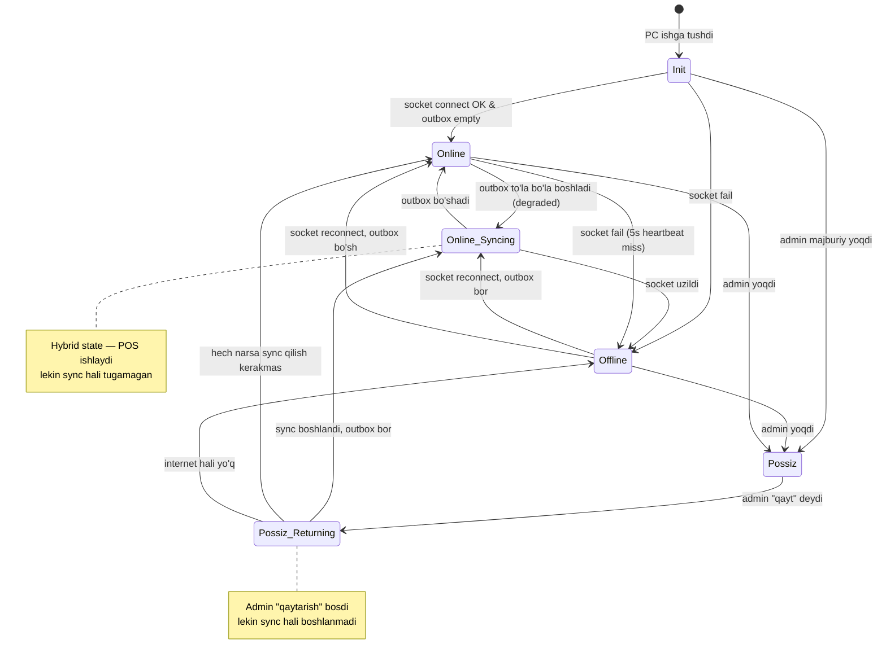

# Rejim o'tish qoidalari (state machine)

## To'liq state machine



## Transition matrix

| Hozirgi rejim → Yangi rejim | Trigger | Avtomatikmi? |
|---|---|---|
| Online → Online_Syncing | outbox > 5 events va not draining | Avtomatik |
| Online_Syncing → Online | outbox = 0 va socket OK | Avtomatik |
| Online → Offline | socket disconnect / heartbeat 3 miss | Avtomatik (avtomatik vaqt: 9s) |
| Online → Possiz | admin force | Qo'lda |
| Online_Syncing → Offline | socket disconnect | Avtomatik |
| Offline → Online | socket reconnect + outbox = 0 (oddiy) | Avtomatik |
| Offline → Online_Syncing | socket reconnect + outbox > 0 | Avtomatik |
| Offline → Possiz | admin force | Qo'lda |
| Possiz → Possiz_Returning | admin "qayt" tugmasi | Qo'lda |
| Possiz_Returning → Online_Syncing | sync boshlandi | Avtomatik |
| Possiz_Returning → Online | sync hech narsa kerakmas | Avtomatik |
| Possiz_Returning → Offline | internet hali yo'q | Avtomatik |
| Possiz → Offline | hech qachon avtomatik emas | — |

## O'tish jarayoni (har transition uchun)

### Online → Offline
```javascript
async function transitionOnlineToOffline(reason) {
  await branch.update({ currentMode: 'offline', modeChangedAt: now() });
  await emit('mode.changed', { from: 'online', to: 'offline', reason });
  await disconnectMobileSubscribers();  // VPS waiter mobile'larga "filial offline"
  await ui.showBanner('offline');
  await audit.log({ kind: 'mode_change', from: 'online', to: 'offline', reason });
}
```

### Offline → Online_Syncing
```javascript
async function transitionOfflineToSyncing() {
  await branch.update({ currentMode: 'online_syncing' });
  await emit('mode.changed', { to: 'online_syncing' });
  await ui.showSyncProgress();
  // sync engine boshlanadi
  await syncEngine.start();
}
```

### Online_Syncing → Online
```javascript
async function transitionSyncingToOnline() {
  if (outbox.count() > 0) throw new Error('outbox bo`sh emas');
  await branch.update({ currentMode: 'online' });
  await emit('mode.changed', { to: 'online' });
  await ui.hideSyncProgress();
  await reconnectMobileSubscribers();
}
```

### Online → Possiz
```javascript
async function transitionOnlineToPossiz(adminUserId, reason) {
  // Avval audit va tasdiq
  await audit.log({ kind: 'possiz_activated', by: adminUserId, reason });

  // Lokal POS UI'ga banner
  await emit('mode.changed', { to: 'possiz' });

  // Mobile'larga push: possiz yoqildi
  await pushToBranch(branchId, 'possiz.activated', { adminUserId });

  // POS PC'da yozish bloklanadi (chunki bu admin tasdiqlagan boshqa rejim)
  await blockLocalWrites();
}
```

### Possiz_Returning → Online_Syncing
```javascript
async function transitionPossizReturning() {
  // Possiz'da yaratilgan order'lar koordinator (admin telefon)'dan tortib olinadi
  const possizEvents = await pullPossizEventsFromCoordinator();
  await outbox.bulkInsert(possizEvents);
  await transitionOfflineToSyncing();
}
```

## Race conditions va ularning yechimi

### Race 1: Heartbeat fail va socket reconnect bir vaqtda
**Holat:** Heartbeat 3-miss bo'ldi, "offline" deb belgilashga harakat qilyapti. Shu paytda socket qaytadan ulandi.

**Yechim:** Mode o'zgartirish — atomik (mongoose `findOneAndUpdate` shart bilan). Hozirgi mode 'online' bo'lsagina 'offline'ga o'tish. Reconnect uchun ham xuddi shu.

```javascript
const result = await branchModel.findOneAndUpdate(
  { _id: branchId, currentMode: 'online' },  // shart
  { currentMode: 'offline', modeChangedAt: now() }
);
if (!result) return; // boshqa joy allaqachon yangiladi
```

### Race 2: Admin "possiz" yoqdi, lekin online_syncing davom etyapti
**Holat:** Sync paytida admin majburiy possiz yoqdi.

**Yechim:** Admin force har doim ustun. Online_syncing → Possiz transition'ni qo'llab-quvvatlash. Sync to'xtatiladi, sync_status='paused' belgi qo'yiladi.

### Race 3: Possiz_Returning paytida internet yana uzildi
**Holat:** Possiz'dan qaytayotgan paytda internet uzildi.

**Yechim:** Possiz_Returning → Offline. Possiz events outbox'da qoladi. Keyingi reconnect'da Offline → Online_Syncing.

### Race 4: Mode flip-flop (5s on, 5s off)
**Holat:** Internet noaniq, ulanadi-uzuladi har 5 sekundda. UI ko'p o'zgaradi.

**Yechim:** Hysteresis.
- Offline → Online o'tish uchun: socket 30s davomida stabil bo'lishi shart
- Online → Offline o'tish: darhol (latency degradation real)
- Bu — UI uchun. Backend internal'da darhol o'zgaradi.

### Race 5: Mode notification keyin keldi
**Holat:** Lokal backend `mode.changed` event'ni mobile'larga jo'natdi, lekin bir mobile uzilgan edi. Reconnect'da eski mode'da deb hisoblamoqda.

**Yechim:** Mobile reconnect bo'lganda **majburiy `branch.status` so'rovi**. Joriy mode shu yerda haqiqiy keladi.

## Atomik o'tish (idempotent)

Har mode o'zgartirish — bitta `branch_mode_event` collection'ga yoziladi:
```javascript
{
  _id, branchId, restaurantId,
  fromMode, toMode,
  reason, triggeredBy: 'system' | 'admin',
  adminUserId,
  ts: Date,
}
```

Idempotency: agar bir xil event id qaytadan kelsa — sokin o'tib ketadi.

## UI animatsiyalari

Mode o'zgarishi POS UI'da silliq:
- Status bar rangi 200ms ichida sekin o'zgaradi
- Banner pastdan yuqoriga "slide in" (500ms)
- Tovushli signal (default off, admin yoqishi mumkin)

## Audit qoidalari

Har mode o'zgartirish:
- `audit_log` ga yoziladi
- Admin dashboard'da "Filial holati tarixi" sahifasi (kelajakda)
- Anomaliya: kun davomida 10+ marta offline ↔ online — internet muammosi alert

## Bog'liq

- [[_MOC]]
- [[online-rejim]]
- [[offline-rejim]]
- [[possiz-rejim]]
- [[../sinxronizatsiya/offline-to-online-otish]]
