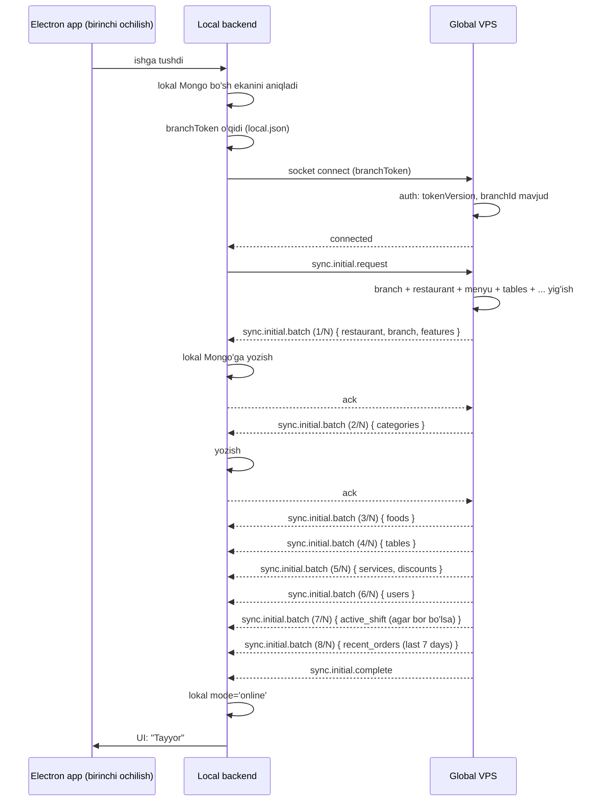

# Boshlang'ich sync (initial sync)

## Vaziyat

Yangi POS PC'da `aridaipos-setup.exe` o'rnatildi. MongoDB bo'sh. Branch ma'lumotlari yo'q. Admin web'dan olingan branchToken kiritildi. Birinchi marta global VPS'ga ulanmoqda.

Tomoshanlar:
- Filial allaqachon mavjud (admin web'dan yaratilgan)
- Menyu allaqachon yaratilgan (yoki yo'q)
- Stollar yaratilgan (yoki yo'q)
- Xodimlar — yo'q (bularni keyin admin qo'shadi)

Lokal MongoDB'ga butun filial ma'lumotlarini olib kelish kerak.

## Oqim (bosqichma-bosqich)



## Initial sync — qaysi entity'lar olinadi

| Entity | Strategiya | Limit |
|---|---|---|
| `restaurant` | Faqat shu restoran (1 ta) | 1 |
| `branch` | Faqat shu filial (1 ta) | 1 |
| `category` | Shu filialdagi barcha | hammasi |
| `food` | Shu filialdagi barcha (isActive yoki not) | hammasi |
| `table` | Shu filialdagi barcha | hammasi |
| `service` | Shu filialdagi barcha | hammasi |
| `discount` | Shu filialdagi barcha active | hammasi |
| `user` | Shu filialdagi barcha xodimlar | hammasi |
| `shift` | Faqat active shift (agar bor) | 1 |
| `order` | Oxirgi 7 kun (lokal tarix) | ~1000 |
| `audit_log` | Olib kelinmaydi | 0 |

## Restoran features cache

`features` field'i alohida — bu toggle holatlari. Lokal'da bu **JSON cache faylda** saqlanadi (Mongo'da ham, lekin tezkor o'qish uchun cache):

```
C:\ProgramData\AridaiPos\config\feature-flags-cache.json
```

Initial sync paytida yoziladi. Toggle o'zgarsa real-time yangilanadi.

## Eski order'lar uchun strategiya

7 kundan eski order'lar — lokal'da yo'q. Bularni qaerdan o'qiymiz?

**Variant A:** Faqat lokal — eski'larni ko'rsatmaymiz.
- Plyus: sodda
- Minus: cashier "10 kun oldingi order" qarashga muhtoj bo'lishi mumkin

**Variant B:** Lokal hisobotlar'da "Eski ma'lumotlar uchun web admin'ga qarang"
- Lokal POS'da yo'q, lekin web admin'da hammasi bor

**Variant C:** On-demand fetch — POS so'rasa global'dan keladi
- Plyus: foydalanuvchi tajribasi yaxshi
- Minus: offline'da ishlamaydi

> [!todo] Tavsiya
> Variant **B** (sodda). Cashier kunlik POS bilan ishlaydi. Hisobot uchun web admin. Lokal — tezkor tezlik, oxirgi 7 kun.

## Tezlikni baholash

Kichik filial:
- 1 restaurant, 1 branch, 20 categories, 200 foods, 30 tables, 1 service, 5 discounts, 10 users, 1 shift, 1000 orders
- Hajmi: ~2-5 MB
- Tezlik: 30s — 2 min (network'ga qarab)

Katta filial (yoki ko'p filial restoran):
- 50 categories, 1000 foods, 100 tables, 50 users, 5000 orders
- Hajmi: ~15-30 MB
- Tezlik: 1-5 min

UI: progress bar `0/8 → 8/8` batch'lari.

## Birinchi ulanish failure

- Branch token noto'g'ri → UI: "Token xato, admin'ga murojaat"
- Server hech qachon javob bermadi → "Internet yo'q, keyinroq urinib ko'ring"
- Mongo lokal'ga yozish fail → "Disk to'la? Boshqa muammomi?"

Failure paytida — lokal Mongo bo'sh qoladi. Foydalanuvchi qayta urinib ko'rishi mumkin.

## Resume (qayta urinish)

```javascript
async function initialSyncIfNeeded() {
  const branchDoc = await localMongo.branches.findOne();
  if (!branchDoc) {
    await performInitialSync();
  }
}
```

Initial sync — idempotent. Yarim qolgan bo'lsa qaytadan to'liq qayta amalga oshiriladi (lokal Mongo bo'shatilmaydi, lekin yangilanadi).

```javascript
async function applyInitialBatch(batchEntities) {
  for (const ent of batchEntities) {
    await localMongo[ent.collection].updateOne(
      { _id: ent._id },
      { $set: ent },
      { upsert: true }
    );
  }
}
```

## Subsequent sync (oddiy)

Boshlang'ich tugagach — har socket reconnect'da subset sync:
- Sync paytidagi o'zgarishlar (lastSyncedAt'dan keyin)
- `last_sync_token` saqlanadi
- Server `since=lastSyncToken` so'rovi orqali — faqat o'zgargan entity'lar

## Bog'liq

- [[_MOC]]
- [[offline-to-online-otish]]
- [[sync-prioritizatsiyasi]]
- [[../local-backend-stack]]
