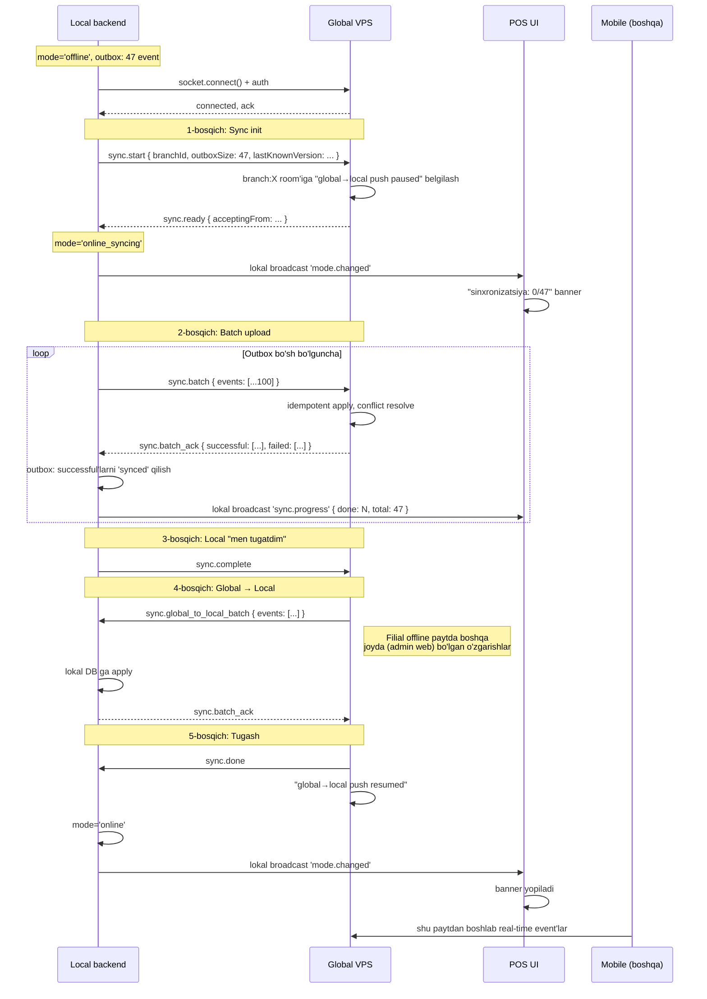

# Offline → Online o'tish protokoli

> [!important] Bu eng nazik joy
> Bu yerda xato bo'lsa — duplikat order, yo'qolgan tolov, balansda mos kelmaslik. Foydalanuvchi to'g'ridan-to'g'ri "local avval jo'natadi, keyin global qabul qiladi" deb ta'kidlagan.

## Vaziyat

- Filial X ma'lum vaqt offline edi (1 daqiqadan 1 sutkagacha bo'lishi mumkin)
- Lokal MongoDB'da `syncStatus: 'pending'` bayroq bilan o'nlab/yuzlab event yig'ildi
- Socket qaytadan ulandi

## Asosiy qoidalar

1. **Local avval jo'natadi, keyin global qabul qiladi.** Bu paytda global → local push to'xtatiladi.
2. **Sync tugaguncha to'liq online emas.** `mode='online_syncing'`.
3. **Tartib muhim**: outbox `created_at ASC`.
4. **Idempotent**: takror jo'natilgan event ack qaytarib bo'ladi, yana ishlamaydi.
5. **Atomik tugash**: yoki batch to'liq qabul qilinadi, yoki butunlay qaytariladi.

## Bosqichma-bosqich oqim



## Failure scenariolari va recovery

### Sync o'rtasida socket uzildi

- Local'da `sync_status='in_progress'` event'lar bor
- Reconnect'da `sync.start` qaytadan jo'natiladi
- Global "men ${eventId} ni allaqachon ko'rganman" — idempotent
- Davomidan davom etiladi

### Global ack qaytarmadi

- Local 30s kutadi, keyin batch'ni qaytadan jo'natadi
- 5 marta retry'dan keyin — `sync_status='error'` belgilab, admin'ga xabar

### Bir event apply paytida xato

Misol: order'ning `branchId` global'dagi noto'g'ri restoranga taalluqli (bug, manipulyatsiya).

- Global rad qiladi: `sync.batch_ack { failed: [{eventId, reason: 'tenant_mismatch'}] }`
- Local belgilaydi: `sync_status='rejected'`
- Admin dashboard'da ko'rsatiladi
- Boshqa event'lar davom etadi (bitta xato sync'ni bloklamaydi)

### Conflict — global'da boshqacha yangilanish bor

Qarang: [[../conflict-resolution]]. Misol: order'ga offline'da taom qo'shildi, online'da bekor qilingan. Per-field merge orqali.

## Online → Offline o'tish (qarama-qarshi yo'l)

Bu sodda:
1. Socket disconnect detect (5s heartbeat fail)
2. Local mode `offline` ga o'tadi
3. POS UI'da "offline" banner
4. Waiter mobile'larga "filial offline" xabari
5. Lokal yozuvlar `sync_status='pending'` bilan davom etadi

Bu yerda hech qanday "sync" yo'q — chunki global'dan oxirgi ma'lumot lokalda allaqachon bor (haqiqiy-vaqtda mirror bo'lgan).

## Possiz → Online o'tish

Possiz rejim — POS umuman ishlamayotgan vaqtda yaratilgan orderlar. Bu yerda murakkablik:

1. Possiz rejimda mobile'lar **lokal backend** bilan ishlagan (agar local backend ishlagan bo'lsa) yoki **bir-biriga peer-to-peer** bo'lgan
2. Reconnect'da local backend (yoki admin telefon) "possiz" event'larini yig'adi
3. Outbox'ga joylaydi
4. Yuqorida ko'rsatilgan oqimga aralashadi

Diqqat: possiz'da yaratilgan order **chek apparatga retroaktiv bosilmaydi** — chunki o'sha paytda chek imkoniyati yo'q edi (dizayn qarori).

## Shift va sync

Shift offline paytda yopilmaydi (foydalanuvchi qoidasi). Lekin offline paytda yaratilgan shift'lar va ularga tegishli orderlar bor.

Reconnect'da:
- Shift `open` deb sync bo'ladi
- Shift `closed` deb sync bo'ladi (agar offline paytda yopilgan bo'lsa va barcha orderlari to'langan/bekor qilingan bo'lsa)

## To'liq atomiklik (kelajakda)

Hozirgi dizayn — eventual consistency. Yana takomillashtirilishi mumkin:
- Two-phase commit ish stilida — global "tayyor" deyilmaguncha local "synced" belgilamaydi
- Lekin bu murakkablashtirib yuboradi

Hozircha — "best effort + idempotent + audit log" bilan boshlanadi.

## POS UI namunasi

```
┌────────────────────────────────────────┐
│ 🔄 Sinxronizatsiya kechmoqda            │
│ Mahalliy o'zgarishlar yuborilmoqda...   │
│ [████████░░] 47/52 event                │
│                                         │
│ Yangi orderlar qabul qilinadi.          │
│ Lekin tolov yopish biroz kutib turing.  │
└────────────────────────────────────────┘
```

> [!note] Sync paytida POS davom etadi
> Sync paytida POS yangi yozadi — bu yozuvlar yangi event sifatida outbox'ga tushadi, sync bilan parallel jo'natiladi. POS bloklanmaydi.

## Bog'liq

- [[../socket-sinxronizatsiya]]
- [[../conflict-resolution]]
- [[../3-rejim]]
