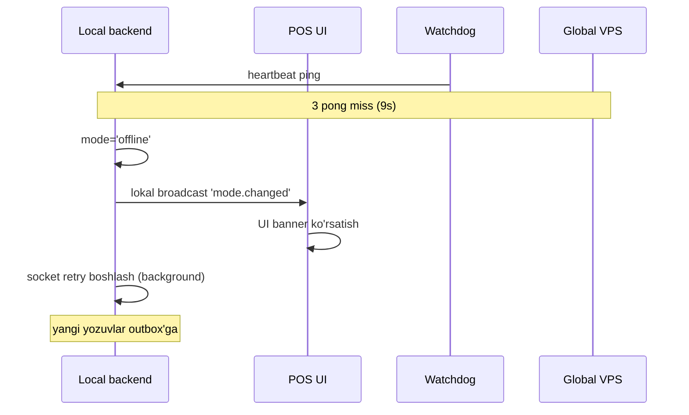

# Online → Offline o'tish

> Bu o'tish — odatda sodda, chunki "sync" yo'q. Lokal'da hammasi mavjud. Lekin baribir bir qancha qoida bor.

## Trigger holatlari

| Trigger | Detect time | Tafsilot |
|---|---|---|
| Socket TCP disconnect | Darhol | TCP RST/FIN keldi |
| Socket heartbeat 3 miss | ~9s | Network o'lgan |
| DNS resolve fail | ~2s | Hostname topilmadi |
| Manual force | Darhol | Admin debug |
| Internet check fail | ~5s | DNS over HTTPS check (kelajakda) |

## O'tish bosqichlari



## Hech qachon offline'da yozish to'xtatilmaydi

Online → Offline o'tish — **POS uchun shaffof**. Yozish to'xtatilmaydi:

```javascript
// Pseudo-kod
async function createOrder(input) {
  const order = await localMongo.orders.create(input);

  if (mode === 'online') {
    socket.emit('order.created', order);  // global'ga
  } else {
    await outbox.insert(order);  // keyinroq jo'natiladi
  }

  return order;
}
```

> [!note] Faqat agar `offline` toggle YOQ bo'lsa
> Restoran admin'i `offline` toggle'ni o'chirib qo'ygan bo'lsa — Internet uzilganda POS yozishni bloklanadi (qarang [[../../04-toollar/online-offline-rejim]]).

## Mobile mijozlarga xabar

Global VPS'da `branch.currentMode` filial'ning hozirgi rejimi sifatida saqlanadi. Mobile waiter app:
- Har 10s'da filial statusini so'raydi
- `branch.currentMode === 'offline'` bo'lsa — "Filial offline" banner

Lekin VPS'ga yetkazish o'zi ham muammo — local'dan global'ga "men offline" deb xabar berib bo'lmaydi (socket uzilgan).

**Yechim:** global VPS o'zi aniqlaydi:
- `branch.lastHeartbeatAt` field'i
- Cron job har 30s'da: `lastHeartbeatAt > 30s` bo'lsa `currentMode = 'offline'`
- Mobile so'rovida shu yangilangan status keladi

```javascript
// cron: detectOfflineBranches.js (har 30s)
const now = Date.now();
const threshold = new Date(now - 30000);
await branchModel.updateMany(
  { lastHeartbeatAt: { $lt: threshold }, currentMode: { $ne: 'offline' } },
  { currentMode: 'offline', modeChangedAt: new Date() }
);
```

## Offline'da global'ning ko'rinishi

Filial offline bo'lib turgan paytda boshqa joylar ko'radi:
- Admin web: dashboard'da filial "🔴 Offline" ko'rsatiladi
- Audit log: `mode_change` to 'offline'
- Alert (kelajak): agar 5 daqiqadan ko'p offline — email admin'ga

## Hysteresis

Internet flap-flop'lashidan qochish — online → offline darhol, lekin offline → online stabilizatsiya kutiladi (qarang [[../rejimlar/rejim-otish-qoidalari]]).

## Mobile branch status fetch

```javascript
// Mobile app, har 10s
async function checkBranchStatus() {
  const branch = await api.get(`/branches/${branchId}/status`);
  if (branch.currentMode === 'offline') {
    showOfflineBanner();
    disableOrderForm();
  } else {
    hideOfflineBanner();
    enableOrderForm();
  }
}
```

## Race conditions

### Race 1: Yozish paytida disconnect

```
T=0ms:   POS.write boshlandi (lokal Mongo yozyapti)
T=10ms:  Mongo yozdi
T=12ms:  socket.emit boshlandi
T=15ms:  Socket FIN keldi (disconnect)
T=16ms:  socket.emit fail
```

Yechim: socket.emit fail bo'lsa — outbox'ga qo'shish:
```javascript
try {
  await socket.emit('order.created', order);
} catch {
  await outbox.insert({ event: 'order.created', payload: order });
}
```

### Race 2: Mode flip-flop

Internet noaniq:
- T=0: online
- T=5s: offline (heartbeat miss)
- T=8s: online (socket reconnect)
- T=12s: offline (yana miss)

POS UI o'zgarib turishi yomon. Hysteresis ([[../rejimlar/rejim-otish-qoidalari]]):
- Offline → Online o'tish uchun 30s stabil bo'lishi shart

## Bog'liq

- [[_MOC]]
- [[offline-to-online-otish]]
- [[../rejimlar/online-rejim]]
- [[../rejimlar/offline-rejim]]
- [[../rejimlar/rejim-otish-qoidalari]]
