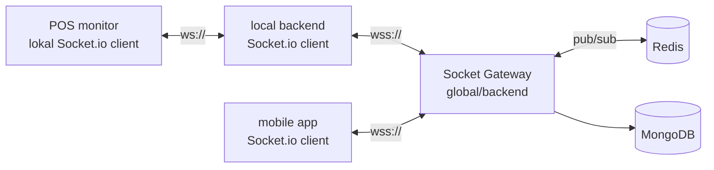
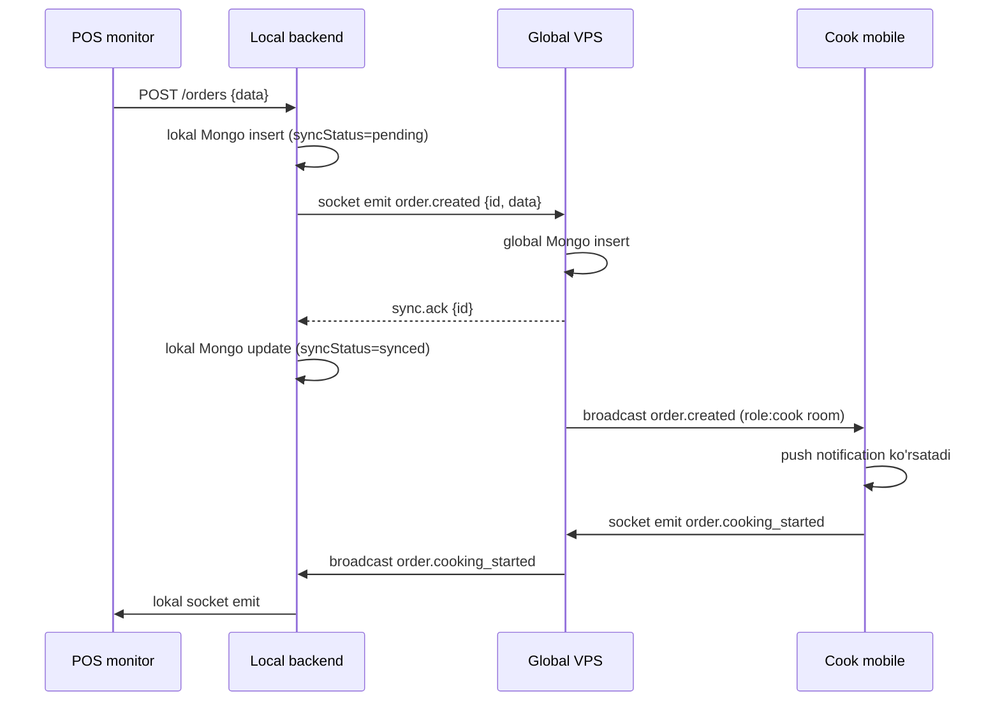

# Socket sinxronizatsiya protokoli

## Nima uchun socket, REST emas

Restoran tizimida ma'lumot **sekundiga o'zgaradi** — order qo'shildi, taom kelmoqda, stol bo'shadi, smena yopildi. REST bilan polling — sekin va og'ir. Socket — push-based, real-time, ulanish doimo ochiq.

## Asosiy elementlar



## Authentication

Socket connect bo'lganida, **handshake'da** quyidagi tokenlar majburiy:

| Mijoz turi | Auth payload |
|---|---|
| local backend | `{ branchId, branchToken (long-lived JWT, server tomon) }` |
| mobile (online) | `{ userId, userToken (JWT) }` |
| POS monitor (lokalga) | `{ branchId, posToken (lokal generatsiya) }` |

Token tekshirilgach **room**'larga qo'shiladi:

```
branch:{branchId}           // shu filial ichidagi hammasi
restaurant:{restaurantId}   // butun restoran (admin uchun)
user:{userId}               // shaxsiy
role:{role}:branch:{branchId} // role'ga bog'liq broadcast (cook'lar)
```

## Event nomlash konvensiyasi

`{domen}.{harakat}` — past harf, nuqta orqali

Domen | Misol harakatlar
---|---
`order` | `order.created`, `order.updated`, `order.cancelled`, `order.paid`
`food` | `food.created`, `food.updated`, `food.deleted`
`stock` | `stock.changed`, `stock.low_alert`
`shift` | `shift.opened`, `shift.closed`
`mode` | `mode.changed` (online/offline/possiz)
`sync` | `sync.required`, `sync.batch`, `sync.ack`
`presence` | `presence.user_online`, `presence.heartbeat`

## Event payload sxemasi

Har bir event'da minimal majburiy field'lar:

```typescript
interface Event<T> {
  id: string;          // UUID v4, idempotent qabul qilish uchun
  type: string;        // 'order.created'
  ts: number;          // epoch ms
  branchId: string;    // qaysi filial
  restaurantId: string;// qaysi restoran (xavfsizlik tekshiruv uchun)
  actorId: string;     // kim yaratdi (user/system)
  version: number;     // entity version (conflict resolution uchun)
  data: T;             // domain payload
  origin: 'global' | 'local'; // kim yuborgan
}
```

## Yo'nalishlar

### Local → Global (yuqoriga)

POS yangi order yaratdi:
1. Local backend lokal MongoDB'ga yozadi (`syncStatus: 'pending'`, `version: 1`)
2. Event UUID generatsiya qiladi
3. Socket orqali `order.created` event jo'natadi
4. Global VPS qabul qiladi → MongoDB'ga yozadi → `sync.ack({id})` qaytaradi
5. Local backend `syncStatus: 'synced'` belgilaydi

### Global → Local (pastga)

Admin web panel'dan menyuga taom qo'shdi:
1. Global VPS MongoDB'ga yozadi
2. `branch:{branchId}` room'iga `food.created` event broadcast
3. Local backend qabul qiladi → lokal MongoDB'ga yozadi → Electron renderer'ga IPC orqali broadcast

### Global → Mobile

Cook mobile'i `branch:{branchId}` room'da. Order yaratilsa unga ham broadcast keladi (faqat `role:cook` filtrlangan).

## Idempotency (takror jo'natilganda ham xavfsiz)

Har bir event'ning `id` (UUID) bor. Qabul qiluvchi:

```javascript
async function handleEvent(ev) {
  if (await db.events.exists({ eventId: ev.id })) {
    return ack(ev.id); // ko'rdik, qaytadan ishlamayman
  }
  await db.events.insert({ eventId: ev.id, ... });
  await applyEvent(ev);
  return ack(ev.id);
}
```

Bu reconnect paytida muhim — local "men sync qildim, ack kelmadi" deb qaytadan jo'natishi mumkin. Global "ko'rdim" deb qaytadan ishlamaydi.

## Heartbeat va disconnect

```
Har 3s — client → server: ping
3s ichida pong kelmasa — disconnect deb hisoblanadi
5s ichida reconnect bo'lmasa — local backend `mode='offline'` ga o'tadi
```

Reconnect strategiyasi:
```
1-urinish: 1s kutib
2-urinish: 2s kutib
3-urinish: 5s kutib
4+: 10s kutib (exponential backoff cap)
```

### Reconnect storm himoyasi (thundering herd)

> [!important] Kritik availability xavfi (J3 — [[xavfsizlik/kritik-risklar]])
> VPS qisqa vaqt yiqilib tiklanса — 100+ filial **bir vaqtda** reconnect qiladi → VPS yana yiqiladi (thundering herd / reconnect storm).

Himoya — backoff'ga **jitter** (tasodifiy qo'shimcha):
```javascript
function reconnectDelay(attempt) {
  const base = Math.min(1000 * Math.pow(2, attempt), 30000); // exponential cap 30s
  const jitter = Math.random() * base * 0.5;                  // 0-50% tasodif
  return base + jitter;  // har filial boshqa vaqtda ulanadi
}
```

- Jitter — filiallar bir vaqtda emas, tarqalib ulanadi
- Server tomon: connection rate limit (sekundiga N yangi ulanish)
- Server `503 + Retry-After` qaytarishi mumkin (overload) → client kutadi
- Boshlang'ich sync ([[sinxronizatsiya/boshlangich-sync]]) ham navbat bilan (hammasi bir vaqtda emas)

## Backpressure

Offline'da qancha event yig'ilgan bo'lsa, reconnect'da to'liq jo'natish kerak. Lekin **bir martada hammasini emas** — VPS toshib ketmasligi uchun:

```
Batch size: 100 event
Har batch'dan keyin VPS `sync.ack` qaytaradi
Faqat ack kelganidan keyin keyingi batch
```

Qarang: [[sinxronizatsiya/offline-to-online-otish]]

## Real-time order misol oqimi



## Xato holatlar

| Xato | Qabul qilish |
|---|---|
| Auth fail | Connection rad etiladi, log'ga yoziladi |
| Event schema noto'g'ri | `sync.error` qaytariladi, retry qilinmaydi |
| Idempotency takrori | Sokin ack, hech narsa qilinmaydi |
| Bandwidth toshish | Throttle: bir minutda 1000 event'gacha |
| Mismatch (restaurantId != tokenRestaurantId) | **Connection darhol uziladi + log** |

## Yo'l xaritasi

- [ ] Socket.io ulashish (global/backend ga qo'shish)
- [ ] Room va auth implementatsiyasi
- [ ] Event schema validator
- [ ] Idempotency layer (Redis SET ko'rib chiqilgan event ID'lar)
- [ ] Heartbeat
- [ ] Local backend boilerplate
- [ ] Reconnect logikasi
- [ ] Batch sync

## Bog'liq

- [[global-va-local]]
- [[3-rejim]]
- [[conflict-resolution]]
- [[multi-tenant-xavfsizlik]]
- [[sinxronizatsiya/offline-to-online-otish]]
