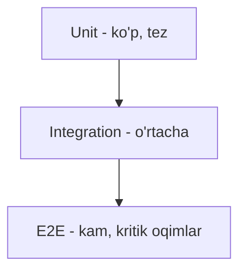

# Testing strategiyasi

## Test piramidasi



| Daraja | Soni | Tezlik | Nima |
|---|---|---|---|
| Unit | Ko'p | Tez | calc, money, phone, business rules |
| Integration | O'rta | O'rta | API endpoint'lar, DB |
| E2E | Kam | Sekin | To'liq oqimlar (order→pay→shift) |

## Unit test — eng muhim joylar

> [!important] Kritik unit test'lar
> Bu funksiyalar **mutlaqo** test qilinishi shart — pul va sync bilan bog'liq:

- `calculateOrderTotals` — [[../05-data-model/biznes-mantiq/total-hisoblash]] (har misol)
- `effectiveQuantity` — cancels hisobi
- `nextReceiptNumber` — [[../07-nozik-nuqtalar/chek-raqamlash]]
- `normalizePhone` — [[../07-nozik-nuqtalar/telefon-normalizatsiya]]
- `formatMoney`, `round`, `percentOf` — [[../07-nozik-nuqtalar/pul-valyuta-yaxlitlash]]
- `businessDate` — [[../07-nozik-nuqtalar/vaqt-va-soat]]
- Conflict resolution merge — [[conflict-resolution]]

```javascript
// Misol: total hisoblash test
describe('calculateOrderTotals', () => {
  it('discount service\'dan oldin', () => {
    const order = { foods: [{foodPrice:100000, quantity:1, cancels:[]}],
                    discount:{type:'percent', percent:10},
                    service:{percent:6} };
    calculateOrderTotals(order);
    expect(order.discountAmount).toBe(10000);
    expect(order.service.amount).toBe(5400); // (100000-10000)*6%
    expect(order.totalPrice).toBe(95400);
  });
});
```

## Integration test

API endpoint'lar — test Mongo instance bilan:
- Auth flow (login → token → protected endpoint)
- Tenant guard (boshqa restoran → 403)
- RBAC (waiter cancel → 403)
- Feature toggle (disabled → 404)
- Order CRUD + payment
- Shift lifecycle

```javascript
describe('POST /orders', () => {
  it('faol smena yo\'q bo\'lsa rad etadi', async () => {
    const res = await request(app).post('/api/orders/create')
      .set('Authorization', `Bearer ${token}`).send(orderData);
    expect(res.status).toBe(400);
    expect(res.body.code).toBe('NO_ACTIVE_SHIFT');
  });
});
```

## E2E test — kritik oqimlar

Playwright (web) / integration (mobile):
- Restoran setup → menyu → order → tolov → smena yopish
- Offline → online sync ([[sinxronizatsiya/offline-to-online-otish]])
- Feature toggle on/off
- Possiz rejim oqimi

## Sync test (maxsus, eng murakkab)

> [!warning] Sync test'lari — eng muhim va eng qiyin
> Offline/online o'tish ko'p edge case. Maxsus test suite:

- Offline'da order yaratish → online → sync
- Konflikt (lokal paid, global cancel)
- Idempotency (event takror)
- Outbox tartibi
- Reconnect o'rtasida socket uzilishi
- Boshlang'ich sync ([[sinxronizatsiya/boshlangich-sync]])

Test harness: lokal + global ikkalasini ko'taradi, network simulyatsiya (uzish/ulash).

## Feature toggle test (har tool)

Har tool uchun ([[../03-tool-strategiyasi/tool-qoshish-shabloni#Test rejasi yozish]]):
- Default OFF
- Enable/disable
- Disabled → 404
- Disable → data qoladi
- Re-enable → data qaytadi
- **O'chiq paytda core flow buzilmaydi** ⭐

## Mock'lar

Tashqi servislar mock:
- Kaspi API → mock webhook
- WhatsApp → mock
- FCM → mock
- SMS gateway → mock

## Test data

- Seed script — soxta restoran, filial, menyu, order
- Factory pattern (har entity uchun)
- Staging — to'liq seed data

## Coverage maqsadi

- Kritik (calc, sync, auth): ~90%
- Business logic: ~80%
- Umumiy: ~70%
- UI: kritik oqimlar

## CI'da

Har PR'da: lint + unit + integration. Merge oldidan: E2E. ([[../09-deployment/ci-cd]])

## Bog'liq

- [[../05-data-model/biznes-mantiq/total-hisoblash]]
- [[sinxronizatsiya/offline-to-online-otish]]
- [[../03-tool-strategiyasi/tool-qoshish-shabloni]]
- [[../09-deployment/ci-cd]]
