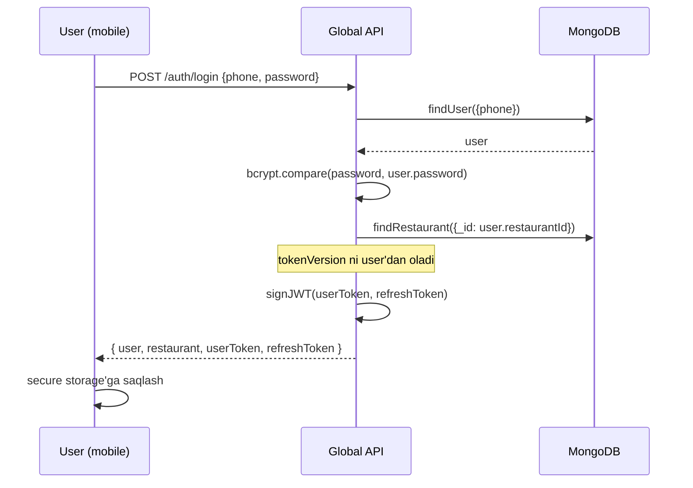
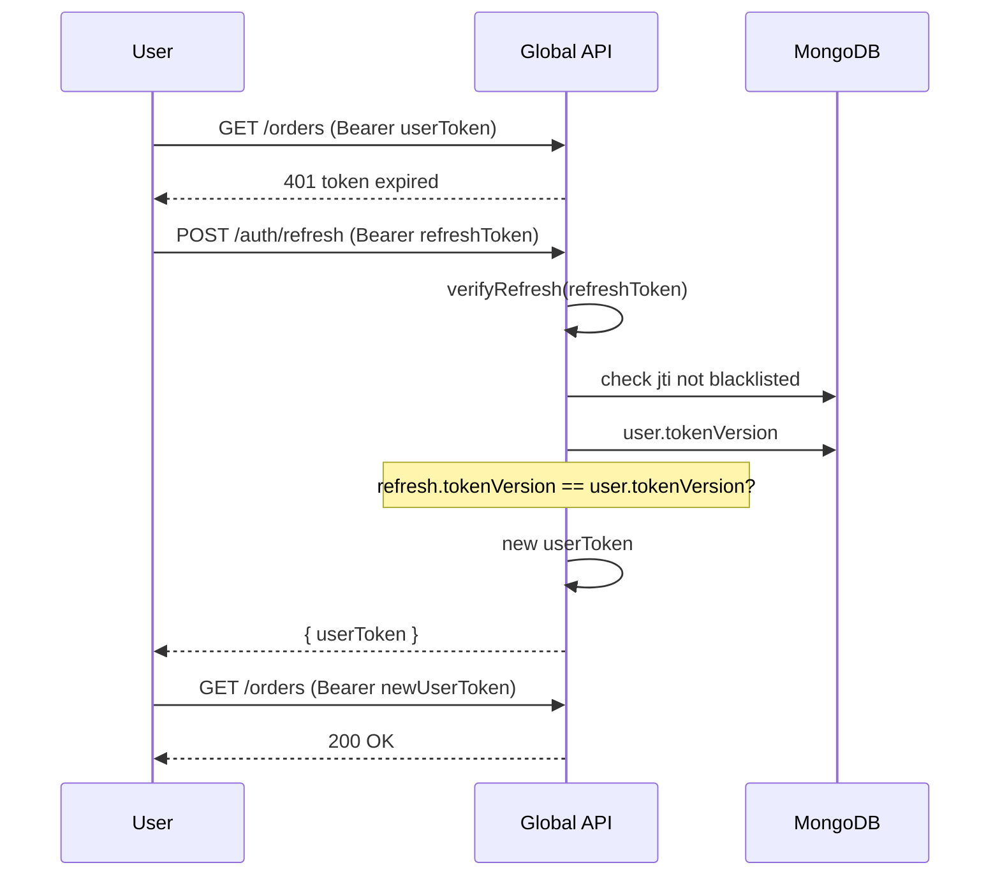

# Auth strategiyasi

## Token turlari

Tizimda 4 xil token aylanadi:

| Token | Egasi | Yashash davri | Saqlash joyi |
|---|---|---|---|
| **userToken** | User (admin, waiter, cook, cashier) | 7 kun | Mobile secure storage |
| **refreshToken** | User | 30 kun | Mobile secure storage |
| **restaurantOwnerToken** | Restoran egasi | 7 kun | Web admin localStorage |
| **branchToken** | Lokal backend (POS PC) | 1 yil | C:\ProgramData (admin only) |

## JWT structure

### userToken (qisqa muddatli)
```json
{
  "type": "user",
  "userId": "65f...",
  "restaurantId": "65f...",
  "branchId": "65f...",
  "role": "waiter",
  "tokenVersion": 3,
  "iat": 1717000000,
  "exp": 1717604800
}
```

`tokenVersion` — user document'da ham bor. Server tomon tekshiruvi:
- Token'dagi version < DB'dagi version → token bekor (revoked)

Bu yo'l bilan logout, role change, branch change paytida eski token'ni bekor qilish oson.

### refreshToken
```json
{
  "type": "refresh",
  "userId": "65f...",
  "tokenVersion": 3,
  "jti": "uuid",     // unique ID, blacklist uchun
  "iat": 1717000000,
  "exp": 1719592000
}
```

`jti` — JWT ID. Blacklist'ga qo'shsa bekor qilinadi.

### restaurantOwnerToken
Xuddi userToken, lekin `role: 'owner'` va `userId` o'rniga `restaurantId`.

### branchToken
```json
{
  "type": "branch",
  "branchId": "65f...",
  "restaurantId": "65f...",
  "issuedFor": "local-backend",
  "iat": 1717000000,
  "exp": 1748536000
}
```

1 yilga. POS PC'ga installer paytida yoziladi.

## Login oqimi (user)



## Refresh token oqimi

userToken muddati tugadi:


> [!note] Refresh — yangi refresh ham beradimi?
> Sliding refresh: yangi refresh token ham qaytarish mumkin (UX yaxshi, lekin replay xavfi). Default — yo'q. Refresh muddati tugagach foydalanuvchi qayta login qiladi.

## Logout

```javascript
// API
async function logout(userId, refreshTokenJti) {
  await db.refreshBlacklist.insert({ jti: refreshTokenJti, exp: ... });
  // userToken hali qisqa muddatli — o'zi tugab ketadi (yoki:)
  await db.users.update({ _id: userId }, { $inc: { tokenVersion: 1 } });
}
```

`tokenVersion` increment qilsak — barcha eski token'lar bekor bo'ladi. Bu — "logout barcha qurilmalarda" semantikasi.

Faqat shu qurilma'dan logout — refresh jti blacklist'ga.

## User document'ida tokenVersion

```javascript
// users.model.js patch
{
  ...
  tokenVersion: { type: Number, default: 1 },
}
```

Quyidagi paytda increment:
- Logout (all devices)
- Parol o'zgartirildi
- Role o'zgartirildi (admin xodimni promote qildi)
- Branch o'zgartirildi
- User vaqtincha bloklandi

## Middleware tekshiruvi

```javascript
async function authMiddleware(req, res, next) {
  const token = req.headers.authorization?.split(' ')[1];
  if (!token) return res.status(401).json({...});

  try {
    const payload = jwt.verify(token, JWT_SECRET);
    if (payload.type !== 'user') return res.status(401).json({...});

    const user = await usersModel.findById(payload.userId);
    if (!user) return res.status(401).json({...});

    // tokenVersion tekshiruvi
    if (payload.tokenVersion !== user.tokenVersion) {
      return res.status(401).json({code: 'TOKEN_REVOKED'});
    }

    // restaurantId/branchId moslashish
    if (payload.restaurantId !== user.restaurantId.toString()) {
      log.warn('TOKEN_TAMPER', { userId: payload.userId });
      return res.status(403).json({code: 'TENANT_MISMATCH'});
    }

    req.userData = user;
    req.userPayload = payload;
    next();
  } catch (err) {
    return res.status(401).json({...});
  }
}
```

## branchToken — alohida verify

Local backend (POS PC) → global VPS ulanish uchun:

```javascript
async function branchAuthMiddleware(socketAuth) {
  const payload = jwt.verify(socketAuth.branchToken, BRANCH_SECRET);
  if (payload.type !== 'branch') throw new Error('not a branch token');

  const branch = await branchesModel.findById(payload.branchId);
  if (!branch) throw new Error('branch not found');
  if (branch.tokenRevoked) throw new Error('branch token revoked');

  return { branchId: payload.branchId, restaurantId: payload.restaurantId };
}
```

> [!note] BRANCH_SECRET alohida
> userToken uchun JWT_SECRET, branchToken uchun BRANCH_SECRET — ikkalasi alohida. Bittasi kompromiss bo'lsa, ikkinchisi mustahkam qoladi.

## Mobile ilova: secure storage

iOS — Keychain
Android — EncryptedSharedPreferences yoki Keystore-backed
Flutter — `flutter_secure_storage` library

Token'lar disk'da plaintext bo'lmasligi shart.

## Foydalanuvchi tajribasi

- Login: phone + password
- "Esda saqlash" — refresh token saqlash
- Auto-login: app ochildi → refresh token bilan userToken oladi
- Tokenlar uzilsa — login screen ko'rinadi
- Inactive 7 kun → barcha tokenlar tugaydi, qayta login

## Bog'liq

- [[restoran-auth-tuzatish]] — joriy eski middleware'ni almashtirish
- [[role-based-access]]
- [[secrets-management]] — JWT_SECRET, BRANCH_SECRET
- [[tenant-izolyatsiyasi]]
