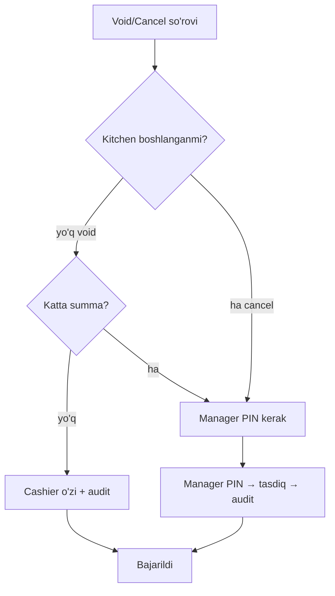

# Xodim firibgarligi nazorati

> [!important] Eng katta real POS pul yo'qotish manbai
> Texnik hujum emas — **insofsiz xodim**. Kassir mijozdan naqd oladi, keyin order'ni void qiladi va pulni cho'ntakka uradi. Yoki soxta refund. Bu — restoranlarda eng keng tarqalgan yo'qotish.

## Qarorlar (foydalanuvchi, 2026-05-29)

| Nazorat | Qaror |
|---|---|
| Void/Cancel | Kitchen boshlamagan → cashier; **kitchen boshlangan YOKI katta summa → manager PIN** |
| Item o'zgartirish | Mumkin (3 plov → 2), lekin kitchen boshlangan item kamaytirishda manager PIN + **oshxonaga delta check** |
| Anomaliya | Faqat **hisobotda** (real-time alert emas) |
| Staff meal | Hozircha yo'q |
| Cash drawer no-sale | Ochiq (foydalanuvchi qarori kutilmoqda) |

## Manager PIN tushunchasi

POS'da **manager-level PIN** — maxsus operatsiyalar uchun tasdiq:
- Manager (branch_admin/owner yoki maxsus huquqli) PIN'i
- Cashier o'zining ishida, lekin "manager tasdig'i kerak" amallarda manager PIN kiritiladi
- Har tasdiq audit log'da (qaysi manager, qachon, nima)

```javascript
user.managerPin: String,  // hash, faqat branch_admin+ uchun
// Maxsus amal → POS manager PIN so'raydi → tasdiqlanadi → audit
```

## Void / Cancel nazorati



```javascript
async function requestVoidCancel(orderId, actor, reason, managerPin) {
  const order = await orderModel.findById(orderId);
  const kitchenStarted = order.foods.some(f =>
    ['cooking','ready','served'].includes(f.cookingStatus));
  const isLarge = order.totalPrice >= restaurant.config.voidApprovalThreshold;

  if (kitchenStarted || isLarge) {
    // Manager PIN majburiy
    const manager = await verifyManagerPin(order.branch, managerPin);
    if (!manager) throw new Error('Manager tasdig\'i kerak');
    await audit.log({ kind: kitchenStarted ? 'cancel_approved' : 'void_approved',
      managerId: manager._id, cashierId: actor._id, orderId, reason, amount: order.totalPrice });
  } else {
    await audit.log({ kind: 'void', actor: actor._id, orderId, reason });
  }

  // void yoki cancel ([[../../07-nozik-nuqtalar/order-operatsion-edge]])
  order.cancelType = kitchenStarted ? 'cancel' : 'void';
  order.isCancel = true;
  // ...
}
```

`voidApprovalThreshold` — config (masalan 100 000 so'm). Undan katta void/cancel → manager.

## Item-level o'zgartirish (yangi tafsilot)

> Foydalanuvchi: *"foydalanuvchi faqat butun orderni cancel qilmasligi mumkin... 3 ta plov → 2 ta yoki 1 ta. povor tomonga stol va order raqami va qaysi taom qanchaga kamaydi yoki kopaygani check print bolishi kerak"*

- Kassir/waiter **alohida taom** miqdorini o'zgartiradi (kamaytirish/oshirish)
- `order.foods[i].cancels[]` (inc/dec, changeVal, reason) — [[../../05-data-model/order]]
- **Kitchen boshlangan taomni kamaytirish** → manager PIN (yuqoridagi kabi)
- **Oshxonaga delta check bosiladi:**

```
┌────────────────────────────┐
│ OSHXONA — O'ZGARISH         │
│ Stol 5 · Order YUN-...0042  │
├────────────────────────────┤
│ Plov:  3 → 2  (−1)          │
│ Sabab: mijoz kamaytirdi     │
│ Vaqt: 14:15                 │
└────────────────────────────┘
```

Bu — povorga aniq nima o'zgarganini bildiradi (ortiqcha tayyorlamaydi yoki to'xtatadi). Tafsilot: [[../../07-nozik-nuqtalar/pre-bill-chek-print#Item o'zgarish → oshxona delta]]

## Refund nazorati

Allaqachon qattiq ([[../../05-data-model/biznes-mantiq/cancel-refund]]):
- Faqat `branch_admin`/`owner` (cashier emas)
- Sabab majburiy
- Audit warn
- Cashback/stock qaytariladi

## Anomaliya — hisobotda (real-time alert emas)

Qaror: anomaliyalar **hisobotda** ko'rinadi, admin o'zi tekshiradi (real-time alert yo'q).

Kunlik/haftalik fraud hisoboti:
```
┌────────────────────────────────────────┐
│ Firibgarlik signallari — 28.05.2026     │
├────────────────────────────────────────┤
│ Kassir Dilshod:                          │
│   Void: 12 (o'rtacha 3) ⚠️               │
│   Kassa farqi: −15 000 ⚠️                │
│ Kassir Alisher:                          │
│   Refund: 5 (o'rtacha 1) ⚠️              │
│   No-sale ochish: 8                      │
├────────────────────────────────────────┤
│ Eng katta void: YUN-...0089 (250k)       │
└────────────────────────────────────────┘
```

Kuzatiladigan signallar:
- Void/cancel soni (kassir bo'yicha, o'rtachadan yuqori)
- Refund soni
- Discount qo'llanishi
- Kassa farqi (discrepancy) — **asosiy signal**
- No-sale ochishlar (har doim log)
- Bekor qilingan order summasi

> [!note] Real-time vs hisobot
> Security anomaliyalari (cross-tenant, secret) — real-time critical alert ([[audit-log]]). **Xodim fraud anomaliyalari** — hisobotda (foydalanuvchi qarori). Sabab: fraud darhol to'xtatish shart emas, lekin admin muntazam ko'rib chiqadi.

## Audit — har shubhali amal

Barcha quyidagilar `audit_log`'da ([[audit-log]]):
- Har void/cancel (kim, sabab, summa, manager tasdig'imi)
- Har refund
- Har katta discount
- Kassa farqi (discrepancy)
- No-sale drawer ochish (kim/qachon/sabab)
- Manager PIN ishlatilishi

## Cash drawer no-sale (qaror 2026-05-29)

> [!important] Qaror: no-sale log qilinadi, asosiy nazorat — smena kassa farqi
> Foydalanuvchi ta'kidladi: muhim narsa — smena **qancha pul bilan ochilgani va qancha bilan yopilgani**. Bu allaqachon dizaynda ([[../../05-data-model/biznes-mantiq/shift-lifecycle]] — `openingCash`, `closingCash`, `closingDiscrepancy`).

**Mantiq — discrepancy hammasini ushlaydi:**
- Kassir no-sale ochib pul olsa ham → smena yopilishida kassa **kam chiqadi** → discrepancy → aniqlanadi
- Demak no-sale uchun **manager ruxsati shart emas** (ish sekinlashmasin)
- No-sale shunchaki **log qilinadi** (kim, qachon, sabab) — discrepancy topilganda tergov uchun

| Nazorat darajasi | Qaror |
|---|---|
| **Asosiy** | Smena openingCash → closingCash → discrepancy (har naqd o'g'irlikni ushlaydi) |
| **Qo'llab-quvvatlovchi** | No-sale ochishlar audit log'da (kim/qachon/sabab) |
| **Hisobot** | No-sale soni kassir bo'yicha fraud hisobotida |

```javascript
async function openDrawerNoSale(actor, reason) {
  await hardware.openCashDrawer();
  await audit.log({ kind: 'drawer_no_sale', actor: actor._id, reason, shiftId, ts: now() });
  // Manager ruxsati shart emas — discrepancy asosiy nazorat
}
```

## Smena kassa farqi (discrepancy) — ASOSIY nazorat

> [!important] Eng aniq fraud signali
> Smena **qancha pul bilan ochilgani va yopilgani** — foydalanuvchi ta'kidlagan asosiy nazorat.

[[../../05-data-model/biznes-mantiq/shift-lifecycle#Discrepancy hisoblash]]:
- `openingCash` — smena ochilganda kassada qancha pul (kassir kiritadi)
- `closingCash` — smena yopilganda real kassa (kassir sanaydi)
- `expectedCash = openingCash + cashRevenue`
- `discrepancy = closingCash − expectedCash`
- `discrepancy < 0` → pul yetishmaydi (o'g'irlik yoki xato) → fraud hisobotida ⚠️
- Kassir handover'da ham kassa sanaladi ([[../../07-nozik-nuqtalar/order-operatsion-edge]])

Bu — har qanday naqd o'g'irlikni (void fraud, no-sale, oddiy o'g'irlik) **yakuniy ushlaydigan** nazorat. Boshqa barcha nazoratlar (manager PIN, audit) — buni qo'llab-quvvatlaydi.

## Schema qo'shimchalar

```javascript
user.managerPin: String,                    // hash
order.cancelApprovedBy: ObjectId,           // manager (agar tasdiq bo'lsa)
order.foods[i].cancels[i].approvedBy: ObjectId,
restaurant.config.voidApprovalThreshold: Number,
```

## Test rejasi

- [ ] Void (kitchen boshlamagan, kichik) → cashier o'zi
- [ ] Cancel (kitchen boshlangan) → manager PIN
- [ ] Katta summa void → manager PIN
- [ ] Manager PIN noto'g'ri → rad
- [ ] Item kamaytirish → kitchen delta check
- [ ] Kitchen boshlangan item kamaytirish → manager PIN
- [ ] Refund → faqat admin/owner
- [ ] Fraud hisoboti (void/refund/discrepancy bo'yicha)
- [ ] Har amal audit'da
- [ ] Manager PIN audit'da

## Bog'liq

- [[kritik-risklar]]
- [[role-based-access]]
- [[audit-log]]
- [[../../05-data-model/biznes-mantiq/cancel-refund]]
- [[../../05-data-model/biznes-mantiq/shift-lifecycle]]
- [[../../07-nozik-nuqtalar/order-operatsion-edge]]
