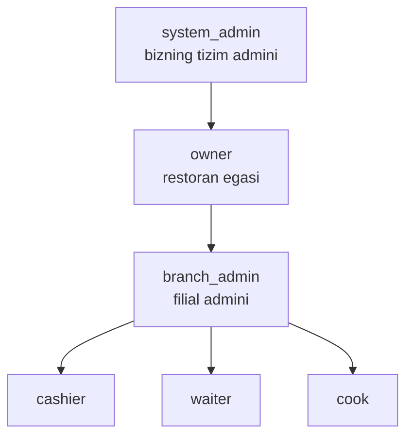

# Role-based access control (RBAC)

## Role ierarxiyasi



| Role | Tavsif | Doirasi |
|---|---|---|
| `system_admin` | AridaiPos tizimi admini | Barcha restoranlar |
| `owner` | Restoran egasi | Bitta restoran |
| `branch_admin` | Filial admini | Bitta filial |
| `cashier` | Kassir | Bitta filial |
| `waiter` | Ofitsiant | Bitta filial |
| `cook` | Oshpaz | Bitta filial |

## Joriy bazadagi muammo

Hozirgi [users.model.js](../../../global/backend/models/users.model.js):
```javascript
role: {
  type: String,
  enum: ["admin", "waiter", "cashier", "cook"],
}
```

Muammolar:
1. `admin` aniq emas — bu owner mi, branch_admin mi?
2. system_admin yo'q
3. RBAC middleware mavjud emas

Tuzatish: enum'ni quyidagiga o'zgartirish:
```javascript
role: {
  type: String,
  enum: ["system_admin", "owner", "branch_admin", "cashier", "waiter", "cook"],
}
```

Mavjud "admin" rolida bo'lganlar — `branch_admin`ga migrate qilinadi.

## Action matrix

Asosiy harakatlar va kim ularni qila oladi:

### Restoran boshqaruvi
| Harakat | system_admin | owner | branch_admin | cashier | waiter | cook |
|---|:-:|:-:|:-:|:-:|:-:|:-:|
| Restoran yaratish | ✅ | — | — | — | — | — |
| Restoran sozlamalari | ✅ | ✅ | — | — | — | — |
| Feature toggle yoqish/o'chirish | ✅ | ✅ | — | — | — | — |
| Restoran o'chirish | ✅ | — | — | — | — | — |

### Filial boshqaruvi
| Harakat | system_admin | owner | branch_admin | cashier | waiter | cook |
|---|:-:|:-:|:-:|:-:|:-:|:-:|
| Filial yaratish | ✅ | ✅ | — | — | — | — |
| Filial sozlamalari | ✅ | ✅ | ✅ | — | — | — |
| Filial o'chirish | ✅ | ✅ | — | — | — | — |

### Xodim boshqaruvi
| Harakat | system_admin | owner | branch_admin | cashier | waiter | cook |
|---|:-:|:-:|:-:|:-:|:-:|:-:|
| Xodim yaratish | ✅ | ✅ | ✅ | — | — | — |
| Xodim role o'zgartirish | ✅ | ✅ | ✅* | — | — | — |
| Xodim filialdan ko'chirish | ✅ | ✅ | — | — | — | — |
| Xodim o'chirish | ✅ | ✅ | ✅ | — | — | — |

(*) branch_admin faqat o'z filial xodimlari bilan

### Menyu (food/category)
| Harakat | system_admin | owner | branch_admin | cashier | waiter | cook |
|---|:-:|:-:|:-:|:-:|:-:|:-:|
| Yangi taom | ✅ | ✅ | ✅ | — | — | — |
| Taom o'zgartirish | ✅ | ✅ | ✅ | — | — | — |
| Taom o'chirish | ✅ | ✅ | ✅ | — | — | — |
| Taom ko'rish | ✅ | ✅ | ✅ | ✅ | ✅ | ✅ |

### Stol
| Harakat | system_admin | owner | branch_admin | cashier | waiter | cook |
|---|:-:|:-:|:-:|:-:|:-:|:-:|
| Stol qo'shish/o'chirish | ✅ | ✅ | ✅ | — | — | — |
| Stol tarifi | ✅ | ✅ | ✅ | — | — | — |
| Stol ko'rish | ✅ | ✅ | ✅ | ✅ | ✅ | — |

### Order
| Harakat | system_admin | owner | branch_admin | cashier | waiter | cook |
|---|:-:|:-:|:-:|:-:|:-:|:-:|
| Order yaratish | — | — | ✅ | ✅ | ✅ | — |
| Order taom qo'shish | — | — | ✅ | ✅ | ✅ | — |
| Order taom kamaytirish | — | — | ✅ | ✅ | ⚠️ | — |
| Order bekor qilish | — | ✅ | ✅ | ✅ | — | — |
| Order tolov | — | — | ✅ | ✅ | — | — |
| Order tarixi | ✅ | ✅ | ✅ | ✅ | ⚠️ | — |
| Order tayyorlash bayrog'i | — | — | — | — | — | ✅ |

(⚠️) cheklangan — faqat o'z orderlari (waiter)

### Smena
| Harakat | system_admin | owner | branch_admin | cashier | waiter | cook |
|---|:-:|:-:|:-:|:-:|:-:|:-:|
| Smena ochish | — | — | ✅ | ✅ | — | — |
| Smena yopish | — | — | ✅ | ✅ | — | — |
| Smena hisoboti | ✅ | ✅ | ✅ | ✅ | — | — |

### Sklad (toggle yoqilgan bo'lsa)
| Harakat | system_admin | owner | branch_admin | cashier | waiter | cook |
|---|:-:|:-:|:-:|:-:|:-:|:-:|
| Stock yangilash | — | ✅ | ✅ | — | — | — |
| Stock ko'rish | ✅ | ✅ | ✅ | ✅ | ✅ | ✅ |
| Inventory check | — | ✅ | ✅ | — | — | — |

### Hisobotlar
| Harakat | system_admin | owner | branch_admin | cashier | waiter | cook |
|---|:-:|:-:|:-:|:-:|:-:|:-:|
| Filial hisoboti | ✅ | ✅ | ✅ | — | — | — |
| Restoran hisoboti | ✅ | ✅ | — | — | — | — |
| Sistemali hisobot | ✅ | — | — | — | — | — |

## Middleware implementation

```javascript
// xavfsizlik/role.middleware.js
export function requireRole(...allowedRoles) {
  return (req, res, next) => {
    if (!req.userData) return res.status(401).json({...});
    if (!allowedRoles.includes(req.userData.role)) {
      audit.log({
        kind: 'rbac_denied',
        userId: req.userData._id,
        role: req.userData.role,
        attempted: req.path,
        required: allowedRoles
      });
      return res.status(403).json({
        status: 'error',
        code: 'INSUFFICIENT_ROLE',
        message: `Bu amal uchun ${allowedRoles.join('/')} role kerak`
      });
    }
    next();
  };
}

// Ishlatish:
router.post('/foods',
  authMiddleware,
  tenantGuard,
  requireRole('owner', 'branch_admin'),
  upload.single('image'),
  createFood
);
```

## Maxsus holatlar

### Waiter o'z orderini boshqaradi (resource ownership)

```javascript
function requireOrderOwnership(req, res, next) {
  const order = req.orderData; // avval load qilingan
  if (req.userData.role === 'waiter' &&
      order.waiter.toString() !== req.userData._id.toString()) {
    return res.status(403).json({...});
  }
  next();
}
```

### Soft permission (cancel paytida)
Waiter order **bekor qila olmaydi** — lekin cashier'ga "bekor qilish so'rovi" yuborishi mumkin. Cashier ko'radi va tasdiqlaydi. Bu — domain logic, alohida endpoint `POST /orders/:id/cancel-request`.

## Frontend conditional render

```jsx
// hooks/useRole.js
const { user } = useAuth();
const can = useMemo(() => ({
  createFood: ['owner', 'branch_admin', 'system_admin'].includes(user.role),
  cancelOrder: ['cashier', 'branch_admin', 'owner'].includes(user.role),
  // ...
}), [user.role]);

// Component
{can.createFood && <Button>Yangi taom</Button>}
```

UI darajadagi tekshiruv — **UX uchun**, asosiy xavfsizlik backend'da.

## Audit (RBAC violations)

Har "INSUFFICIENT_ROLE" 403 — audit log'ga. Real-time monitoring: bitta user'da 5+ violation in 5 min → alert (manipulation attempt?).

## Bog'liq

- [[auth-strategiyasi]]
- [[tenant-izolyatsiyasi]]
- [[audit-log]]
- [[../multi-tenant-xavfsizlik]]
