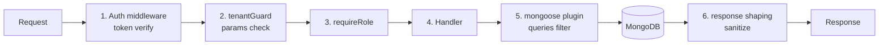

# Tenant izolyatsiyasi

> Maqsad: hech qachon, hech qanday yo'l bilan A restoran ma'lumotlari B restoranga oqib o'tmasligi. Bir filial ma'lumotlari boshqa filialga oqib o'tmasligi.

## Modellar va to'g'ri foydalanish

Har bir entity'da quyidagilar bo'lishi shart:
- `restaurantId` — qaysi restoran (top-level boundary)
- `branchId` — qaysi filial (sub-boundary, agar tegishli bo'lsa)

Mavjud bazada bu **noto'liq**. Tuzatish kerak:

| Model | Joriy holat | Kerakli holat |
|---|---|---|
| `restaurant` | - | _id o'zi |
| `branch` | restaurant ✅ | + (tezroq indekslash uchun branchId index'da yana ham) |
| `user` | branch ✅ | + `restaurantId` (denormalize) |
| `food` | branch ✅ | + `restaurantId` |
| `category` | branch ✅ | + `restaurantId` |
| `table` | branch ✅ | + `restaurantId` |
| `order` | branch ✅ | + `restaurantId` |
| `discount` | branch ✅ | + `restaurantId` |
| `service` | branch ✅ | + `restaurantId` |
| `shift` | branch ✅ | + `restaurantId` |

> [!note] Nima uchun `restaurantId` ham?
> 1. **Tezlik** — query'da darhol filterlash, branch join siz
> 2. **Xavfsizlik** — token'dagi restaurantId bilan to'g'ridan-to'g'ri taqqoslash
> 3. **Multi-tenant index** — `{restaurantId: 1, branchId: 1, _id: 1}` compound index
> 4. **Denormalization** — restoran va filial endi alohida qism

## Migratsiya (mavjud data uchun)

```javascript
// scripts/add-restaurant-id-denorm.js
const branches = await branchesModel.find().lean();
for (const b of branches) {
  await foodModel.updateMany({ branch: b._id }, { restaurantId: b.restaurant });
  await categoryModel.updateMany({ branch: b._id }, { restaurantId: b.restaurant });
  // ...
}
```

## Mongoose plugin: avtomatik filter

```javascript
// xavfsizlik/mongoose-tenant.plugin.js
export function tenantPlugin(schema) {
  // pre find/findOne/findOneAndUpdate
  ['find', 'findOne', 'findOneAndUpdate', 'count', 'updateOne', 'updateMany'].forEach(op => {
    schema.pre(op, function() {
      const opts = this.getOptions();
      if (opts.__tenantSafe) return; // explicit override

      if (!opts.__tenantRestaurantId) {
        throw new Error(`tenant filter qo'yilmagan: ${op}`);
      }
      this.where({ restaurantId: opts.__tenantRestaurantId });
      if (opts.__tenantBranchId) {
        this.where({ branchId: opts.__tenantBranchId });
      }
    });
  });
}
```

Har model'da plugin yoqiladi:
```javascript
foodSchema.plugin(tenantPlugin);
```

Endi:
```javascript
// Yomon (xato qaytaradi):
await foodModel.find({ name: 'Osh' });
// Error: tenant filter qo'yilmagan: find

// Yaxshi:
await foodModel.find({ name: 'Osh' }, null, {
  __tenantRestaurantId: req.userData.restaurantId,
  __tenantBranchId: req.userData.branchId,
});

// Yoki query helper:
await foodModel.findInTenant(req.userData).where({ name: 'Osh' });
```

## Query helper

```javascript
// Modellarga static method qo'shish
foodSchema.statics.findInTenant = function(userData) {
  return this.find().setOptions({
    __tenantRestaurantId: userData.restaurantId,
    __tenantBranchId: userData.branchId,
  });
};
```

## Middleware: tenantGuard

```javascript
// xavfsizlik/tenant.middleware.js
export async function tenantGuard(req, res, next) {
  const tokenRestaurantId = req.userPayload.restaurantId;
  const tokenBranchId = req.userPayload.branchId;

  // params'dagi har qanday id ni tekshirish
  const checkIds = [
    { param: 'branchId', value: req.params.branchId || req.body.branchId, expected: tokenBranchId },
    { param: 'restaurantId', value: req.params.restaurantId, expected: tokenRestaurantId },
  ];

  for (const c of checkIds) {
    if (c.value && c.value !== c.expected) {
      audit.log({
        kind: 'cross_tenant_attempt',
        userId: req.userData._id,
        attempted: { [c.param]: c.value },
        actual: { [c.param]: c.expected },
        path: req.path,
      });
      return res.status(403).json({
        status: 'error',
        code: 'TENANT_BOUNDARY_VIOLATION'
      });
    }
  }
  next();
}
```

## Socket darajadagi guard

Har socket event payload'ida `restaurantId` va `branchId` bor (qarang [[../socket-sinxronizatsiya]]).

```javascript
io.on('connection', (socket) => {
  const auth = socket.auth; // handshake'da olingan

  socket.use(([eventName, eventData], next) => {
    if (eventData?.restaurantId && eventData.restaurantId !== auth.restaurantId) {
      audit.log({ kind: 'socket_cross_tenant', socketId: socket.id, ... });
      return next(new Error('tenant mismatch'));
    }
    if (eventData?.branchId && eventData.branchId !== auth.branchId) {
      return next(new Error('branch mismatch'));
    }
    next();
  });
});
```

## Room hierarchy (socket)

Server tomon foydalanuvchini boshqarilgan room'larga avtomatik qo'shadi:

```javascript
io.on('connection', async (socket) => {
  const { restaurantId, branchId, userId, role } = socket.auth;
  socket.join(`restaurant:${restaurantId}`);
  socket.join(`branch:${branchId}`);
  socket.join(`role:${role}:branch:${branchId}`);
  socket.join(`user:${userId}`);

  // Mijoz iltimosi orqali room'ga qo'shilish — taqiqlangan
  socket.on('join', () => {
    audit.log({ kind: 'socket_join_attempt', socketId: socket.id });
    socket.disconnect();
  });
});
```

Broadcast'lar har doim **shu room'lar ichida**:
```javascript
io.to(`branch:${branchId}`).emit('order.created', data);
```

## Aggregation pipeline ham xavfsiz

Mongoose'ning `aggregate()` plugin'ni o'tkazib yuboradi! Maxsus tutish:

```javascript
schema.pre('aggregate', function() {
  const pipeline = this.pipeline();
  const opts = this.options;
  if (!opts.__tenantRestaurantId) {
    throw new Error('aggregate tenant filter qo`yilmagan');
  }
  pipeline.unshift({
    $match: { restaurantId: opts.__tenantRestaurantId }
  });
});
```

## Defense in depth (qatlamlar)



Har qatlam mustaqil. Bittasi bekor qilinsa — boshqalari ushlab qolishi kerak.

## Test rejasi

- [ ] User A token bilan user B branch resurs'iga POST → 403
- [ ] User A token bilan boshqa restoran resurs ID → 403
- [ ] Mongoose plugin'ni o'tkazib yuborgan query → throw
- [ ] Aggregate plugin'ni o'tkazib yuborgan query → throw
- [ ] Socket auth'siz connect → reject
- [ ] Socket boshqa branchId payload → reject + disconnect
- [ ] `socket.join()` mijoz iltimosi → disconnect

## Mavjud routelarda muammolar

Hozirgi backend'da `tenantGuard` umuman yo'q. Tuzatishi shart bo'lgan endpointlar:
- [routes/branch.routes.js](../../../global/backend/routes/branch.routes.js) — `restaurantId` parametri token bilan moslashtirilmagan
- [routes/food.routes.js](../../../global/backend/routes/food.routes.js) — `branchId` filter yo'q
- [routes/order.routes.js](../../../global/backend/routes/order.routes.js) — har order branchId tekshirilmagan
- Va boshqa hammasi

Bularning hammasiga `tenantGuard` qo'shilishi shart. [[restoran-auth-tuzatish]] bilan birga.

## Bog'liq

- [[../multi-tenant-xavfsizlik]] — yuqori darajadagi
- [[role-based-access]]
- [[socket-xavfsizligi]]
- [[audit-log]]
