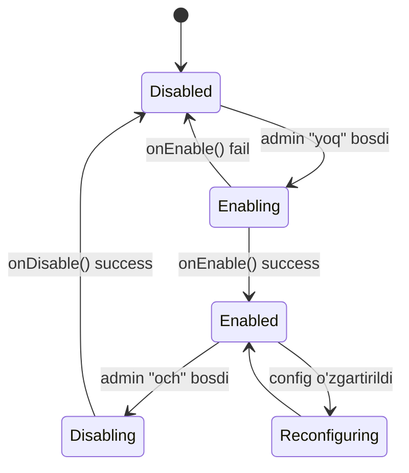
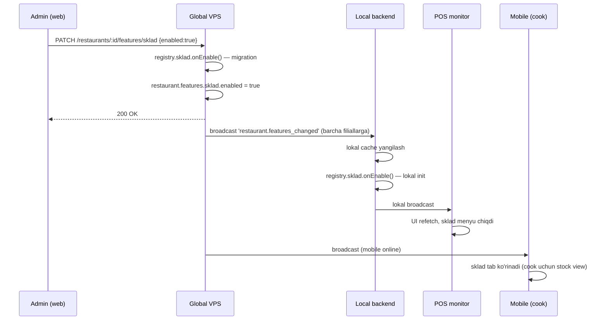

# Feature toggle tizimi

> [!important] Bu — vault'dagi eng muhim hujjat
> Butun [[../01-vizyon/choziluvchanlik-printsipi|choziluvchanlik printsipi]] shu tizimga tayanadi. Bu yerda yozilgan dizayn buzilsa — butun vizyon buziladi.

## Maqsad

Restoranni admin paneldan bitta checkbox bilan tool yoqish/o'chirish imkoni. O'chirilgan tool — tizimda **xuddi yo'q kabi**. Yoqilgan tool — tizimda **tabiiy mavjud** kabi. Hech qanday `if (sklad_yoq) skip` kabi xunuk kod yo'q.

## ⭐ Production'da (jonli tizim) tool qo'shish

> [!important] Asosiy qiymat: tool'lar jonli tizimga, downtime'siz, boshqa restoranlarni buzmasdan qo'shiladi (qaror 2026-05-29)

Poydevor (toggle tizimi) bir marta qurilgach, yangi tool quyidagicha qo'shiladi — **jonli tizim ishlab turganda:**

1. Yangi tool kodi **default OFF** bilan deploy qilinadi (zero-downtime, additive)
2. Toggle OFF → **hech narsa o'zgarmaydi**, mavjud restoranlar sezmaydi
3. Kerakli restoran toggle'ni yoqadi → faqat **o'sha restoran** uchun ishlaydi
4. Boshqa restoran/filiallar ta'sirlanmaydi

**Shartlar:**
- **Poydevor avval** — Phase 0 (registry, `requireFeature`, lifecycle) bir marta ([[../01-vizyon/roadmap]])
- **POS ham yangilanadi** — tool global + lokal POS'da kerak; Electron auto-update orqali. Eski/offline POS to'liq yangilanmaguncha tool ishlamaydi ([[../07-nozik-nuqtalar/versiya-empty-state]])
- **Schema additive** — mavjud entity'ga field qo'shilsa optional/default (eski data buzilmaydi)
- **Core hook toggle bilan guard** — faqat yoqilganda ishlaydi ([[tool-lifecycle]])

**Natija:** minimal kafe faqat POS bilan ishlaydi; katta restoran keyinroq sklad+keshbek+qr yoqadi — hammasi jonli, bir-birini buzmasdan.

## Asosiy ma'lumot modeli

`restaurant` modeliga `features` mongoose subdocument:

```javascript
{
  _id, brand, logo, owner: {...},
  features: {
    offline:        { enabled: true,  config: {} },   // default ON
    possiz:         { enabled: false, config: {} },
    sklad:          { enabled: false, config: { lowStockAlert: 10 } },
    keldiKetti:     { enabled: false, config: {} },
    qrOrder:        { enabled: false, config: { publicUrl: null } },
    qrPay:          { enabled: false, config: { kaspiMerchantId: null } },
    keshbek:        { enabled: false, config: { percent: 5 } },
    // kelajakda: loyalty, reservation, delivery, kitchenDisplay, ...
  }
}
```

`config` ichida — tool'ga xos sozlamalar (Kaspi merchant ID, keshbek %, ...).

## Toggle Registry (kod tomonda)

`global/backend/features/registry.js`:

```javascript
export const FEATURES = {
  offline: {
    key: 'offline',
    displayName: { uz: 'Offline rejim', en: 'Offline mode' },
    description: { uz: 'Internet uzulganda lokal ishlash' },
    defaultEnabled: true,
    requires: [],        // boshqa featurelar talab qilinmaydi
    excludes: [],        // bir paytda boshqa feature bilan ishlay olmaydi
    onEnable: async (restaurantId, config) => { /* setup */ },
    onDisable: async (restaurantId) => { /* cleanup mantiq, data qoldiriladi */ },
    schemaPatch: null,   // model'ga qo'shimcha kerak emas
  },
  sklad: {
    key: 'sklad',
    displayName: { uz: 'Sklad', en: 'Inventory' },
    description: { uz: '...' },
    defaultEnabled: false,
    requires: [],
    excludes: [],
    onEnable: async (restaurantId, config) => {
      await runMigration('sklad_init', restaurantId);
      await registerEventListener('order.created', skladDecrement);
    },
    onDisable: async (restaurantId) => {
      await unregisterEventListener('order.created', skladDecrement);
      // lokal/global MongoDB'dagi stock ma'lumotlari qoladi
    },
    schemaPatch: 'sklad', // models/sklad/*.js yuklanadi
  },
  // ...
}
```

Bu registry har bir tool'ning **yagona haqiqat manbai**.

## 3 qatlamli tekshirish

### Qatlam 1: REST middleware

```javascript
// features/middleware.js
export function requireFeature(featureKey) {
  return async (req, res, next) => {
    const restId = req.userData.restaurantId; // tokendan
    const rest = await restaurantsModel.findById(restId).lean();
    if (!rest?.features?.[featureKey]?.enabled) {
      return res.status(404).json({
        status: 'error',
        code: 'FEATURE_DISABLED',
        message: `${featureKey} ushbu restoranda yoqilmagan`
      });
    }
    req.featureConfig = rest.features[featureKey].config;
    next();
  };
}

// routes/sklad.routes.js
router.use(authMiddleware, requireFeature('sklad'));
router.post('/items', ...);
```

### Qatlam 2: Socket event handler

```javascript
io.on('connection', (socket) => {
  socket.on('stock.changed', async (ev, cb) => {
    if (!await isFeatureEnabled(socket.auth.restaurantId, 'sklad')) {
      return cb({ ok: false, code: 'FEATURE_DISABLED' });
    }
    // ...
  });
});
```

### Qatlam 3: Frontend UI

Frontend (mobile + web admin) restoran connect bo'lganda `features` map'ini oladi:

```javascript
// Login response:
{ token, user, restaurant: { _id, features: {...} } }

// React render:
{features.sklad.enabled && <SkladTab />}
{features.qrPay.enabled && <KaspiButton />}
```

Yangi toggle yoqilsa — push event `restaurant.features_changed` keladi, frontend refetch qiladi.

## Toggle hayoti (lifecycle)



Tafsilot: [[tool-lifecycle]]

## Toggle bog'liqligi

Ba'zi tool'lar boshqalarga bog'liq:

```javascript
keshbek: {
  requires: ['baseCheck'],  // chek tizimi bo'lishi shart
  // ...
}

qrPay: {
  requires: ['onlineOnly'], // offline'da Kaspi ishlamaydi
  excludes: [],
}
```

Yoqayotganda — `requires` ham yoqiq emasligi tekshiriladi. Bo'sh bo'lsa — UI'da disabled, ustozni mavhum yoqish kerakligi yoziladi.

O'chirayotganda — agar boshqa tool unga `requires` qilgan bo'lsa, ogohlantirish ("Keshbek o'chirilsa, X tool ham o'chadi"). Qarang: [[modullar-orasidagi-bogliqlik]]

## Yangi tool qo'shish algoritmi (yuqori darajada)

1. [[tool-qoshish-shabloni]] bo'yicha tool fayl yarating
2. `FEATURES` registry'ga kalit qo'shing
3. Model patch yozing (kerak bo'lsa)
4. Route fayl yarating, `requireFeature` bilan o'rang
5. Socket event handler — `isFeatureEnabled` bilan o'rang
6. Frontend conditional render
7. onEnable/onDisable hook'larni yozing
8. Migration script (kerak bo'lsa)
9. Test: yoq → och → yoq oqimi
10. [[../06-changelog]] ga yozing

## Tool **o'chirilganda nima bo'lishini** kafolatlash

> [!warning] Tool o'chirilsa, qolgan tizim 100% ishlashi shart

Test rejasi har tool uchun:

1. Tool yoqilgan, ma'lumot bor
2. Tool o'chiriladi
3. Quyidagi senariolar buzilmasligi kerak:
   - Yangi order yaratish
   - Order to'lash
   - Smena yopish
   - Hisobot olish
4. Toolga oid menyu/tugma ko'rinmaydi
5. Toolga oid API endpoint 404 qaytaradi
6. Toolga oid socket event ignorat etiladi

Avtomatik test: `__tests__/features/{tool}.e2e.test.js` — har tool uchun on/off senariosi.

## Sinxronizatsiya bilan ko'shilish

Toggle o'zgargani:
1. Global VPS — `restaurant.features.sklad.enabled = false` (yozildi)
2. Global → barcha shu restoran filiallariga `restaurant.features_changed` broadcast
3. Har local backend qabul qiladi, lokal cache yangilanadi
4. Local'dagi handler'lar darhol o'zgaradi (event listener detach)
5. Mobile/POS UI'lar refetch qiladi

**Diqqat**: agar shu paytda filial offline bo'lsa — toggle o'zgarishi local'ga yetib bormaydi. Reconnect'da `sync.complete` paytida olib keladi.

## Misol: sklad toolini yoqish (uchidan uchgacha)



## Bog'liq

- [[../01-vizyon/choziluvchanlik-printsipi]]
- [[tool-lifecycle]]
- [[tool-qoshish-shabloni]]
- [[modullar-orasidagi-bogliqlik]]
- [[../04-toollar/_MOC]]
