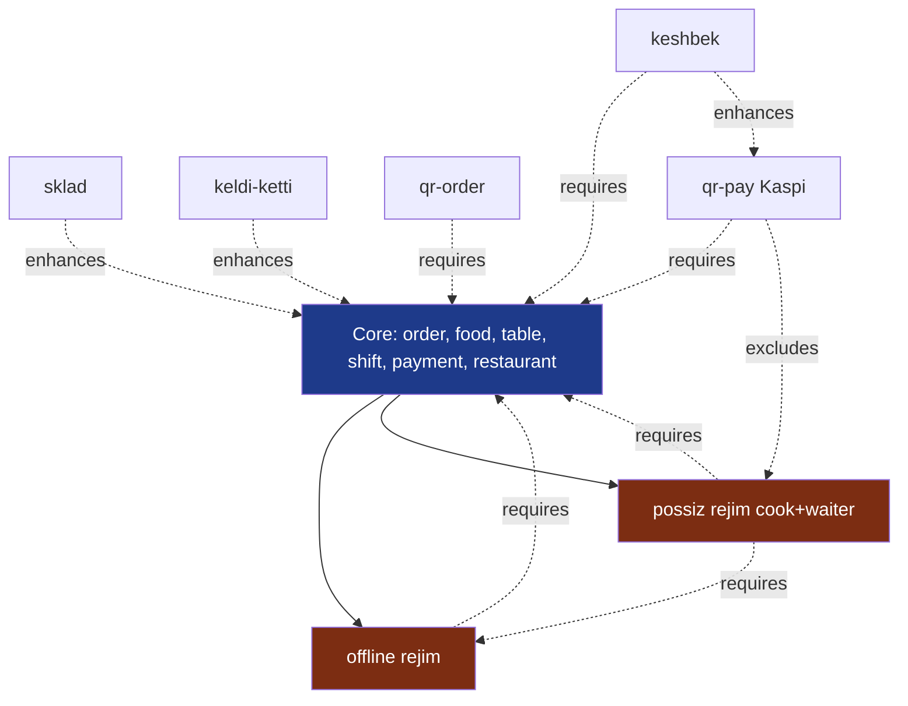

# Modullar orasidagi bog'liqlik

## Maqsad

Tool'lar ideal holda — **mustaqil**. Lekin amalda ba'zilari boshqalariga tayanadi. Bu hujjat shu bog'liqliklarni xaritalashtirib boradi.

## Bog'liqlik turlari

| Tur | Misol | Aks ta'sir |
|---|---|---|
| **requires** | `keshbek` → `baseCheck` (chek kerak) | Keshbek yoqish uchun chek tizimi bo'lishi shart |
| **excludes** | `qrPay` ↔ `offlineOnly` (yo'q, bu mantiqsiz, ham yoqila olmaydi) | Bir paytda ikkalasi yoqila olmaydi |
| **optional integration** | `sklad` → `order` (order yaratilsa stock kamayadi, lekin sklad bo'lmasa order bemalol) | Sklad yo'q — order bemalol |
| **enhances** | `keldiKetti` → `salary` hisoboti | KeldiKetti bo'lmasa salary qo'lda kiritiladi |
| **shares** | `qrOrder` va `qrPay` — ikkalasi ham QR generatsiya qiladi | Umumiy QR servisidan foydalanish |

## Joriy bog'liqlik grafi



## Tool-by-tool bog'liqlik jadvali

| Tool | requires | excludes | enhances |
|---|---|---|---|
| [[../04-toollar/online-offline-rejim\|offline]] | core | - | - |
| [[../04-toollar/cook-waiter-possiz-rejim\|possiz]] | core, offline | - | - |
| [[../04-toollar/sklad\|sklad]] | core | - | order, food |
| [[../04-toollar/keldi-ketti\|keldi-ketti]] | core | - | salary, shift |
| [[../04-toollar/qr-order\|qr-order]] | core, table | - | order |
| [[../04-toollar/qr-pay-kaspi\|qr-pay]] | core, payment | possiz | order |
| [[../04-toollar/keshbek-tizimi\|keshbek]] | core, payment | - | qr-pay, check |

## Yangi tool qo'shilganda graf yangilash

Yangi tool dizayn paytida [[tool-qoshish-shabloni]] da grafga element qo'shing va ushbu jadvalga qator qo'shing.

## Validation: yoqishda

Toggle yoqishda quyidagilar tekshiriladi:

```javascript
function canEnable(restaurantId, featureKey) {
  const tool = registry[featureKey];
  const rest = await restaurantsModel.findById(restaurantId);

  // requires
  for (const dep of tool.requires) {
    if (!rest.features[dep]?.enabled) {
      return { ok: false, reason: `${dep} avval yoqilishi kerak` };
    }
  }

  // excludes
  for (const exc of tool.excludes) {
    if (rest.features[exc]?.enabled) {
      return { ok: false, reason: `${exc} bilan birga ishlay olmaydi` };
    }
  }

  return { ok: true };
}
```

## Validation: o'chirishda

```javascript
function canDisable(restaurantId, featureKey) {
  const rest = await restaurantsModel.findById(restaurantId);

  // boshqa tool'lar shunga require qiladimi?
  for (const [otherKey, otherTool] of Object.entries(registry)) {
    if (otherKey === featureKey) continue;
    if (!rest.features[otherKey]?.enabled) continue;
    if (otherTool.requires.includes(featureKey)) {
      return {
        ok: false,
        reason: `${otherKey} ham o'chiriladi`,
        confirmRequired: true,
        cascade: [otherKey]
      };
    }
  }

  return { ok: true };
}
```

Cascade tasdig'i:
> "Sklad'ni o'chirsangiz, recipe-management tool ham o'chadi. Davom etaymizmi?"

## Maxsus holatlar

### "shares" (umumiy infrastruktura)

`qrOrder` va `qrPay` ikkalasi ham QR generatsiya qiladi. Buni bitta kuda yozish — `core/qr-generator/`. Hech qaysi tool unga `requires` qilmaydi, lekin ikkalasi ham ishlatadi. Bu — **infra** darajadagi, "feature" emas.

### "alternative implementations"

Kelajakda `payment` tool ostida bir nechta variantlar: `naqd`, `karta`, `kaspi`, `payme`, `humo`. Har biri alohida sub-toggle:
```javascript
features.payment.enabled = true,
features.payment.config = {
  methods: { naqd: true, karta: true, kaspi: false, payme: false }
}
```

Bu shaklda graf'da kichik kichik bog'liqlik chiqmaydi — markaziy `payment` modulida konfiguratsiya bo'ladi.

## Bog'liq

- [[feature-toggle-tizimi]]
- [[tool-qoshish-shabloni]]
- [[../04-toollar/_MOC]]
