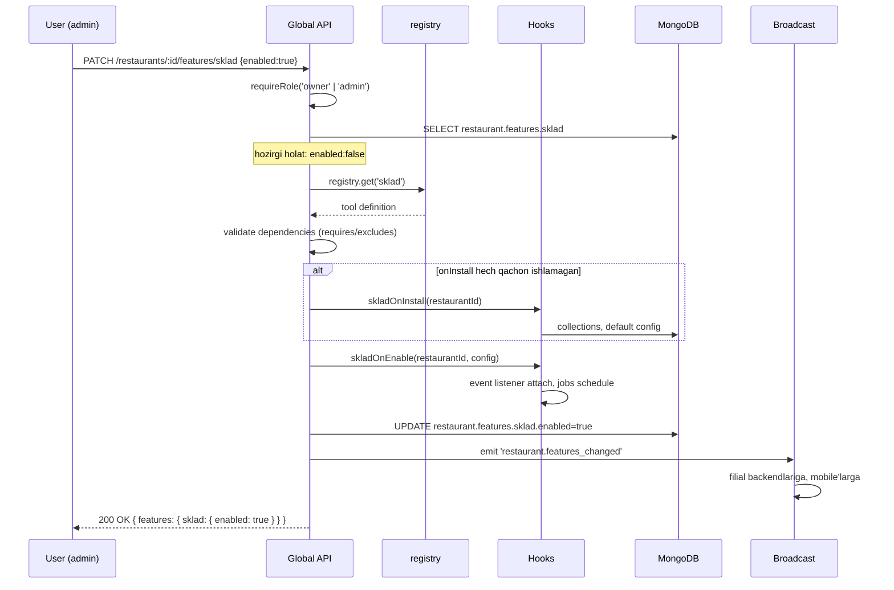

# Tool lifecycle (yoqish/o'chirish jarayoni)

## To'rt asosiy hodisa

| Hodisa | Qachon | Idempotent? | Reversible? |
|---|---|---|---|
| `onInstall` | Birinchi marta restoran yaratilganda yoki tool qo'shilganda | Ha | Yo'q (data qoladi) |
| `onEnable` | Toggle "off" dan "on" ga | Ha | Ha (onDisable) |
| `onDisable` | Toggle "on" dan "off" ga | Ha | Ha (onEnable) |
| `onUninstall` | Tool butunlay olib tashlanadi (kamdan-kam) | Ha | Yo'q (data o'chadi) |

## Har birining vazifasi

### onInstall

**Bir martalik** ishlar:
- Yangi collection/jadval yaratish
- Default `config` qiymatlar yozish
- Tashqi servislarga ro'yxatdan o'tish (masalan, WhatsApp webhook URL yozish)

Misol:
```javascript
async function skladOnInstall(restaurantId) {
  await mongoose.connection.db.createCollection('stocks');
  await mongoose.connection.db.createCollection('stock_movements');
  await mongoose.connection.db.createCollection('ingredients');

  await restaurantsModel.updateOne(
    { _id: restaurantId },
    { $set: { 'features.sklad.config': { lowStockAlert: 10, autoDeductOnOrder: true }}}
  );
}
```

**Diqqat**: collection allaqachon bor bo'lsa — xato qaytarmasligi kerak (idempotent).

### onEnable

**Qaytariladigan** ishlar:
- Event listener'larni `attach` qilish
- Socket handler'larni faollashtirish
- Background job'larni rejalashtirish
- Cache'ni issitish (warm up)
- Boshqa tool'larga "men qo'shildim" deb xabar berish

Misol:
```javascript
async function skladOnEnable(restaurantId, config) {
  // Order yaratilsa stock kamayadi
  eventBus.on(`order.created:${restaurantId}`, decrementStock);
  // Stock past bo'lsa admin'ga xabar
  eventBus.on(`stock.changed:${restaurantId}`, checkLowStock);
  // Har kuni 00:00 — kunlik xulosa
  scheduler.schedule(`sklad_daily_${restaurantId}`, '0 0 * * *', dailyReport);
}
```

### onDisable

**Tozalash** ishlar — lekin **data qoldiriladi**:
- Event listener'lar detach
- Background job'lar bekor
- Cache tozalash
- Boshqa tool'larga "men chiqdim" deb xabar

```javascript
async function skladOnDisable(restaurantId) {
  eventBus.off(`order.created:${restaurantId}`, decrementStock);
  eventBus.off(`stock.changed:${restaurantId}`, checkLowStock);
  scheduler.cancel(`sklad_daily_${restaurantId}`);
  // stocks collection o'chirilmaydi!
}
```

### onUninstall

**Xavfli** — admin tasdig'i so'raladi. Faqat tizim admini chaqirishi mumkin.

```javascript
async function skladOnUninstall(restaurantId) {
  await db.stocks.deleteMany({ restaurantId });
  await db.stock_movements.deleteMany({ restaurantId });
  await db.ingredients.deleteMany({ restaurantId });
}
```

Default — `onUninstall` `null`. Faqat ataylab implementatsiya qilinadi.

## Toggle o'zgarishi paytidagi to'liq oqim



## Xato holatlar

### `onEnable` o'rtasida xato

Misol: WhatsApp bot webhook ro'yxatdan o'tkazib bo'lmadi.

Rollback:
```javascript
try {
  await hooks.onEnable(restaurantId);
  await db.update({ enabled: true });
} catch (err) {
  await hooks.onDisable(restaurantId); // tozalab tashlash
  throw err;
}
```

### `onDisable` xato

Misol: scheduler.cancel xato qaytardi.

Strategiya: **`onDisable` har doim muvaffaqiyatli tugashi kerak**. Listener detach noaniq bo'lsa — log'ga yozib o'tib ketiladi. `enabled:false` baribir yoziladi. Sababi: o'chirish foydalanuvchining xohishi, uni bloklamaslik kerak.

### Filial offline'da toggle o'zgartirildi

Toggle global'da darhol yoziladi. Lokal `features_changed` event'ini reconnect'da oladi. Lekin:
- Lokal `enabled:true` bo'lsin, real'da `enabled:false` deb yangilanmoqda
- Lokal tool ishlayotgan kabi qabul qilaverasi
- Reconnect'da event keladi, listener detach qilinadi
- Bu davrda yaratilgan ma'lumotlar — qoladi, lekin yangi yozilmaydi

> [!note] Tool o'chirilgan paytdagi offline ma'lumot
> Agar admin "sklad" ni o'chirsa-yu, filial offline bo'lsa va lokal hali sklad operatsiya qilayotgan bo'lsa — bu kichik tartibsizlik. Reconnect'da local sklad'ga oid eventlar global'da `FEATURE_DISABLED` qaytariladi. Lokal log'ga yoziladi, admin'ga "shu order'lar uchun stock o'zgarishi sklad o'chirilgani uchun olinmadi" xabari boradi.

## Tool versiya boshqaruvi

Tool ko'p marta yangilanishi mumkin. Har versiyada `migrations[]`:

```javascript
sklad: {
  version: 3,
  migrations: [
    { v: 1, fn: createInitialCollections },
    { v: 2, fn: addLowStockAlertField },
    { v: 3, fn: addRecipeBOM },
  ],
}
```

`onInstall` paytida — barcha migration'lar ketma-ket. Restoran allaqachon `version: 2` bo'lsa — faqat `v: 3` migration ishlaydi.

Migration'lar `restaurant.features.sklad.installedVersion` da kuzatiladi.

## Bog'liq

- [[feature-toggle-tizimi]]
- [[tool-qoshish-shabloni]]
- [[modullar-orasidagi-bogliqlik]]
