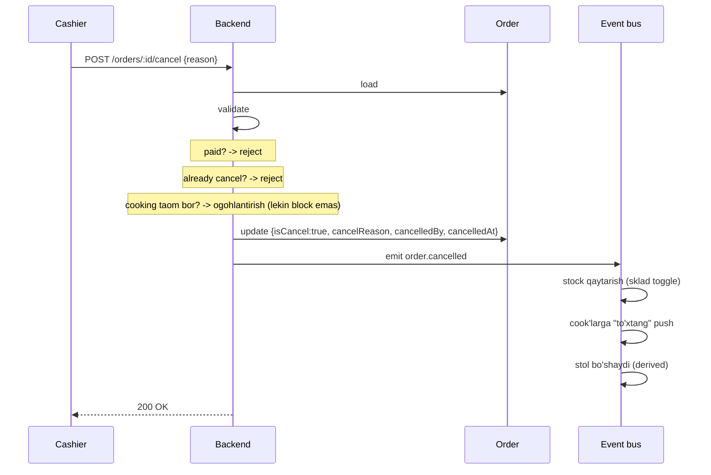
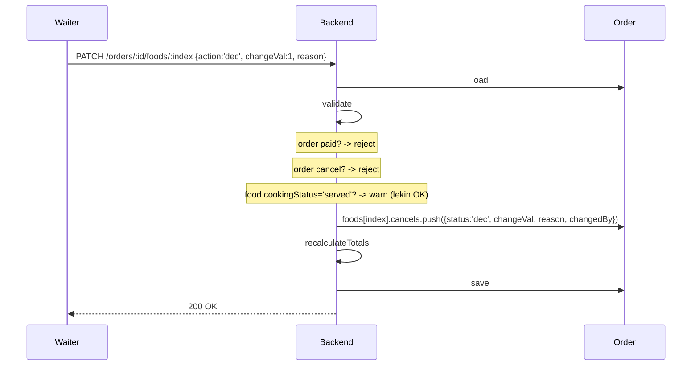

# Cancel va refund qoidalari

## Ikki turli operatsiya

| Operatsiya | Qachon | Kim qila oladi |
|---|---|---|
| **Cancel** | Tolanmagan order | cashier, branch_admin, owner |
| **Refund** | Tolangan order qaytarish | branch_admin, owner |
| **Food cancel** | Order ichida taom kamaytirish | waiter (o'ziniki), cashier, admin |

## Cancel oqimi (tolanmagan order)



```javascript
async function cancelOrder(orderId, reason, actor) {
  if (!reason || reason.trim().length < 3) {
    throw new Error('Cancel sababi majburiy (min 3 ta belgi)');
  }

  const order = await orderModel.findById(orderId);

  // Validations
  if (order.isCancel) throw new Error('Allaqachon bekor qilingan');
  if (order.paymentStatus === 'paid') {
    throw new Error('Tolangan order. Refund ishlating');
  }
  if (order.paymentStatus === 'partiallyPaid') {
    throw new Error('Bir qism tolangan. Avval refund qiling yoki adminga murojaat');
  }

  // RBAC — waiter o'z orderini bekor qila olmaydi
  if (actor.role === 'waiter') {
    throw new Error('Waiter cancel qila olmaydi. Cashier yoki adminga murojaat');
  }

  order.isCancel = true;
  order.cancelReason = reason;
  order.cancelledBy = actor._id;
  order.cancelledAt = new Date();
  order.lastModifiedAt = new Date();
  order.lastModifiedBy = { userId: actor._id, origin: 'local' };

  await order.save();
  await emit('order.cancelled', { order, reason, actor });

  await audit.log({
    kind: 'order_cancelled',
    severity: 'info',
    actor: { type: 'user', id: actor._id, role: actor.role },
    branchId: order.branch,
    data: { orderId, reason, totalPrice: order.totalPrice }
  });

  return order;
}
```

## Cancel sabab kategoriyalari (tavsiya)

Free-text emas, predefined categories + free-text:

```javascript
const CANCEL_REASONS = [
  'customer_changed_mind',      // mijoz fikri o'zgardi
  'food_unavailable',           // stockda yo'q
  'long_wait',                  // mijoz uzoq kutdi
  'wrong_order',                // noto'g'ri order
  'kitchen_problem',            // oshxonada muammo
  'customer_left',              // mijoz ketdi
  'staff_error',                // xodim xatosi
  'other',                      // boshqa (free text)
];
```

UI: dropdown + ixtiyoriy izoh.

Hisobotda: cancel statistikasi turlari bo'yicha — restoran zaif joylarini ko'rish.

## Cancelled order — totals'ga ta'siri

Smena totals'da:
```javascript
totals.cancelledOrders++;  // count
// Lekin revenue'ga qo'shilmaydi (paid emas)
```

Cancelled order'lar:
- Hisobotda alohida ko'rinadi
- Stock qaytarildi (sklad toggle)
- Order tarixiy data sifatida qoladi (hard delete emas)

## Food cancel (order ichida taom kamaytirish)

Order davomida ba'zi taomlar bekor qilinadi:



```javascript
async function decreaseFoodInOrder(orderId, foodIndex, changeVal, reason, actor) {
  const order = await orderModel.findById(orderId);
  if (order.isCancel || order.paymentStatus === 'paid') {
    throw new Error('O\'zgartirib bo\'lmaydi');
  }
  if (!order.foods[foodIndex]) throw new Error('Food index xato');

  const food = order.foods[foodIndex];
  const effective = effectiveQuantity(food);
  if (changeVal > effective) {
    throw new Error(`Ortiqcha kamayttirish: ${changeVal} > ${effective}`);
  }

  // Waiter faqat o'zining order'ini o'zgartira oladi
  if (actor.role === 'waiter' && order.waiter.waiterId.toString() !== actor._id.toString()) {
    throw new Error('Boshqa waiter order');
  }

  food.cancels.push({
    status: 'dec',
    changeVal,
    changeReason: reason,
    changedBy: actor._id,
    changedAt: new Date(),
  });

  calculateOrderTotals(order);
  await order.save();
  await emit('order.food_decreased', { order, foodIndex, changeVal });
}
```

## Food increase

`status: 'inc'` — order'ga taom qo'shish allaqachon ketgan paytdan keyin:

```javascript
food.cancels.push({
  status: 'inc',
  changeVal: 1,  // 1 ta qo'shildi
  changeReason: 'mijoz xohladi',
  changedBy: actor._id,
  changedAt: new Date(),
});
```

> [!note] cancels nomi xato?
> "cancels" so'zi `inc` ham bor — mantiq bo'yicha noto'g'ri. Tuzatish: `changes` deb nomlash kerak. Lekin joriy schema'da `cancels` nomi bor.
>
> Tavsiya: yangi schema patch'da `changes` deb nomlash. Eski'ga backward compat.

## Refund (tolangan order qaytarish)

Tafsilot: [[tolov-oqimi#Tolov bekor qilish (refund)]]

Asosiy farqlar:
- Faqat `branch_admin`, `owner` qila oladi
- Sabab majburiy
- Cashback balanslar qaytariladi
- Stock qaytariladi
- `paymentStatus = 'refunded'`
- Audit warn severity bilan

## Partial refund

Bir qism qaytarish — kelajakda. Hozircha to'liq refund yoki hech narsa.

## Anomaliyalar

Quyidagi holatlar — `audit_log` warn:

| Vaziyat | Sabab |
|---|---|
| `order_cancelled_after_payment` | Paid order cancel qilingan (bug?) |
| `large_discount_then_cancel` | Katta discount + cancel — fraud? |
| `frequent_cancels_same_waiter` | Waiter ko'p cancel — xato yoki fraud |
| `refund_within_short_time` | Tolangan va 5 daqiqada refund |
| `force_close_with_cancel` | Smena force-close paytida ko'p cancel |

Dashboard'da:
- Cancel statistikasi
- Refund statistikasi
- Cancel rate per waiter
- Largest discount cancels

## Cancel paytida boshqa effektlar

### Sklad (toggle yoqilgan bo'lsa)
- Order cancel → ingredient qaytariladi
- `stock_movement` direction='in', reason='order_cancelled'

### Cook bilan aloqa
- Order cancel → cook'larga real-time "to'xtang" notification
- Mobile UI: bekor qilingan order qizil rangda

### Keshbek
- Cancel → keshbek `earned` ham bekor (chunki tolov yo'q)
- Refund → keshbek `spent` qaytariladi, `earned` bekor

## Test rejasi

- [ ] Reason majburiy
- [ ] Paid order cancel — error
- [ ] Already cancelled — error
- [ ] Waiter cancel taqiqlangan
- [ ] Food dec — quantity to'g'ri
- [ ] Food inc — quantity oshadi
- [ ] Effective quantity > 0 shart
- [ ] Cancel → stock qaytariladi (sklad)
- [ ] Refund — paid order'ni qaytaradi
- [ ] Refund cashback restoration
- [ ] Audit log entries
- [ ] Partial paid — refund yo'l bilan hal qilish

## Bog'liq

- [[_MOC]]
- [[../order]]
- [[order-lifecycle]]
- [[tolov-oqimi]]
- [[total-hisoblash]]
- [[../../02-arxitektura/xavfsizlik/audit-log]]
