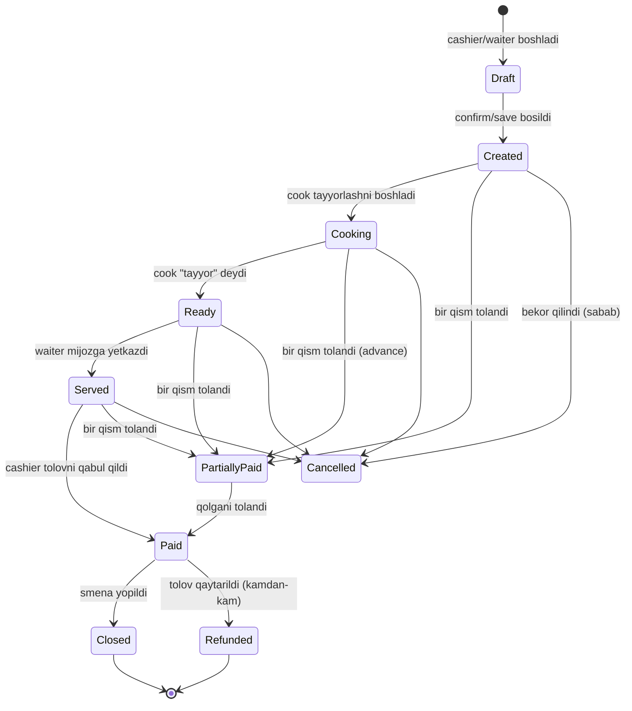

# Order lifecycle

## To'liq state machine



## Holatlar va field'larning bog'liqligi

| Holat | paymentStatus | foods.cookingStatus | isCancel | paidAt | cancelledAt |
|---|---|---|---|---|---|
| Draft | — | — | — | — | — |
| Created | pending | waiting | false | null | null |
| Cooking | pending | cooking | false | null | null |
| Ready | pending | ready | false | null | null |
| Served | pending | served | false | null | null |
| PartiallyPaid | partiallyPaid | * | false | null | null |
| Paid | paid | served (ideal) | false | filled | null |
| Cancelled | pending | * | true | null | filled |
| Refunded | refunded | * | false | filled | (filled refund) |

> Draft holat — UI-only, bazaga yozilmaydi. Faqat front-end'da. Cashier/waiter "saqlash" tugmasi bosgach Created bo'ladi.

## Bosqichlar — tafsilot

### 1. Created (yaratish)

**Trigger:** POS yoki waiter mobile'da "Buyurtma berish" tugmasi.

**Shartlar:**
- Faol smena bo'lishi shart
- dineIn bo'lsa stol talab qilinadi
- Foods array bo'sh emas
- Multi-tenant guard

**Side effects:**
- `order.created` event broadcast
- Cook'larga push notification (yangi order keldi)
- Stock decrement (sklad yoqilgan bo'lsa)
- Stol holati "occupied" (derived)
- Snapshot'lar olinadi (food name/price, waiter, service, discount)

**Yozish protokoli:**
```javascript
async function createOrder(input, actor) {
  // 1. Validation
  const shift = await shiftModel.findOne({ branch: input.branch, isActive: true });
  if (!shift) throw new Error('Faol smena yo\'q');

  if (input.orderType === 'dineIn' && !input.table) {
    throw new Error('Stol talab qilinadi');
  }

  // 2. Snapshot olish
  const order = await assembleOrder(input);  // snapshot + calculate totals

  // 3. Yozish (atomic)
  const created = await orderModel.create(order);

  // 4. Side effects
  await emit('order.created', created);

  return created;
}
```

### 2. Cooking (tayyorlash)

**Trigger:** Cook mobile yoki POS'da "Tayyorlash" tugmasi.

**Per-food darajada:**
- `order.foods[i].cookingStatus = 'cooking'`
- `order.foods[i].cookingStartedAt = now()`
- `order.foods[i].cookId = cook._id`

> [!note] Order yoki food darajadagi cook status?
> Bitta order'da 5 ta taom bor. Ba'zilari boshqasidan ertaroq tayyor bo'ladi. Shuning uchun status — har food'da alohida.
>
> Order'ning umumiy "cookingStatus" — derived: `min(foods.cookingStatus)`.

**Side effects:**
- `order.cooking_started` event (waiter mobile'iga)
- Kelajakda: KDS (Kitchen Display System) — agar toggle yoqilgan bo'lsa

### 3. Ready (tayyor)

**Trigger:** Cook "Tayyor" tugmasi.

**Per-food:**
- `cookingStatus = 'ready'`
- `readyAt = now()`

**Side effects:**
- `order.food_ready` event → waiter mobile push: "Stol 5 — Osh tayyor"
- Waiter mobile'da o'zgartirish (UI badge)

### 4. Served (yetkazildi)

**Trigger:** Waiter "Yetkazdim" tugmasi (mobile'da).

**Per-food:**
- `cookingStatus = 'served'`
- `servedAt = now()`

**Yoki:** waiter dineIn'da har food'ni alohida belgilamasligi mumkin. Ko'pchilik vaziyatlarda mijoz tolovga kelganda barchasi served deb hisoblanadi.

### 5. Paid (tolandi)

**Trigger:** Cashier "Tolovni qabul qildim" tugmasi.

**Field'lar:**
- `paymentStatus = 'paid'`
- `paymentMethod = ...`
- `paidAt = now()`
- `paidBy = cashier._id`
- Tolov metodiga qarab: `mixed`, `kaspi`, `cashback`

**Side effects:**
- `order.paid` event
- Chek apparat — bosadi (online/offline)
- Keshbek toggle — earn balance, QR generate
- Possiz'da — PDF check generate
- Smena `totals` real-time yangilanadi
- Stol bo'shaydi (derived)
- Kelajakda: waiter foiz hisoblanadi (keldi-ketti)

### 6. Closed (yopildi)

Order o'zi yopilmaydi — **smena yopilganda** barcha paid order'lar arxivlanadi.

Bu shartli "closed" — alohida field yo'q. Hisobotda smena yopilganidan keyin shu order'lar `closed` deb hisoblanadi.

## Alternative oqimlar

### Order'ga taom qo'shish (cooking paytida)

Waiter "Mijoz osh ham qo'shing dedi" desa:
```javascript
async function addFoodToOrder(orderId, foodItem, actor) {
  const order = await orderModel.findById(orderId);
  if (order.paymentStatus === 'paid') throw new Error('Tolangan order');
  if (order.isCancel) throw new Error('Bekor qilingan order');

  const food = await foodModel.findById(foodItem.foodId);
  order.foods.push({
    foodId: food._id,
    foodName: food.name,      // SNAPSHOT yangi narx
    foodPrice: food.price,
    quantity: foodItem.quantity,
    cookingStatus: 'waiting',
  });

  await recalculateTotals(order);
  await order.save();
  await emit('order.food_added', { order, foodItem });
}
```

### Order'dan taom kamaytirish

```javascript
async function decreaseFoodInOrder(orderId, foodIndex, changeVal, reason, actor) {
  const order = await orderModel.findById(orderId);
  const food = order.foods[foodIndex];
  food.cancels.push({
    status: 'dec',
    changeVal,
    changeReason: reason,
    changedBy: actor._id,
    changedAt: new Date(),
  });
  await recalculateTotals(order);
  await order.save();
  await emit('order.food_decreased', { order, foodIndex, changeVal });
}
```

### Order bekor qilish

Qarang: [[cancel-refund]]

## Validatsiya qoidalari (per transition)

| Transition | Shart |
|---|---|
| Created → Cooking | order paid emas, isCancel false |
| Cooking → Ready | bitta yoki ko'p foods cooking holatda |
| Ready → Served | foods ready holatda |
| Any → Paid | foods bor, isCancel false, totalPrice > 0 |
| Any → Cancelled | paid emas, cancelReason kerak |
| Paid → Refunded | admin/owner role, sabab kerak |

## Cooking status — order darajasidagi derived

```javascript
function orderCookingStatus(order) {
  if (order.foods.every(f => f.cookingStatus === 'served')) return 'served';
  if (order.foods.every(f => ['ready', 'served'].includes(f.cookingStatus))) return 'ready';
  if (order.foods.some(f => f.cookingStatus === 'cooking')) return 'cooking';
  return 'waiting';
}
```

UI'da bu derived ko'rsatiladi.

## Possiz va offline'da farqlar

- **Possiz:**
  - `createdInMode = 'possiz'`
  - Cook bilan aloqa — push notification + lokal Wi-Fi
  - Tolov — cashier mobile'da PDF
  - Chek apparat ishlamaydi (`checkPrinted = false` permanent)
- **Offline:**
  - `createdInMode = 'offline'`
  - Hammasi POS'da, lekin global'ga sync kechikadi
  - Chek apparat ishlaydi

## Bog'liq

- [[_MOC]]
- [[../order]]
- [[shift-lifecycle]]
- [[tolov-oqimi]]
- [[total-hisoblash]]
- [[cancel-refund]]
