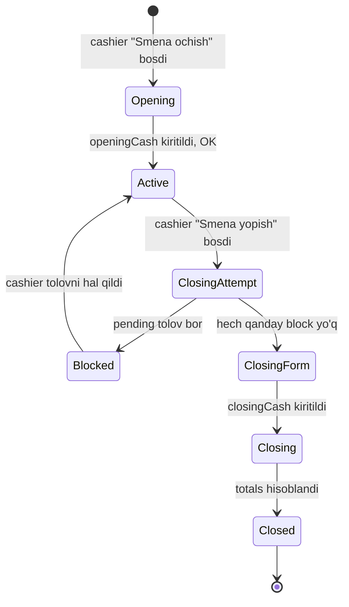

# Shift lifecycle (smena hayot davri)

## State machine



## 1. Smena ochish (Opening)

**Trigger:** Cashier/admin POS'da "Yangi smena ochish" tugmasi.

**Form:**
- Kassa hozir nechta? (openingCash) — majburiy
- Izoh (ixtiyoriy)

**Shartlar:**
- Filialda allaqachon faol smena yo'q
- User role: cashier, branch_admin, owner
- Smena ochish — multi-tenant guard

**Implementatsiya:**
```javascript
async function openShift(branchId, userId, openingCash, notes) {
  // 1. Faol smena tekshiruvi
  const existing = await shiftModel.findOne({
    branch: branchId,
    isActive: true,
    deleted: { $ne: true }
  });
  if (existing) {
    throw new Error(`Faol smena allaqachon mavjud (id: ${existing._id})`);
  }

  // 2. Yaratish
  const shift = await shiftModel.create({
    branch: branchId,
    restaurantId: <derived>,
    isActive: true,
    openedBy: userId,
    openedAt: new Date(),
    openingCash,
    notes,
  });

  // 3. Event
  await emit('shift.opened', shift);
  await audit.log({ kind: 'shift_opened', actor: ..., branchId });

  return shift;
}
```

## 2. Active (smena ishlamoqda)

Smena ochiq paytda:
- Order'lar yaratiladi (`order.shift = shift._id`)
- Tolovlar olinadi
- Cancel'lar bo'ladi
- `shift.totals` real-time yangilanmaydi — yopishda hisoblanadi

> [!note] Real-time vs at-close totals
> Alternative — `shift.totals` real-time yangilash (har order paid bo'lganda). Bu:
> - **Plyus:** dashboard real-time
> - **Minus:** ko'p yozish (race conditions)
> - Kompromiss: cached dashboard (5 daqiqa) + at-close authoritative

## 3. ClosingAttempt (yopishga harakat)

**Trigger:** Cashier "Smena yopish" tugmasi.

**Tekshiruvlar (ketma-ket):**

### 3.1 Pending tolovli orderlar bor?

```javascript
const pending = await orderModel.countDocuments({
  shift: shiftId,
  paymentStatus: { $in: ['pending', 'partiallyPaid'] },
  isCancel: false,
});
if (pending > 0) {
  return {
    blocked: true,
    reason: 'pending_payments',
    pendingCount: pending,
    message: `${pending} ta order tolanmagan. Avval tolating yoki bekor qiling.`
  };
}
```

UI: pending orderlar list bilan.

### 3.2 Tayyorlanayotgan ovqatlar bor?

Cook hali tayyorlamagan ovqatlar — odatda muammo emas (mijoz ketgan bo'lishi mumkin). Lekin ogohlantirish:

```javascript
const cooking = await orderModel.countDocuments({
  shift: shiftId,
  isCancel: false,
  'foods.cookingStatus': { $in: ['waiting', 'cooking'] },
});
if (cooking > 0) {
  return {
    warning: true,
    reason: 'orders_still_cooking',
    cookingCount: cooking,
    // Lekin block emas
  };
}
```

### 3.3 Smena yopish formasi

Cashier "Davom etish" bossa:
- Real kassa kiritish (closingCash) — majburiy
- Izoh (ixtiyoriy)
- "Yopish" tugmasi

## 4. Closing (yopilmoqda)

```javascript
async function closeShift(shiftId, userId, closingCash, notes) {
  const shift = await shiftModel.findById(shiftId);
  if (!shift.isActive) throw new Error('Smena allaqachon yopilgan');

  // Yana bir marta pending tekshiruv (race condition oldini olish)
  const pending = await orderModel.countDocuments({
    shift: shiftId,
    paymentStatus: { $in: ['pending', 'partiallyPaid'] },
    isCancel: false,
  });
  if (pending > 0) {
    throw new Error('Yopishdan oldin: pending tolovlar mavjud');
  }

  // Totals hisoblash
  const totals = await calculateShiftTotals(shiftId);

  // Discrepancy
  const expectedCash = shift.openingCash + totals.cashRevenue;
  const discrepancy = closingCash - expectedCash;

  // Update (atomic)
  await shiftModel.updateOne(
    { _id: shiftId, isActive: true },
    {
      isActive: false,
      closedBy: userId,
      closedAt: new Date(),
      closingCash,
      totals,
      closingDiscrepancy: discrepancy,
      notes,
    }
  );

  // Side effects
  await emit('shift.closed', shift);
  if (Math.abs(discrepancy) > 0) {
    await audit.log({
      kind: 'shift_cash_discrepancy',
      severity: Math.abs(discrepancy) > 10000 ? 'warn' : 'info',
      branchId: shift.branch,
      data: { expected: expectedCash, actual: closingCash, discrepancy }
    });
  }

  return shift;
}
```

## Totals hisoblash

Tafsilot: [[../shift#Totals hisoblash]]

```javascript
async function calculateShiftTotals(shiftId) {
  const pipeline = [
    { $match: { shift: ObjectId(shiftId), isCancel: false } },
    {
      $facet: {
        revenue: [
          { $match: { paymentStatus: 'paid' } },
          { $group: {
              _id: null,
              count: { $sum: 1 },
              totalRevenue: { $sum: '$totalPrice' },
              cashRevenue: {
                $sum: {
                  $switch: {
                    branches: [
                      { case: { $eq: ['$paymentMethod', 'cash'] }, then: '$totalPrice' },
                      { case: { $eq: ['$paymentMethod', 'mixed'] }, then: '$mixed.cash' },
                    ],
                    default: 0
                  }
                }
              },
              // similar for cardRevenue, kaspiRevenue, transferRevenue
              cashbackUsed: { $sum: '$mixed.cashback' },
              discountTotal: { $sum: '$discountAmount' },
              serviceTotal: { $sum: '$service.amount' },
          }}
        ],
        cancelled: [
          { $match: { isCancel: true } },
          { $count: 'count' }
        ]
      }
    }
  ];

  const [result] = await orderModel.aggregate(pipeline);
  return {
    ordersCount: result.revenue[0]?.count || 0,
    revenue: result.revenue[0]?.totalRevenue || 0,
    cashRevenue: result.revenue[0]?.cashRevenue || 0,
    // ...
    cancelledOrders: result.cancelled[0]?.count || 0,
  };
}
```

## Discrepancy hisoblash

```
expectedCash = openingCash + cashRevenue (faqat naqd)
discrepancy = closingCash - expectedCash
```

| Vaziyat | Ma'no |
|---|---|
| discrepancy = 0 | To'g'ri |
| discrepancy > 0 | Ortiqcha (xato hisoblash, tip, yangi mijoz advance) |
| discrepancy < 0 | Yetishmaydi (cashier xatosi, o'g'rilik) |

Katta discrepancy (>5000 yoki >2%) — admin'ga alert.

## Force close (admin override)

Bir necha holat:
- Pending order'lar bor, lekin restoran yopilmoqchi
- Mijoz tashlab ketgan, hech kim tolamaydi
- Kassir favqulodda holat

Admin "Force close" qiladi:
```javascript
async function forceCloseShift(shiftId, adminUserId, reason) {
  const shift = await shiftModel.findById(shiftId);

  // Pending orderlar — admin tomonidan bekor qilinadi
  const pendingOrders = await orderModel.find({
    shift: shiftId,
    paymentStatus: { $in: ['pending', 'partiallyPaid'] },
    isCancel: false,
  });

  for (const order of pendingOrders) {
    await cancelOrder(order._id, adminUserId, `Smena force-close: ${reason}`);
  }

  await closeShift(shiftId, adminUserId, /* closingCash so'raladi */, `FORCE CLOSE: ${reason}`);

  await audit.log({
    kind: 'shift_force_closed',
    severity: 'warn',
    actor: { type: 'user', id: adminUserId, role: 'owner' },
    branchId: shift.branch,
    data: { reason, cancelledOrders: pendingOrders.length }
  });
}
```

## Smena va offline rejim

- Smena lokal'da ochilishi mumkin
- Lokal smena `clientId` bilan saqlanadi
- Sync paytida global'ga jo'natiladi
- Konflikt holati: lokal va global'da bir vaqtda faol smena bo'lib qolishi mumkin (rare race)
  - Sabab: lokal offline'da ochildi, lekin global'da boshqa kanaldan ham ochildi
  - Yechim: clientId tekshiruvi. Faqat bittasi qoladi, ikkinchisi conflict log'ga

## Smena va possiz rejim

- Possiz'da smena ochib bo'lmaydi (POS yo'q)
- Mavjud smena'ga possiz orderlar qo'shiladi
- Possiz tugagach (online'ga qaytsa) → mavjud smena davom etadi

## Hisobotlar

Smena yopilgach:
- **Smena hisoboti** — PDF/print: openingCash, closingCash, totals, discrepancy
- **Order'lar ro'yxati** — print imkoni
- **Cancelled orderlar** — alohida ro'yxat
- **Discount/Service breakdown**

## Bog'liq

- [[_MOC]]
- [[../shift]]
- [[../order]]
- [[order-lifecycle]]
- [[tolov-oqimi]]
