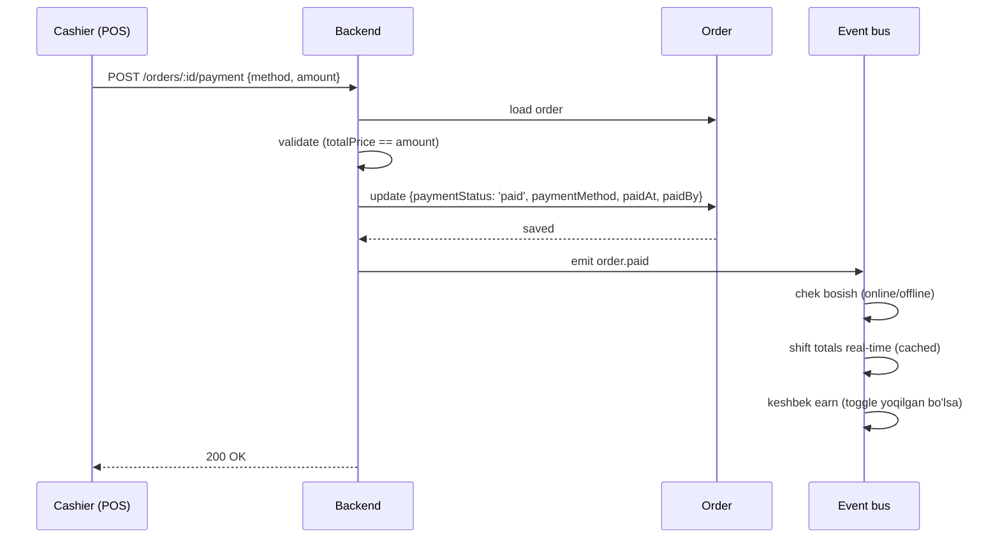
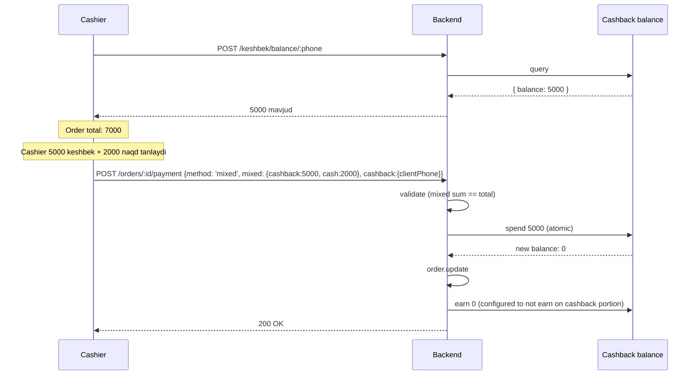
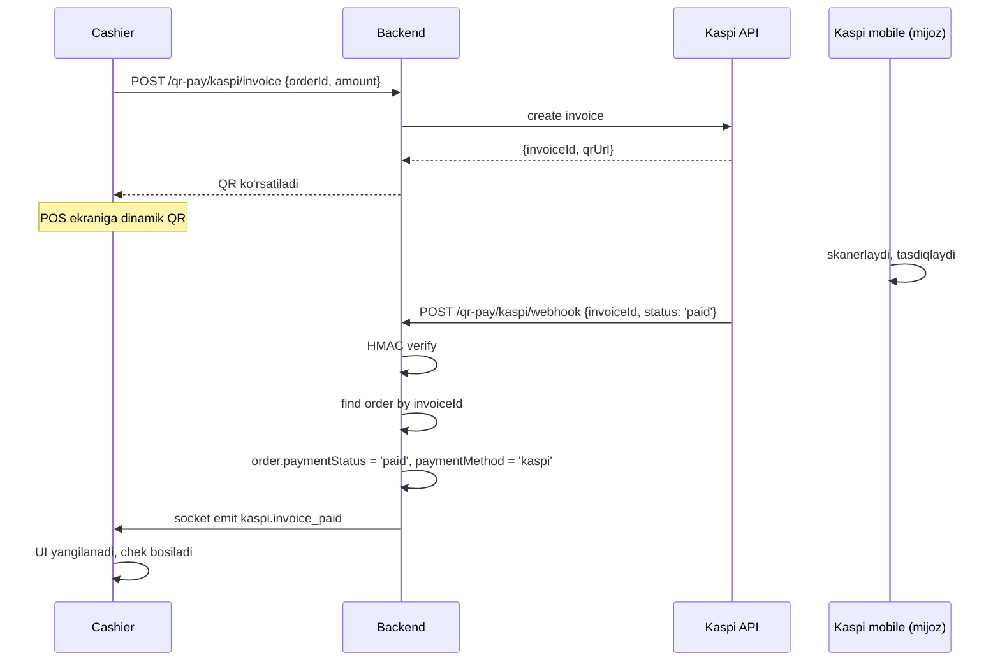

# Tolov oqimi

## Tolov turlari

| Method | Tavsif | Toggle kerakmi |
|---|---|---|
| `cash` | Naqd pul | yo'q (har doim) |
| `card` | Bank kartasi (terminal) | yo'q |
| `transfer` | Bank o'tkazma | yo'q |
| `kaspi` | Kaspi Pay QR | qrPay toggle |
| `cashback` | Mijoz keshbek balansidan | keshbek toggle |
| `mixed` | Bir nechta usul birga | — (har doim, lekin yuqoridagi'lar fault) |

## Asosiy oqim: simple payment



## Single payment (oddiy)

```javascript
async function payOrder(orderId, paymentData, cashier) {
  const order = await orderModel.findById(orderId);

  if (order.paymentStatus === 'paid') throw new Error('Allaqachon tolangan');
  if (order.isCancel) throw new Error('Bekor qilingan order');
  if (order.totalPrice <= 0) throw new Error('Negative yoki nol total');

  if (paymentData.amount !== order.totalPrice) {
    throw new Error(`Tolov summa mos kelmaydi: ${paymentData.amount} != ${order.totalPrice}`);
  }

  order.paymentStatus = 'paid';
  order.paymentMethod = paymentData.method;
  order.paidAt = new Date();
  order.paidBy = cashier._id;

  await order.save();
  await emit('order.paid', order);

  return order;
}
```

## Mixed payment

Mijoz qisman naqd, qisman karta tolaydi:

```javascript
{
  paymentMethod: 'mixed',
  mixed: {
    cash: 50000,
    card: 30000,
    transfer: 0,
    kaspi: 0,
    cashback: 0,
  }
}
```

Validation:
```javascript
function validateMixed(mixed, totalPrice) {
  const sum = (mixed.cash || 0) + (mixed.card || 0) + (mixed.transfer || 0)
            + (mixed.kaspi || 0) + (mixed.cashback || 0);
  if (sum !== totalPrice) {
    throw new Error(`Mixed sum ${sum} != totalPrice ${totalPrice}`);
  }
}
```

## Partial payment

Mijoz oldindan 50% tolaydi (oldindan to'lov, advance):

```javascript
{
  paymentStatus: 'partiallyPaid',
  paymentMethod: 'cash',
  paidAmount: 25000,   // jami tolangan
}
```

> [!todo] Schema
> Joriy schema'da `paidAmount` field yo'q. Partial payment qo'llab-quvvatlashi uchun:
> ```javascript
> paidAmounts: [{
>   amount: Number,
>   method: String,
>   paidAt: Date,
>   paidBy: ObjectId,
> }]
> ```
> Yoki: `partiallyPaid` statusda har transaction bog'liq audit log'da saqlanadi.

```javascript
async function partialPay(orderId, amount, method, cashier) {
  const order = await orderModel.findById(orderId);

  const alreadyPaid = order.paidAmounts?.reduce((s, p) => s + p.amount, 0) || 0;
  const remaining = order.totalPrice - alreadyPaid;

  if (amount > remaining) throw new Error('Ortiqcha tolov');

  order.paidAmounts = order.paidAmounts || [];
  order.paidAmounts.push({ amount, method, paidAt: new Date(), paidBy: cashier._id });

  const newPaidTotal = alreadyPaid + amount;
  if (newPaidTotal === order.totalPrice) {
    order.paymentStatus = 'paid';
    order.paidAt = new Date();
  } else {
    order.paymentStatus = 'partiallyPaid';
  }

  await order.save();
  await emit('order.partial_paid', { order, amount, method });
}
```

## Cashback payment

Mijoz keshbek balansidan tolaydi (qarang [[../../04-toollar/keshbek-tizimi]]):



### Yoki to'liq keshbek
```javascript
{
  paymentMethod: 'cashback',
  cashback: {
    spent: 7000,
    clientPhone: '+998901234567',
  }
}
```

## Kaspi QR payment (dinamik)



## Tolov bekor qilish (refund)

Tolangan order qaytarilishi kerak bo'lsa:

```javascript
async function refundOrder(orderId, reason, admin) {
  const order = await orderModel.findById(orderId);
  if (order.paymentStatus !== 'paid') throw new Error('Tolanmagan');
  if (admin.role !== 'owner' && admin.role !== 'branch_admin') {
    throw new Error('Refund — faqat admin');
  }

  // Cashback: spent qiymatni qaytarish
  if (order.cashback?.spent > 0) {
    await cashbackBalanceModel.updateOne(
      { restaurantId: order.restaurantId, clientPhone: order.cashback.clientPhone },
      { $inc: { balance: order.cashback.spent } }
    );
  }

  // Earned cashback ham qaytariladi (bekor)
  if (order.cashback?.earned > 0) {
    await cashbackBalanceModel.updateOne(
      { restaurantId: order.restaurantId, clientPhone: order.cashback.clientPhone },
      { $inc: { balance: -order.cashback.earned } }
    );
  }

  // Stock qaytarish (sklad toggle)
  await emit('order.refunded', order);

  order.paymentStatus = 'refunded';
  order.refundedAt = new Date();
  order.refundedBy = admin._id;
  order.refundReason = reason;
  await order.save();

  await audit.log({
    kind: 'order_refunded',
    severity: 'warn',
    actor: { type: 'user', id: admin._id, role: admin.role },
    branchId: order.branch,
    data: { orderId, amount: order.totalPrice, reason }
  });
}
```

## Tolov audit

Har tolov — audit log'ga:
- Kim tolov oldi (cashier)
- Qachon
- Qaysi summa
- Qaysi metod
- IP, terminal

Kelajakda — har cashier per smena tolov sonini hisobot.

## Tolov security

- **Server tomonidan total tekshiriladi** — mijoz UI'dagi summa ishonchsiz
- **Mixed sum validation** — har transaction'da
- **Cashback balance atomic spend** — race condition oldini olish (MongoDB `findOneAndUpdate` with `$inc` and condition)
- **Webhook HMAC** — Kaspi tolov uchun
- **Audit log** — har tolov

## Offline'da tolov

Naqd, karta — lokal'da bemalol. Sync paytida jo'natiladi.

Kaspi — offline'da disabled (webhook keling olinmaydi).

Cashback — offline'da **butunlay disabled** (qaror 2026-05-29). Keshbek balansi umumiy hisoblagich, offline'da xavfsiz kamaytirib bo'lmaydi (double-spend). Mijoz naqd/karta tolaydi, keshbegi online qaytganda ishlatiladi. Earn esa ishlaydi (deferred, QR-skanerlash). Tafsilot: [[../../04-toollar/keshbek-tizimi#Offline]]

## Possiz'da tolov

Cashier mobile orqali:
- Cash, transfer — ishlaydi (manual belgilanadi)
- Kaspi — offline turi → disabled
- Cashback — **disabled** (possiz = offline turi). Earn: PDF chekka QR.

Chek apparat ishlamaydi → PDF check.

## Bog'liq

- [[_MOC]]
- [[../order]]
- [[total-hisoblash]]
- [[../../04-toollar/qr-pay-kaspi]]
- [[../../04-toollar/keshbek-tizimi]]
- [[cancel-refund]]
