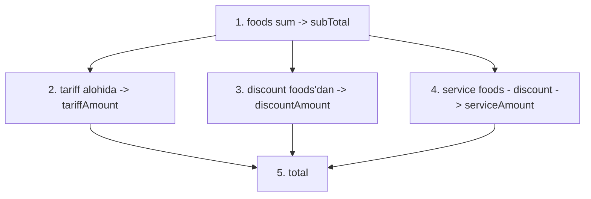

# Total hisoblash

> Bu hujjat — order'ning narxlari qanday hisoblanishini aniq belgilaydi. Eng ko'p xatoga olib keladigan joy. Aniq qoidalar shart.

## Asosiy formula

```
subTotal = SUM(foods[i].foodPrice * effectiveQuantity(foods[i]))
tariffAmount = tariff hisobi (hourly/fixed/daily)
discountAmount = subTotal asosida (lekin tariff'siz)
serviceAmount = (subTotal - discountAmount) asosida

totalPrice = subTotal + tariffAmount + serviceAmount - discountAmount
```

## Tartib (eng muhim)

Quyidagi ketma-ketlik **majburiy**:



Yoki sodda:
1. **subTotal** — taomlar yig'indisi (snapshot narxlar)
2. **tariff** — stol tarifi (alohida, foods'ga aralashmaydi)
3. **discount** — subTotal'dan foiz yoki absolut
4. **service** — (subTotal − discount)'dan foiz
5. **total** — yuqoridagilar summasi minus discount

## Implementatsiya

```javascript
function calculateOrderTotals(order) {
  // === 1. subTotal ===
  order.subTotal = order.foods.reduce((sum, item) => {
    const qty = effectiveQuantity(item);
    return sum + item.foodPrice * qty;
  }, 0);

  // === 2. tariffAmount ===
  let tariffAmount = 0;
  if (order.selectedTariff?.chargeType) {
    tariffAmount = calculateTariff(order.selectedTariff);
    order.selectedTariff.totalAmount = tariffAmount;
  }

  // === 3. discountAmount (subTotal asosida) ===
  let discountAmount = 0;
  if (order.discount) {
    if (order.discount.type === 'amount') {
      discountAmount = Math.min(order.discount.amount, order.subTotal);
    } else {
      discountAmount = Math.round(order.subTotal * order.discount.percent / 100);
    }
  }
  order.discountAmount = discountAmount;

  // === 4. serviceAmount ((subTotal - discount) asosida) ===
  let serviceAmount = 0;
  if (order.service?.percent > 0) {
    const baseForService = order.subTotal - discountAmount;
    serviceAmount = Math.round(baseForService * order.service.percent / 100);
    order.service.amount = serviceAmount;
  }

  // === 5. totalPrice ===
  order.totalPrice = order.subTotal + tariffAmount + serviceAmount - discountAmount;

  return order;
}

function effectiveQuantity(item) {
  const inc = item.cancels
    .filter(c => c.status === 'inc')
    .reduce((s, c) => s + c.changeVal, 0);
  const dec = item.cancels
    .filter(c => c.status === 'dec')
    .reduce((s, c) => s + c.changeVal, 0);
  return Math.max(0, item.quantity + inc - dec);
}
```

## Tariff hisoblash

### chargeType: 'fixed'
```javascript
function calculateFixed(tariff) {
  return tariff.price;
}
```

### chargeType: 'hourly'
```javascript
function calculateHourly(tariff) {
  const elapsedMs = Date.now() - new Date(tariff.startedAt).getTime();
  const elapsedMinutes = elapsedMs / 60000;
  const units = Math.ceil(elapsedMinutes / tariff.duration);
  return units * tariff.price;
}
```

Misol: `duration: 60` (1 soat), `price: 50000`, mijoz 1 soat 15 daqiqa o'tirdi.
- units = Math.ceil(75/60) = 2
- Total = 2 × 50000 = 100,000 so'm

### chargeType: 'daily'
```javascript
function calculateDaily(tariff) {
  const elapsedMs = Date.now() - new Date(tariff.startedAt).getTime();
  const days = Math.ceil(elapsedMs / (24 * 3600 * 1000));
  return days * tariff.price;
}
```

## Misol oqimlar

### Misol 1: Oddiy dineIn
- Foods: Osh × 2 (35000), Mantı × 1 (28000)
- Service: 6%
- Discount: yo'q
- Tariff: yo'q

```
subTotal = 2 × 35000 + 1 × 28000 = 70000 + 28000 = 98000
tariffAmount = 0
discountAmount = 0
serviceAmount = (98000 - 0) × 6% = 5880
totalPrice = 98000 + 0 + 5880 - 0 = 103,880
```

### Misol 2: Discount bilan
- Foods: 100,000
- Service: 6%
- Discount: 10%

```
subTotal = 100000
discountAmount = 100000 × 10% = 10000
serviceAmount = (100000 - 10000) × 6% = 5400
totalPrice = 100000 + 0 + 5400 - 10000 = 95,400
```

> [!note] Service discount'dan keyin hisoblanadi
> Agar discount avval qo'llanmasa: service = 100000 × 6% = 6000. Total = 100000 - 10000 + 6000 = 96,000.
>
> Farq 600 so'm. Bizning yondashuv (service discount'dan keyin) — mijoz uchun **arzonroq**. Bu bo'sh emas — dizayn qarori.

### Misol 3: Billiard (hourly tariff)
- Stol "1 soat — 50000" tarifi
- Foydalanish: 2 soat 30 daqiqa
- Foods: choy + somsa = 25000
- Service: 6%
- Discount: yo'q

```
subTotal = 25000
tariffAmount = ceil(150/60) × 50000 = 3 × 50000 = 150,000
discountAmount = 0
serviceAmount = 25000 × 6% = 1500
totalPrice = 25000 + 150000 + 1500 - 0 = 176,500
```

> [!note] Service tariff'ga qo'llanmaydi
> Service charge faqat **taomlar uchun**. Stol tarifi alohida — service'ga hisoblanmaydi.

### Misol 4: Promo code (absolute discount)
- Foods: 50,000
- Discount: 5,000 absolute
- Service: 6%

```
subTotal = 50000
discountAmount = min(5000, 50000) = 5000
serviceAmount = (50000 - 5000) × 6% = 2700
totalPrice = 50000 + 0 + 2700 - 5000 = 47,700
```

### Misol 5: Cancel bo'lgan taom
- Foods: Osh × 3 (35000 each)
- 1 ta bekor: cancels = [{status:'dec', changeVal:1}]
- Service: 6%

```
effectiveQuantity = 3 - 1 = 2
subTotal = 2 × 35000 = 70000
serviceAmount = 70000 × 6% = 4200
totalPrice = 70000 + 0 + 4200 - 0 = 74,200
```

## Rounding qoidalari

Pul birligi: O'zbekiston — so'm, Qozog'iston — tenge. Ikkalasida ham eng kichik birlik 1.

```javascript
const round = (x) => Math.round(x);
```

Service va discount foizi hisoblanganda — `Math.round` ishlatamiz. Banker's rounding emas, oddiy.

## Negative total — taqiqlangan

```javascript
if (order.totalPrice < 0) {
  throw new Error('Negative total: discount > subTotal? Bug bor');
}
```

`discountAmount` har doim `subTotal`'dan kichik yoki teng. Lekin extra check uchun assert.

## Real-time recalculation

Order o'zgartirilgan paytda (taom qo'shildi/kamaytirildi) — totals qayta hisoblanadi:

```javascript
async function updateOrderFoods(orderId, newFoods, actor) {
  const order = await orderModel.findById(orderId);
  order.foods = newFoods;
  calculateOrderTotals(order);
  order.lastModifiedAt = new Date();
  order.lastModifiedBy = { userId: actor._id, origin: 'local' };
  await order.save();
  await emit('order.updated', order);
}
```

UI'da har o'zgarishda lokal hisoblanadi — instant feedback. Server tomonda yana hisoblanadi — manipulatsiya oldini olish.

## Server-side authority

Mijoz UI'da `totalPrice = 50000` ko'rsatishi mumkin — lekin **server** order saqlayotganda mustaqil hisoblaydi. Mijozning yuborgan total'i ignorat etiladi.

```javascript
async function createOrder(input) {
  const order = await assembleOrder(input);  // foods snapshot
  calculateOrderTotals(order);                // SERVER tomonidan hisob
  // input.totalPrice — ignore
  return orderModel.create(order);
}
```

## Validation

Order yaratish/o'zgartirish paytida:
- `subTotal >= 0`
- `discountAmount >= 0 && discountAmount <= subTotal`
- `serviceAmount >= 0`
- `tariffAmount >= 0`
- `totalPrice >= 0`
- Sum check: `totalPrice == subTotal + tariffAmount + serviceAmount - discountAmount`

## Konfiguratsiya (kelajakda)

Restoran admin'i tartibni o'zgartira olishi mumkin (config):
```javascript
restaurant.config.totalCalculation = {
  serviceAppliesToTariff: false,    // default false
  serviceAfterDiscount: true,        // default true
  discountAppliesToTariff: false,    // default false
}
```

Hozircha — default fixed. Kelajakda configurable.

## Test rejasi

- [ ] Subtotal calculation (foods + cancels)
- [ ] Discount percent calculation
- [ ] Discount amount calculation, capped at subTotal
- [ ] Service calculation (subTotal - discount asosida)
- [ ] Tariff hourly (ceil minutes)
- [ ] Tariff fixed
- [ ] Tariff daily
- [ ] Total = subTotal + tariff + service - discount
- [ ] Cancel'lar effective quantity
- [ ] Server ignores client's totalPrice
- [ ] Negative total throws

## Bog'liq

- [[_MOC]]
- [[../order]]
- [[../service]]
- [[../discount]]
- [[../table]]
- [[order-lifecycle]]
