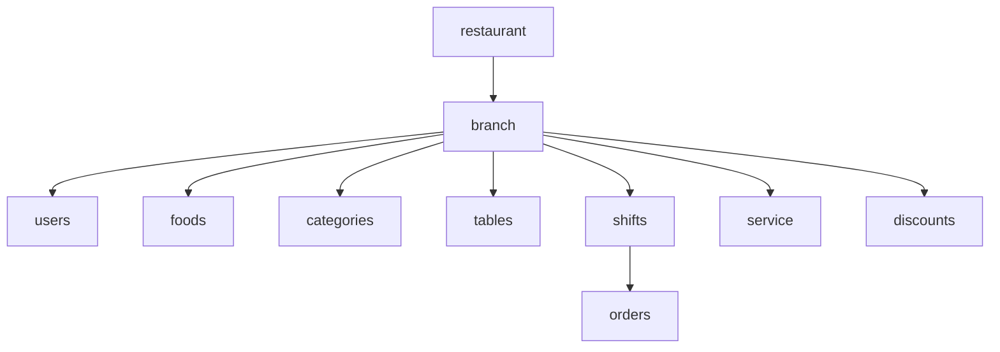

# Entity: branch (filial)

## Maqsadi

Filial — restoran'ning bitta jismoniy joyi. Har filial o'z menyusi, xodimlari, stollari, smenalari va orderlariga ega. Lokal backend har filial uchun alohida o'rnatiladi.

## Schema

```javascript
const branchSchema = new mongoose.Schema({
  // Asosiy
  name: {
    type: String,
    required: true,
  },
  address: {
    type: String,
  },

  // Multi-tenant boundary
  restaurant: {
    type: mongoose.Schema.Types.ObjectId,
    ref: 'restaurant',
    required: true,
    index: true,
  },

  // Lokal backend bilan ulanish
  branchToken: {
    type: String,        // bcrypt hash (plaintext lokal config'da)
    select: false,        // default query'da chiqmaydi
  },
  tokenVersion: {
    type: Number,
    default: 1,
  },
  tokenRevoked: {
    type: Boolean,
    default: false,
  },

  // Lokal backend ulanish konfiguratsiyasi
  allowedIps: {
    type: [String],
    default: [],         // ixtiyoriy IP whitelist
  },

  // Chek raqami prefiksi (qarang [[../07-nozik-nuqtalar/chek-raqamlash]])
  receiptPrefix: {
    type: String,
    maxLength: 4,
    uppercase: true,
    // masalan: YUN, MRK, CHL — restoran ichida unique tavsiya
  },

  // Hozirgi holat (real-time, lokal backend tomonidan yangilanadi)
  currentMode: {
    type: String,
    enum: ['online', 'offline', 'online_syncing', 'possiz', 'possiz_returning', 'unknown'],
    default: 'unknown',
  },
  modeChangedAt: Date,
  lastSyncedAt: Date,
  outboxPending: {
    type: Number,
    default: 0,
  },
  lastHeartbeatAt: Date,

  // Metadata
  geo: {
    country: String,
    city: String,
    lat: Number,
    lng: Number,
  },
  workingHours: {
    monday: { open: String, close: String },
    tuesday: { open: String, close: String },
    // ...
  },
  isActive: { type: Boolean, default: true },

  // Sync metadata (qarang [[sync-metadata]])
  deleted: { type: Boolean, default: false },
  deletedAt: Date,

}, {
  timestamps: true,
});

branchSchema.index({ restaurant: 1, deleted: 1 });
branchSchema.index({ restaurant: 1, name: 1 }, { unique: true });
branchSchema.index({ currentMode: 1 });
```

## Field'lar tafsiloti

| Field | Tur | Tavsif |
|---|---|---|
| `name` | string | Filial nomi (masalan "Yunusobod") |
| `address` | string | Manzil |
| `restaurant` | ObjectId | Qaysi restoran'ga tegishli |
| `branchToken` | string | bcrypt hash; plaintext lokal POS'da |
| `tokenVersion` | number | Token bekor qilish uchun |
| `currentMode` | enum | Hozirgi ish rejimi (real-time) |
| `lastSyncedAt` | date | Oxirgi muvaffaqiyatli sync vaqti |
| `outboxPending` | number | Lokal outbox'da kutayotgan event'lar soni |
| `lastHeartbeatAt` | date | Lokal backend oxirgi ping qachon |
| `geo` | object | Geo-IP anomaliya aniqlash uchun |
| `workingHours` | object | Smena avtomatik ochish/yopish uchun |

## Munosabatlar



## branchToken xavfsizligi

```javascript
// Server tomondan generatsiya
function createBranchToken(branchId, restaurantId) {
  return jwt.sign({
    type: 'branch',
    branchId,
    restaurantId,
    issuedFor: 'local-backend',
  }, BRANCH_SECRET, { expiresIn: '365d' });
}

// Hash (database'da plaintext saqlamaslik)
const branchTokenHash = await bcrypt.hash(rawToken, 10);
await branch.update({ branchToken: branchTokenHash });
```

Foydalanuvchiga **plaintext** beriladi (installer paytida kiritadi). Server **hash** saqlaydi.

Verify:
```javascript
async function verifyBranchToken(branchId, presentedToken) {
  const branch = await branchModel.findById(branchId).select('+branchToken');
  if (!branch || branch.tokenRevoked) return false;
  const payload = jwt.verify(presentedToken, BRANCH_SECRET);
  if (payload.tokenVersion !== branch.tokenVersion) return false;
  return await bcrypt.compare(presentedToken, branch.branchToken);
}
```

## Sync — ikki tomondan

Branch entity:
- **Yaratish** — faqat admin web'dan (global)
- **Yangilash** — admin web'dan (name, address, workingHours), lokal backend'dan (currentMode, lastSyncedAt, outboxPending, lastHeartbeatAt)
- **O'chirish** — admin web'dan

Lokal backend o'zgartiradigan field'lar **sync metadata-only**:
- `currentMode`
- `modeChangedAt`
- `lastSyncedAt`
- `outboxPending`
- `lastHeartbeatAt`

Bular `lastModifiedBy.origin = 'local'` belgisi bilan.

Foydalanuvchi tomonidan o'zgartiriladigan field'lar — global tomondan boshqariladi.

## currentMode real-time yangilanishi

Lokal backend har 10s'da `branch.heartbeat` event jo'natadi:
```javascript
socket.emit('branch.heartbeat', {
  branchId,
  currentMode: 'online',
  outboxPending: 0,
  ts: now(),
});
```

Global VPS qabul qiladi → branch document yangilanadi → boshqa mijoz'larga (admin web) broadcast.

> [!note] heartbeat sync entity sifatida emas
> Heartbeat har 10s — agar event sifatida outbox'ga tushsa, juda ko'p shovqin. Yechim: heartbeat — ephemeral event, outbox'ga tushmaydi, lekin global'da darhol qabul qilinadi.

## Branch deactivation

Filial yopilsa:
1. Admin web → `PATCH /api/branches/:id { isActive: false }`
2. Barcha xodimlar logout (tokenVersion +1)
3. Pending orderlar tugatilishi kerak (block delete)
4. `branchToken` revoked (lokal backend ulanmaydi)
5. POS UI: "Bu filial faollikdan chetlatilgan, admin'ga murojaat qiling"

## Lokal backend'da branch entity

Lokal MongoDB'da `branch` collection bo'ladi, lekin faqat **bitta** document — shu filialning o'zi. Buni o'qib, name/address/workingHours/etc'ni POS UI ko'rsatadi.

Boshqa filiallar lokal'da mavjud emas — xavfsizlik.

## Sample document

```json
{
  "_id": "65f2b3c4d5e6f7a8b9c0d1e2",
  "name": "Olov Mehmonxonasi — Yunusobod",
  "address": "Toshkent shahar, Yunusobod tumani, Bunyodkor 23",
  "restaurant": "65f1a2b3c4d5e6f7a8b9c0d1",
  "tokenVersion": 1,
  "tokenRevoked": false,
  "allowedIps": ["188.166.10.20"],
  "currentMode": "online",
  "modeChangedAt": "2026-05-28T08:00:00Z",
  "lastSyncedAt": "2026-05-28T14:30:15Z",
  "outboxPending": 0,
  "lastHeartbeatAt": "2026-05-28T14:30:10Z",
  "geo": { "country": "UZ", "city": "Toshkent", "lat": 41.34, "lng": 69.28 },
  "workingHours": {
    "monday": { "open": "10:00", "close": "23:00" },
    "tuesday": { "open": "10:00", "close": "23:00" }
  },
  "isActive": true,
  "deleted": false
}
```

## Bog'liq

- [[_MOC]]
- [[restaurant]]
- [[../02-arxitektura/local-backend-stack]]
- [[../02-arxitektura/xavfsizlik/auth-strategiyasi]]
- [[../02-arxitektura/3-rejim]]
