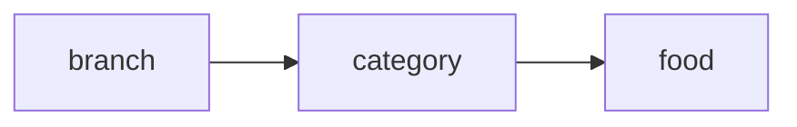

# Entity: category (kategoriya)

## Maqsadi

Menyu'ni guruhlash uchun (Issiq taomlar, Salatlar, Ichimliklar, Shirin taomlar va h.k.). Har filial o'z kategoriyalariga ega — bir filial "Pizza" qo'shsa, boshqa filialda yo'q.

## Schema

```javascript
const categorySchema = new mongoose.Schema({
  title: {
    type: String,
    required: true,
  },

  branch: {
    type: mongoose.Schema.Types.ObjectId,
    ref: 'branch',
    required: true,
    index: true,
  },
  restaurantId: {
    type: mongoose.Schema.Types.ObjectId,
    ref: 'restaurant',
    required: true,
    index: true,
  },

  // UI
  sortOrder: {
    type: Number,
    default: 0,
  },
  isActive: {
    type: Boolean,
    default: true,
  },
  icon: String,
  color: String,    // tab rangi (UI uchun)

  // Sync metadata
  clientId: { type: String, sparse: true, unique: true },
  version: { type: Number, default: 1 },
  syncStatus: { type: String, default: 'synced' },
  lastModifiedAt: { type: Date, default: Date.now },
  lastModifiedBy: { userId: mongoose.Schema.Types.ObjectId, origin: String },
  deleted: { type: Boolean, default: false },
  deletedAt: Date,

}, {
  timestamps: true,
});

categorySchema.index({ branch: 1, sortOrder: 1, isActive: 1 });
categorySchema.index({ restaurantId: 1, branch: 1 });
categorySchema.index({ branch: 1, title: 1 }, { unique: true });
```

## Field'lar tafsiloti

| Field | Tur | Tavsif |
|---|---|---|
| `title` | string | Kategoriya nomi |
| `branch` | ObjectId | Filial — har filial o'z kategoriyalari |
| `restaurantId` | ObjectId | Denorm |
| `sortOrder` | number | POS'da chap paneldagi tartib |
| `isActive` | boolean | Vaqtinchalik o'chirish |
| `icon` | string | Ikonka (Material Icon nomi yoki URL) |
| `color` | string | Hex color (#FF5733) |

## Munosabatlar



- `1 category → N food`
- Kategoriya o'chirilsa — food'lar **nima qiladi?**

## Kategoriya o'chirilganda food'lar

Kategoriya o'chirilgan bo'lsa, undagi food'lar:

**Variant A:** Cascade soft delete (food'lar ham `deleted: true`)
- Plyus: tartibli
- Minus: yangi kategoriyaga ko'chirib bo'lmaydi

**Variant B:** Food'lar "Kategoriyasiz" guruhga ko'chiriladi
- Plyus: data yo'qolmaydi
- Minus: "Kategoriyasiz" — alohida virtual kategoriya kerak

**Variant C:** Kategoriya o'chirilishi taqiqlanadi agar food bor bo'lsa
- "Bu kategoriyani o'chirib bo'lmaydi: ichida 5 ta taom bor. Avval taomlarni ko'chiring."

> [!todo] Qaror
> **Variant C** tavsiya etiladi — eng aniq. Admin ataylab xohlasa ham accident'dan himoyalanadi.

```javascript
async function deleteCategory(id, branchId) {
  const foodCount = await foodModel.countDocuments({
    category: id,
    branch: branchId,
    deleted: { $ne: true }
  });
  if (foodCount > 0) {
    throw new Error(`Kategoriyani o'chirib bo'lmaydi: ichida ${foodCount} ta taom bor`);
  }
  await categoryModel.softDelete(id, ...);
}
```

## Multi-tenant guard

```javascript
categoryModel.findInTenant(req.userData)
  .where({ branch: req.userData.branchId, isActive: true })
  .sort({ sortOrder: 1 });
```

## Title uniqueness — branch ichida

```javascript
{ branch: 1, title: 1 }, { unique: true }
```

A filialda "Pizza" bor, B filialda ham "Pizza" — bemalol. Bir filialda ikkita "Pizza" — yo'q.

## Sample document

```json
{
  "_id": "65f5e6f7a8b9c0d1e2f3a4b5",
  "title": "Issiq taomlar",
  "branch": "65f2b3c4d5e6f7a8b9c0d1e2",
  "restaurantId": "65f1a2b3c4d5e6f7a8b9c0d1",
  "sortOrder": 1,
  "isActive": true,
  "icon": "soup_kitchen",
  "color": "#E74C3C",
  "syncStatus": "synced",
  "version": 1,
  "deleted": false,
  "createdAt": "2026-01-15T09:00:00Z"
}
```

## Bog'liq

- [[_MOC]]
- [[food]]
- [[branch]]
