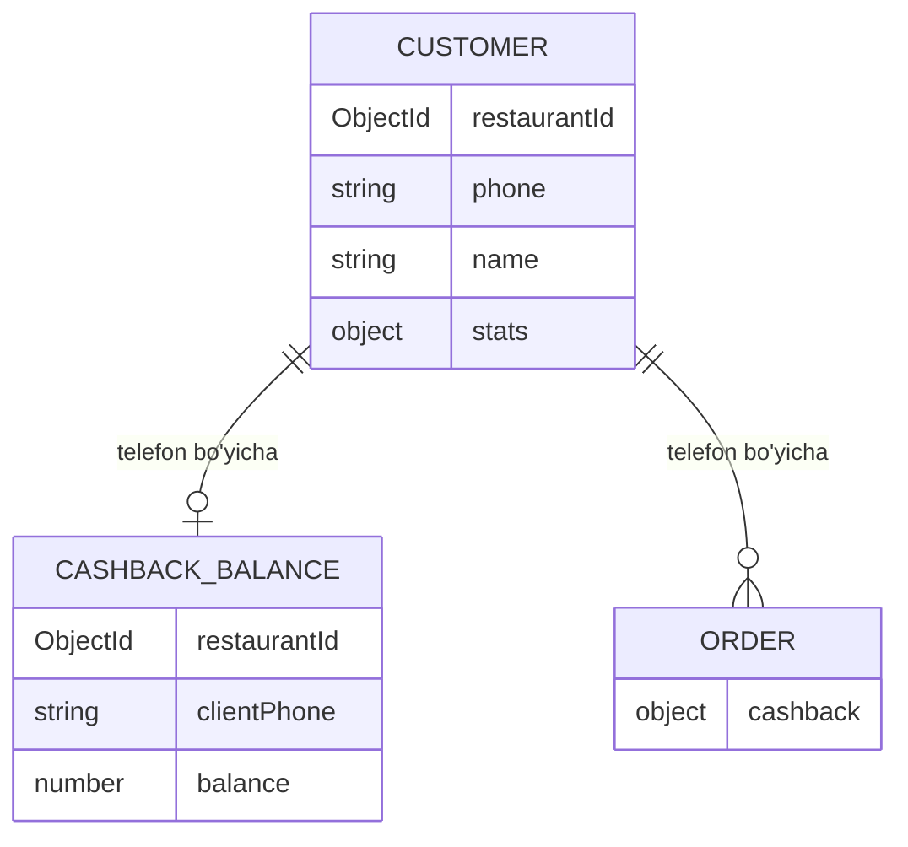

# Entity: customer (mijoz)

> [!important] Qaror (foydalanuvchi, 2026-05-29)
> Mijoz telefon raqami **WhatsApp orqali** olinadi (keshbek oqimi). Shu telefon bo'yicha mijoz **tarixi, keshbegi, tolovlari** ko'rsatiladi.

## Maqsadi

Mijozni telefon raqami bo'yicha kuzatish — keshbek, order tarixi, tolovlar. Telefon WhatsApp bot orqali olinadi ([[../04-toollar/keshbek-tizimi]]). Restoran bo'yicha (multi-tenant).

## Schema

```javascript
const customerSchema = new mongoose.Schema({
  // Multi-tenant (restoran bo'yicha)
  restaurantId: {
    type: mongoose.Schema.Types.ObjectId,
    ref: 'restaurant',
    required: true,
    index: true,
  },

  // Identity
  phone: {
    type: String,         // E.164 normalize ([[../07-nozik-nuqtalar/telefon-normalizatsiya]])
    required: true,
  },
  name: {
    type: String,         // WhatsApp profilidan yoki cashier kiritadi (ixtiyoriy)
  },

  // Manba
  source: {
    type: String,
    enum: ['whatsapp', 'cashier', 'qr_order'],
    default: 'whatsapp',
  },

  // Aggregate stats (hisoblanadigan / cache)
  stats: {
    totalOrders: { type: Number, default: 0 },
    totalSpent: { type: Number, default: 0 },
    firstOrderAt: Date,
    lastOrderAt: Date,
    visitCount: { type: Number, default: 0 },
  },

  // Kelajak (delivery toggle bilan)
  addresses: [{
    label: String,        // "Uy", "Ish"
    address: String,
    lat: Number, lng: Number,
  }],

  // Marketing (kelajak)
  marketingOptIn: { type: Boolean, default: false },

  // Metadata
  isActive: { type: Boolean, default: true },
  deleted: { type: Boolean, default: false },

  // Sync metadata
  version: { type: Number, default: 1 },
  syncStatus: { type: String, default: 'synced' },
  lastModifiedAt: { type: Date, default: Date.now },

}, { timestamps: true });

customerSchema.index({ restaurantId: 1, phone: 1 }, { unique: true });
customerSchema.index({ restaurantId: 1, 'stats.lastOrderAt': -1 });
customerSchema.index({ phone: 1 });
```

## Customer va cashback munosabati



- `customer` — identity + tarix/stats
- `cashback_balance` — balans + harakatlar (telefon bo'yicha bog'lanadi) — [[../04-toollar/keshbek-tizimi]]
- Ikkalasi ham `(restaurantId, phone)` bo'yicha
- Order `order.cashback.clientPhone` orqali bog'lanadi

> [!note] Customer keshbek toggle bilan keladi
> Customer entity asosan **keshbek** orqali to'ldiriladi (WhatsApp telefon). Keshbek o'chiq bo'lsa — customer ham deyarli bo'sh (faqat cashier qo'lda kiritsa). Kelajakda delivery/loyalty toggle bilan kengayadi.

## Customer qachon yaratiladi

| Manba | Qachon |
|---|---|
| WhatsApp (keshbek) | Mijoz QR skanerlab telefon yuborganda → customer upsert |
| Cashier | Cashier order'da telefon kiritsa (keshbek tolov) |
| QR Order | Mijoz QR order'da telefon qoldirsa (ixtiyoriy) |

```javascript
// Upsert (bor bo'lsa yangilanadi, yo'q bo'lsa yaratiladi)
async function upsertCustomer(restaurantId, phone, name, source) {
  const normalized = normalizePhone(phone, country);
  return customerModel.findOneAndUpdate(
    { restaurantId, phone: normalized },
    { $setOnInsert: { name, source, createdAt: new Date() } },
    { upsert: true, returnDocument: 'after' }
  );
}
```

## Stats yangilanishi

Order paid bo'lganda (eventBus 'order.paid'), agar customer bog'langan bo'lsa:
```javascript
async function updateCustomerStats(order) {
  const phone = order.cashback?.clientPhone;
  if (!phone) return;
  await customerModel.updateOne(
    { restaurantId: order.restaurantId, phone },
    {
      $inc: { 'stats.totalOrders': 1, 'stats.totalSpent': order.totalPrice, 'stats.visitCount': 1 },
      $set: { 'stats.lastOrderAt': new Date() },
      $setOnInsert: { 'stats.firstOrderAt': new Date() },
    }
  );
}
```

## Mijoz tarixi (admin/POS ko'rinishi)

Web admin yoki POS — telefon bo'yicha qidirish:
```
┌────────────────────────────────────┐
│ Mijoz: +998 90 123 45 67            │
│ Ism: Aziz (WhatsApp)                │
├────────────────────────────────────┤
│ Tashriflar: 12                      │
│ Jami sarflagan: 1 240 000 so'm      │
│ Oxirgi: 25.05.2026                  │
│ Keshbek balansi: 3 200 so'm         │
├────────────────────────────────────┤
│ Order tarixi:                       │
│  YUN-...0042  99 180  28.05         │
│  YUN-...0031  45 000  25.05         │
│  ...                                │
└────────────────────────────────────┘
```

Endpoint: `GET /customers/:phone` (restoran bo'yicha), `GET /customers/:phone/orders`.

## Multi-tenant

- Customer **restoran bo'yicha** — A restoran mijozi B restoranga ko'rinmaydi
- Bir telefon raqami har xil restoranlarda har xil customer (alohida tarix)
- Telefon — shaxsiy ma'lumot ([[../07-nozik-nuqtalar/xavfsizlik-qoshimcha]], GDPR)

## Privacy / GDPR

- Telefon — shaxsiy ma'lumot
- Mijoz "o'chiring" desa → anonimizatsiya (telefon olib tashlanadi, order tarixi anonim qoladi)
- WhatsApp opt-in (mijoz QR skanerlab roziligini bildiradi)

## Offline

- Customer asosan global'da (WhatsApp webhook global'ga keladi)
- Offline'da keshbek tolov **yo'q** ([[../04-toollar/keshbek-tizimi#Offline]]) → customer lookup offline'da kerak emas
- Order tarixi — global'da hisoblanadi

## Sample document

```json
{
  "_id": "65fc...",
  "restaurantId": "65f1a2b3...",
  "phone": "+998901234567",
  "name": "Aziz",
  "source": "whatsapp",
  "stats": {
    "totalOrders": 12,
    "totalSpent": 1240000,
    "firstOrderAt": "2026-01-10T...",
    "lastOrderAt": "2026-05-25T...",
    "visitCount": 12
  },
  "marketingOptIn": true,
  "isActive": true,
  "deleted": false
}
```

## Test rejasi

- [ ] WhatsApp telefon → customer upsert
- [ ] Order paid → stats yangilanadi
- [ ] Telefon bo'yicha tarix
- [ ] Multi-tenant (A→B ko'rinmaydi)
- [ ] Telefon normalize
- [ ] GDPR anonimizatsiya
- [ ] Bir telefon, ko'p restoran → alohida customer

## Bog'liq

- [[_MOC]]
- [[../04-toollar/keshbek-tizimi]]
- [[../07-nozik-nuqtalar/telefon-normalizatsiya]]
- [[order]]
- [[../07-nozik-nuqtalar/xavfsizlik-qoshimcha]]
