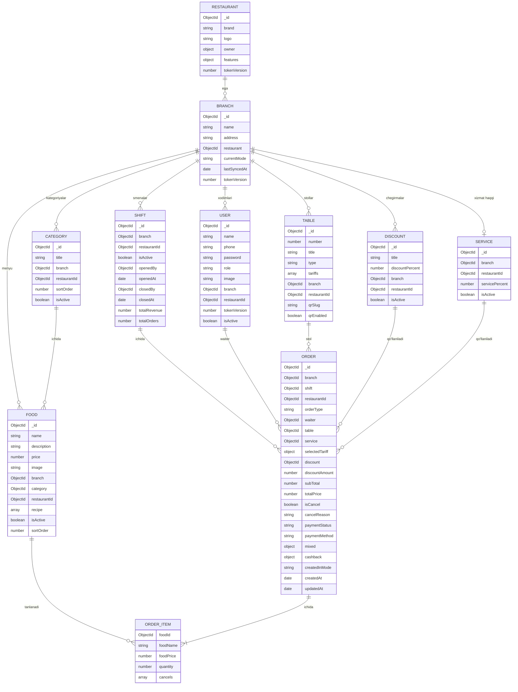
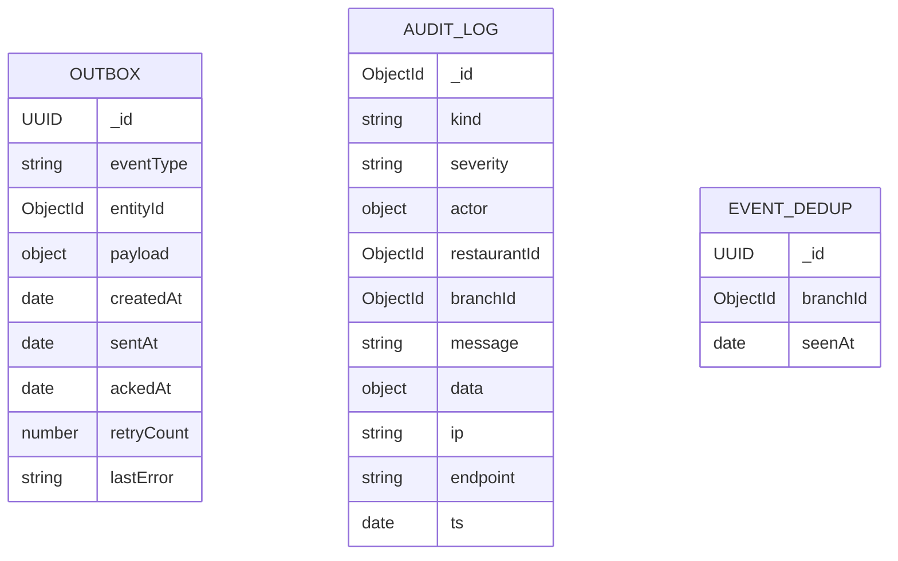
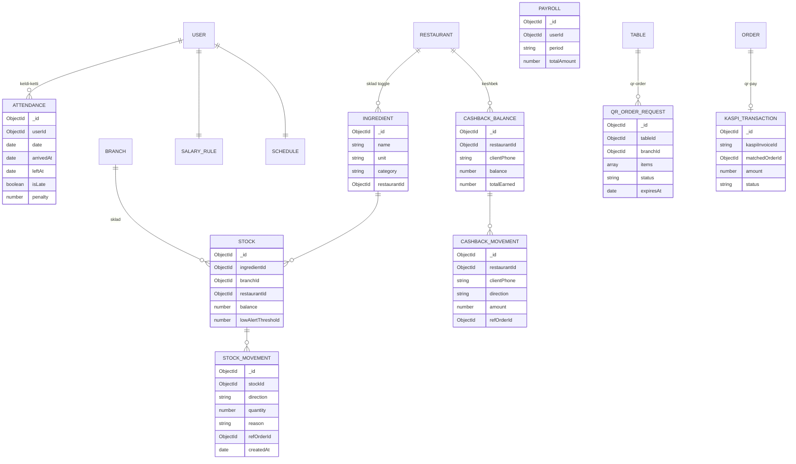
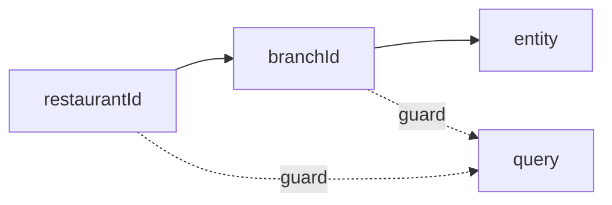

# ER diagrammasi

## Core entity'lar (tool'larsiz)

## Sync infrastructure entity'lari

`OUTBOX` faqat lokal MongoDB'da. `AUDIT_LOG` faqat global'da. `EVENT_DEDUP` ikkalasida.

## Tool entity'lari (toggle'lar)

Bu entity'lar faqat tegishli toggle yoqilgan bo'lsa mavjud:

## Ko'p ijaralilik (multi-tenancy) bog'lanishi

Har bir entity'da `restaurantId` (top-level), ko'p hollarda `branchId` ham (sub-tenant) bor. Bu — query speed va xavfsizlik uchun denormalize qilinadi (qarang: [[../02-arxitektura/xavfsizlik/tenant-izolyatsiyasi]]).

## Bog'liq

- [[_MOC]]
- [[sync-metadata]]
- [[index-strategiyasi]]
- [[snapshot-strategiyasi]]
