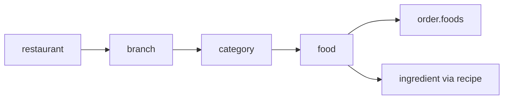

# Entity: food (taom)

## Maqsadi

Filial menyusi'dagi taom. Order'larda ishlatiladi. Sklad toggle yoqilgan bo'lsa — `recipe[]` orqali ingredient'larga bog'lanadi.

## Schema

```javascript
const foodSchema = new mongoose.Schema({
  // Asosiy
  name: { type: String, required: true },
  description: { type: String },
  price: { type: Number, required: true, min: 0 },
  image: { type: String },

  // Multi-tenant
  branch: {
    type: mongoose.Schema.Types.ObjectId,
    ref: 'branch',
    required: true,
    index: true,
  },
  restaurantId: {
    type: mongoose.Schema.Types.ObjectId,
    ref: 'restaurant',
    required: true,
    index: true,
  },

  // Klassifikatsiya
  category: {
    type: mongoose.Schema.Types.ObjectId,
    ref: 'category',
    required: true,
    index: true,
  },

  // UI
  isActive: {
    type: Boolean,
    default: true,
    index: true,
  },
  sortOrder: {
    type: Number,
    default: 0,
  },

  // Stop-list va kunlik limit (core — toggle emas) — qarang [[../07-nozik-nuqtalar/stop-list-limit]]
  availability: {
    stopped: { type: Boolean, default: false },       // manual stop-list
    stoppedAt: Date,
    stoppedBy: { type: mongoose.Schema.Types.ObjectId, ref: 'user' },
    stopReason: String,
    dailyLimit: { type: Number, default: null },       // null = limitsiz
    soldToday: { type: Number, default: 0 },            // limit qo'yilgandan beri
    limitSetAt: Date,
    autoStoppedByLimit: { type: Boolean, default: false },
  },

  // Sklad (toggle'da yoqilgan bo'lsa)
  recipe: [{
    ingredientId: {
      type: mongoose.Schema.Types.ObjectId,
      ref: 'ingredient',
    },
    quantity: { type: Number, required: true, min: 0 },
    unit: { type: String, required: true },
  }],

  // Kelajakda
  preparationTimeMinutes: Number,
  calories: Number,
  allergens: [String],
  isVegan: Boolean,
  isHalal: Boolean,
  spiciness: { type: Number, min: 0, max: 5 },

  // Sync metadata
  clientId: { type: String, sparse: true, unique: true },
  version: { type: Number, default: 1 },
  syncStatus: { type: String, default: 'synced' },
  lastModifiedAt: { type: Date, default: Date.now },
  lastModifiedBy: { userId: mongoose.Schema.Types.ObjectId, origin: String },
  deleted: { type: Boolean, default: false },
  deletedAt: Date,

}, {
  timestamps: true,
});

foodSchema.index({ restaurantId: 1, branch: 1, deleted: 1 });
foodSchema.index({ branch: 1, category: 1, isActive: 1, sortOrder: 1 });
foodSchema.index({ branch: 1, name: 1 });
foodSchema.index({ branch: 1, 'availability.stopped': 1 });  // stop-list filter
```

> [!important] Menyu har filial mustaqil (qaror 2026-05-29)
> Har filial o'z menyusini yaratadi (narx/tanlov farq qiladi). Filiallar orasida nusxalash — JSON export/import ([[../07-nozik-nuqtalar/menyu-export-import]]). Stop-list/limit ham per-branch ([[../07-nozik-nuqtalar/stop-list-limit]]).

## Field'lar tafsiloti

| Field | Tur | Tavsif |
|---|---|---|
| `name` | string | Taom nomi ("Osh", "Mantı") |
| `description` | string | Ixtiyoriy tavsif |
| `price` | number | Joriy narx |
| `image` | string | Tasvir URL |
| `branch` | ObjectId | Filial — har filial o'z menyu'sini boshqaradi |
| `restaurantId` | ObjectId | Denorm |
| `category` | ObjectId | Kategoriya |
| `isActive` | boolean | Menyu'da ko'rinadimi (vaqtinchalik o'chirish) |
| `sortOrder` | number | Kategoriya ichida tartib |
| `recipe[]` | array | Sklad uchun ingredient'lar (BOM) |
| `preparationTimeMinutes` | number | Cook uchun ko'rsatuv |
| `allergens[]` | string array | Mijozni ogohlantirish (kelajakda) |

## isActive vs deleted farqi

- `isActive: false` — vaqtinchalik o'chirilgan. Menyuda ko'rinmaydi, lekin oson qaytarib qo'shilishi mumkin. Admin web'da "Ko'rsatish" toggle.
- `deleted: true` — abadiy o'chirilgan. UI'da yo'qoladi. Tarixiy order'larda ref qoladi.

## Munosabatlar



## Order'da snapshot

Order yaratilganda `foodName` va `foodPrice` snapshot olinadi (qarang [[snapshot-strategiyasi]]):

```javascript
order.foods.push({
  foodId: food._id,
  foodName: food.name,        // SNAPSHOT
  foodPrice: food.price,      // SNAPSHOT
  quantity: 2,
});
```

Bu sababdan food narxi o'zgartirilsa — eski order'larda eski narx ko'rinadi.

## Recipe (sklad toggle)

```javascript
food.recipe = [
  { ingredientId: 'un', quantity: 200, unit: 'g' },
  { ingredientId: 'go\'sht', quantity: 150, unit: 'g' },
  { ingredientId: 'sabzavot', quantity: 50, unit: 'g' },
];
```

Order yaratilganda (sklad yoqilgan bo'lsa) → eventBus 'order.created' → sklad listener → har taom uchun recipe'ga qarab `stock.balance -= quantity`.

Sklad o'chirilgan bo'lsa — `recipe` saqlanadi, lekin ishlatilmaydi.

## Multi-tenant guard

Har query:
```javascript
foodModel.findInTenant(req.userData)
  .where({ branch: req.userData.branchId, isActive: true })
  .sort({ sortOrder: 1 });
```

## Sync xulq-atvori

Food entity'si **ikkala tomonda** yashaydi:
- Global — admin web'dan yangilanadi
- Lokal — POS UI menyu uchun

Global'da o'zgartirilgan menyu — barcha shu filial lokal backendlariga sync.

> [!note] Menyu sync prioritizatsiyasi
> Menyu o'zgarishi order'lardan past prioritet. Order — real-time, menyu — eventual (1-2 sekund kechikish OK).

## Yaratish

```javascript
POST /api/foods/create
Body: { name, description, price, branch, category, recipe? }
File: image

Backend:
1. Validate (price >= 0, category mavjudligi)
2. Branch/category tenant tekshiruvi
3. Image upload (multer)
4. Create food
5. Broadcast 'food.created' (boshqa mijozlarga)
6. Lokal backend(lar)ga sync
```

## O'chirish (2 daraja)

1. **Vaqtinchalik (stop-list/isActive):** menyudan yashirin (oson qaytariladi)
2. **O'chirish:** `DELETE /:id` → `findByIdAndDelete` EMAS → `isDeleted: true`. 1 oy saqlanadi (tiklash uchun), hamma joydan yashirin. 1 oydan keyin tiklanmasa fizik o'chadi ([[../07-nozik-nuqtalar/ochirish-cascade#Soft delete + 1 oylik tiklash]])

## Sample document

```json
{
  "_id": "65f4d5e6f7a8b9c0d1e2f3a4",
  "name": "Osh",
  "description": "An'anaviy o'zbek oshi, go'shtli",
  "price": 35000,
  "image": "/uploads/foods/1717000000-osh.jpg",
  "branch": "65f2b3c4d5e6f7a8b9c0d1e2",
  "restaurantId": "65f1a2b3c4d5e6f7a8b9c0d1",
  "category": "65f5e6f7a8b9c0d1e2f3a4b5",
  "isActive": true,
  "sortOrder": 1,
  "recipe": [
    { "ingredientId": "65f6...un", "quantity": 200, "unit": "g" },
    { "ingredientId": "65f6...gosht", "quantity": 150, "unit": "g" },
    { "ingredientId": "65f6...sabzi", "quantity": 100, "unit": "g" }
  ],
  "preparationTimeMinutes": 25,
  "allergens": ["gluten"],
  "isVegan": false,
  "isHalal": true,
  "spiciness": 1,
  "syncStatus": "synced",
  "version": 3,
  "deleted": false
}
```

## Bog'liq

- [[_MOC]]
- [[category]]
- [[order]]
- [[../04-toollar/sklad]]
- [[snapshot-strategiyasi]]
