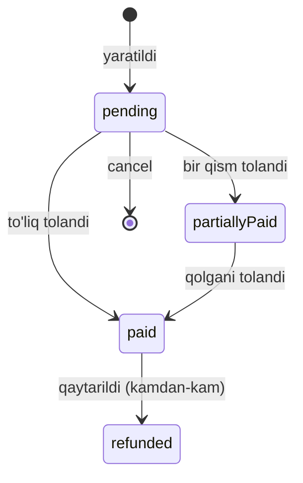

# Entity: order (buyurtma)

> ⭐ Tizim'dagi eng muhim va eng murakkab entity. Hisobotlar, tolovlar, kassa, sklad — barchasi shu yerga bog'lanadi.

## Maqsadi

Mijoz buyurtmasi. Stol turida (dineIn) yoki olib ketish (takeaway) yoki yetkazib berish (delivery). Smena ichida yaratiladi. To'lov olinadi yoki bekor qilinadi. Tarixiy ma'lumot sifatida saqlanadi.

## Schema (joriy + kengaytirilgan)

```javascript
const orderSchema = new mongoose.Schema({
  // ============= Multi-tenant =============
  branch: {
    type: mongoose.Schema.Types.ObjectId,
    ref: 'branch',
    required: true,
    index: true,
  },
  restaurantId: {
    type: mongoose.Schema.Types.ObjectId,
    ref: 'restaurant',
    required: true,
    index: true,
  },

  // ============= Smena =============
  shift: {
    type: mongoose.Schema.Types.ObjectId,
    ref: 'shift',
    required: true,
    index: true,
  },

  // ============= Chek raqami (inson o'qiydigan) =============
  // qarang [[../07-nozik-nuqtalar/chek-raqamlash]]
  receiptNumber: {
    type: String,
    required: true,
    // format: PREFIX-YYYYMMDD-NNNN (masalan YUN-20260528-0042)
  },

  // ============= Valyuta snapshot =============
  // restaurant.currency'dan, snapshot (qarang [[../07-nozik-nuqtalar/pul-valyuta-yaxlitlash]])
  currency: {
    type: String,
    enum: ['UZS', 'KZT'],
  },

  // ============= Bog'langan order (split/keyin qo'shilgan) =============
  // qarang [[../07-nozik-nuqtalar/split-bill-order-tahrir]]
  parentOrderId: {
    type: mongoose.Schema.Types.ObjectId,
    ref: 'order',
    default: null,
  },

  // ============= Order turi =============
  orderType: {
    type: String,
    enum: ['dineIn', 'takeaway', 'delivery'],
    required: true,
    index: true,
  },

  // ============= Waiter (snapshot) =============
  waiter: {
    waiterId: { type: mongoose.Schema.Types.ObjectId, ref: 'user' },
    name: String,           // SNAPSHOT
    phone: String,          // SNAPSHOT
  },

  // ============= Stol (faqat dineIn) =============
  table: {
    type: mongoose.Schema.Types.ObjectId,
    ref: 'table',
    default: null,
    required: function () {
      return this.orderType === 'dineIn';
    },
  },

  // ============= Service (snapshot) =============
  service: {
    serviceId: { type: mongoose.Schema.Types.ObjectId, ref: 'service' },
    percent: { type: Number, default: 0 },  // SNAPSHOT
    amount: { type: Number, default: 0 },   // hisoblangan
  },

  // ============= Stol tarifi snapshot (dineIn) =============
  selectedTariff: {
    name: { type: String, default: null },
    price: { type: Number, default: 0 },
    chargeType: { type: String, enum: ['hourly', 'fixed', 'daily', null], default: null },
    duration: Number,
    startedAt: Date,          // hourly uchun
    totalAmount: Number,      // hisoblangan
  },

  // ============= Taomlar =============
  foods: {
    type: [{
      foodId: {
        type: mongoose.Schema.Types.ObjectId,
        ref: 'food',
        required: true,
      },
      foodName: { type: String, required: true },    // SNAPSHOT
      foodPrice: { type: Number, required: true, min: 0 },  // SNAPSHOT
      quantity: { type: Number, required: true, min: 1 },

      // changelog
      cancels: [{
        status: { type: String, enum: ['inc', 'dec'], required: true },
        changeVal: { type: Number, required: true, min: 1 },
        changeReason: { type: String, default: null },
        changedBy: { type: mongoose.Schema.Types.ObjectId, ref: 'user' },
        changedAt: { type: Date, default: Date.now },
      }],

      // Cook bilan integratsiya
      cookingStatus: {
        type: String,
        enum: ['waiting', 'cooking', 'ready', 'served'],
        default: 'waiting',
      },
      cookingStartedAt: Date,
      readyAt: Date,
      servedAt: Date,
      cookId: { type: mongoose.Schema.Types.ObjectId, ref: 'user' },
    }],
    validate: [{
      validator: function (v) { return v.length > 0; },
      message: 'At least one food is required',
    }],
  },

  // ============= Chegirma (snapshot) =============
  discount: {
    discountId: { type: mongoose.Schema.Types.ObjectId, ref: 'discount' },
    title: String,           // SNAPSHOT
    type: String,            // 'percent' | 'amount'
    percent: Number,         // SNAPSHOT
    amount: Number,          // SNAPSHOT (amount type)
  },
  discountAmount: {
    type: Number,
    default: 0,
    min: 0,
  },

  // ============= Hisoblar =============
  subTotal: {                // foods total
    type: Number,
    default: 0,
    min: 0,
  },
  totalPrice: {              // foods + tariff + service - discount
    type: Number,
    required: true,
    min: 0,
  },

  // ============= Cancel =============
  isCancel: {
    type: Boolean,
    default: false,
    index: true,
  },
  cancelReason: { type: String, default: null },
  cancelledBy: { type: mongoose.Schema.Types.ObjectId, ref: 'user' },
  cancelledAt: Date,

  // ============= Tolov =============
  paymentStatus: {
    type: String,
    enum: ['pending', 'paid', 'partiallyPaid', 'refunded'],
    default: 'pending',
    index: true,
  },
  paymentMethod: {
    type: String,
    enum: ['cash', 'card', 'transfer', 'kaspi', 'mixed', 'cashback', null],
    default: null,
  },
  paidAt: Date,
  paidBy: { type: mongoose.Schema.Types.ObjectId, ref: 'user' },  // cashier

  // Mixed payment breakdown
  mixed: {
    cash: { type: Number, default: 0 },
    card: { type: Number, default: 0 },
    transfer: { type: Number, default: 0 },
    kaspi: { type: Number, default: 0 },
    cashback: { type: Number, default: 0 },
  },

  // Cashback (keshbek tool)
  cashback: {
    earned: { type: Number, default: 0 },    // bu order'dan keshbek olinadi
    spent: { type: Number, default: 0 },     // bu order tolovida keshbek ishlatildi
    clientPhone: String,
  },

  // Kaspi tolov
  kaspi: {
    invoiceId: String,
    qrType: { type: String, enum: ['static', 'dynamic'] },
    paidAmount: Number,
    paidAt: Date,
    webhookReceivedAt: Date,
  },

  // ============= Rejim (qaysi rejimda yaratildi) =============
  createdInMode: {
    type: String,
    enum: ['online', 'offline', 'possiz'],
    default: 'online',
  },
  checkPrinted: {
    type: Boolean,
    default: false,
  },
  checkPdfUrl: String,

  // ============= Source =============
  source: {
    type: String,
    enum: ['pos', 'waiter_mobile', 'qr', 'admin', 'possiz_mobile'],
    default: 'pos',
  },

  // ============= QR Order (tool) =============
  qrOrderRequestId: { type: mongoose.Schema.Types.ObjectId, ref: 'qr_order_request' },

  // ============= Fiskal (RESERVED — hozircha ishlatilmaydi) =============
  // qarang [[../07-nozik-nuqtalar/fiskal-soliq]]. Kelajakda KKM uchun joy.
  fiscal: {
    enabled: { type: Boolean, default: false },
    fiscalNumber: { type: String, default: null },
    fiscalSign: String,
    ofdProvider: String,
    ofdSentAt: Date,
    ofdStatus: { type: String, default: null },
    qqs: { rate: Number, amount: Number },
    raw: Object,
  },

  // DIQQAT: tip (chayyot pul) field YO'Q — qaror 2026-05-29
  // (qarang [[../07-nozik-nuqtalar/pul-valyuta-yaxlitlash#Chayyot pul (tip) — YO'Q qarori]])

  // ============= Sync metadata =============
  clientId: { type: String, sparse: true, unique: true },
  version: { type: Number, default: 1 },
  syncStatus: {
    type: String,
    enum: ['synced', 'pending', 'in_progress', 'rejected', 'conflict'],
    default: 'synced',
    index: true,
  },
  lastModifiedAt: { type: Date, default: Date.now },
  lastModifiedBy: { userId: mongoose.Schema.Types.ObjectId, origin: String, branchId: mongoose.Schema.Types.ObjectId },

  // Soft delete kamdan-kam — kassa hujjat
  deleted: { type: Boolean, default: false },

}, {
  timestamps: true,
});

// INDEXES — qarang [[index-strategiyasi]]
orderSchema.index({ branch: 1, createdAt: -1 });
orderSchema.index({ branch: 1, shift: 1, createdAt: -1 });
orderSchema.index({ branch: 1, paymentStatus: 1 });
orderSchema.index({ branch: 1, table: 1, paymentStatus: 1 });
orderSchema.index({ branch: 1, isCancel: 1 });
orderSchema.index({ shift: 1, paymentStatus: 1 });
orderSchema.index({ 'waiter.waiterId': 1, createdAt: -1 });
orderSchema.index({ restaurantId: 1, createdAt: -1 });
orderSchema.index({ syncStatus: 1, branch: 1 });
orderSchema.index({ clientId: 1 }, { sparse: true, unique: true });
orderSchema.index({ 'cashback.clientPhone': 1 }, { sparse: true });
orderSchema.index({ 'kaspi.invoiceId': 1 }, { sparse: true });
orderSchema.index({ branch: 1, receiptNumber: 1 }, { unique: true });  // chek raqami unique
orderSchema.index({ parentOrderId: 1 }, { sparse: true });
```

## Joriy holatdan farqi

Hozirgi [order.model.js](../../../global/backend/models/order.model.js) — yaxshi yo'lda. Lekin tuzatishlar:

| Yangi/o'zgartirish | Sabab |
|---|---|
| `restaurantId` (denorm) | Multi-tenant guard, query speed |
| `waiter` — snapshot subdoc | [[snapshot-strategiyasi]] |
| `service` — snapshot subdoc | Eski order'da eski foiz |
| `discount` — snapshot subdoc | Eski order'da eski discount |
| `foods.cookingStatus` | Cook ↔ Waiter integratsiya |
| `paymentMethod` 'kaspi', 'transfer' qo'shildi | Tolov turlari kengaytirildi |
| `cancelledBy`, `cancelledAt` | Audit |
| `paidBy`, `paidAt` | Audit + payroll uchun |
| `mixed.kaspi`, `mixed.cashback` | Mixed paytida kaspi/keshbek |
| `mixed.transfer` qo'shildi | |
| `createdInMode` | offline/possiz farqlash |
| `source` | QR/mobile/POS farqlash |
| `qrOrderRequestId` | QR Order toggle |
| Sync metadata | [[sync-metadata]] |

## Order turi (orderType)

### dineIn
- Stol talab qilinadi (`table` required)
- Service qo'llaniladi (default)
- Tariff (selectedTariff) bo'lishi mumkin
- Waiter ko'pincha bog'liq
- POS yoki waiter mobile'dan

### takeaway
- Stol yo'q
- Service default qo'shilmaydi
- Mijoz olib ketadi
- Waiter ixtiyoriy
- Asosan POS'dan

### delivery
- Stol yo'q
- Service ixtiyoriy
- Mijoz manzili kerak (kelajak field: `deliveryAddress`)
- Courier bog'lanish (kelajak)

## Foods array — chuqurroq

```javascript
foods: [
  {
    foodId: '65f4...',
    foodName: 'Osh',            // SNAPSHOT
    foodPrice: 35000,           // SNAPSHOT
    quantity: 3,
    cancels: [
      { status: 'inc', changeVal: 1, changeReason: 'mijoz xohladi', changedBy: 'waiter id', changedAt: '...' },
      { status: 'dec', changeVal: 2, changeReason: 'cancel', changedBy: 'cashier id', changedAt: '...' },
    ],
    cookingStatus: 'cooking',
    cookingStartedAt: '...',
    cookId: 'cook user id',
  },
]
```

Effektiv miqdor:
```javascript
function effectiveQuantity(item) {
  const inc = item.cancels.filter(c => c.status === 'inc').reduce((s, c) => s + c.changeVal, 0);
  const dec = item.cancels.filter(c => c.status === 'dec').reduce((s, c) => s + c.changeVal, 0);
  return Math.max(0, item.quantity + inc - dec);
}
```

> [!warning] cancels'da quantity to'g'rilanadi?
> Boshqa yondashuv — har cancel'dan keyin `item.quantity` ham yangilanadi. Bu sodda, lekin tarix yo'qoladi. Joriy yondashuv (cancels changelog) — yaxshi.
>
> Yana boshqa savol: foods.cancels qaytadan o'qib hisoblash o'rniga, asosiy `quantity` ni yangilab, alohida `audit_log` saqlash. Bu yengilroq, lekin mavjud dizayn changelog'ga moyil. Buni tasdiqlash kerak.

## Hisoblash (totals)

```javascript
function calculateOrderTotals(order) {
  // subTotal
  order.subTotal = order.foods.reduce((sum, item) => {
    return sum + item.foodPrice * effectiveQuantity(item);
  }, 0);

  // tariff
  let tariffAmount = 0;
  if (order.selectedTariff) {
    if (order.selectedTariff.chargeType === 'fixed') {
      tariffAmount = order.selectedTariff.price;
    } else if (order.selectedTariff.chargeType === 'hourly') {
      const elapsed = (Date.now() - order.selectedTariff.startedAt) / 60000;
      const units = Math.ceil(elapsed / order.selectedTariff.duration);
      tariffAmount = units * order.selectedTariff.price;
    } else if (order.selectedTariff.chargeType === 'daily') {
      const days = Math.ceil((Date.now() - order.selectedTariff.startedAt) / (24 * 3600 * 1000));
      tariffAmount = days * order.selectedTariff.price;
    }
    order.selectedTariff.totalAmount = tariffAmount;
  }

  // discount
  if (order.discount) {
    if (order.discount.type === 'amount') {
      order.discountAmount = Math.min(order.discount.amount, order.subTotal);
    } else {
      order.discountAmount = Math.round(order.subTotal * order.discount.percent / 100);
    }
  }

  // service
  if (order.service && order.service.percent > 0) {
    const baseForService = order.subTotal - (order.discountAmount || 0);
    order.service.amount = Math.round(baseForService * order.service.percent / 100);
  }

  // total
  order.totalPrice = order.subTotal + tariffAmount + (order.service?.amount || 0) - (order.discountAmount || 0);
  return order;
}
```

Tafsilot: [[biznes-mantiq/total-hisoblash]]

## Payment status oqimi



## Order lifecycle (umumiy)

Tafsilot: [[biznes-mantiq/order-lifecycle]]

## Sync xulq-atvori

Order — eng aktiv sinxron entity:
- **Yaratish:** lokal yoki global → outbox → boshqa tomonga
- **Update (taom qo'shish, cancel, tolov):** har versiya +1
- **Konflikt:** [[../02-arxitektura/conflict-resolution|per-field merge]] (foods additive, paymentStatus last-writer)
- **Possiz orderlar:** `createdInMode='possiz'`, `checkPrinted` always false

## Offline yaratish

```javascript
// Offline'da yaratilgan order
{
  ...,
  clientId: 'uuid-v4',           // lokal generatsiya
  syncStatus: 'pending',
  createdInMode: 'offline',
  shift: <lokal shift id>,        // lokal'dagi smena
  // ...
}
```

Sync paytida outbox orqali global'ga yetadi, global'da yangi `_id` beriladi yoki `clientId` orqali topiladi.

## Sample document (oddiy paid order)

```json
{
  "_id": "65fb1d2e3f4a5b6c7d8e9f0a",
  "branch": "65f2b3c4d5e6f7a8b9c0d1e2",
  "restaurantId": "65f1a2b3c4d5e6f7a8b9c0d1",
  "shift": "65f8b9c0d1e2f3a4b5c6d7e8",
  "orderType": "dineIn",
  "waiter": {
    "waiterId": "65f3c4d5e6f7a8b9c0d1e2f3",
    "name": "Alisher Karimov",
    "phone": "+998901112233"
  },
  "table": "65f7a8b9c0d1e2f3a4b5c6d7",
  "service": {
    "serviceId": "65f9c0d1e2f3a4b5c6d7e8f9",
    "percent": 6,
    "amount": 4200
  },
  "selectedTariff": null,
  "foods": [
    {
      "foodId": "65f4d5e6f7a8b9c0d1e2f3a4",
      "foodName": "Osh",
      "foodPrice": 35000,
      "quantity": 2,
      "cancels": [],
      "cookingStatus": "served",
      "cookingStartedAt": "2026-05-28T14:00:00Z",
      "readyAt": "2026-05-28T14:25:00Z",
      "servedAt": "2026-05-28T14:27:00Z",
      "cookId": "65f3...cook"
    }
  ],
  "discount": null,
  "discountAmount": 0,
  "subTotal": 70000,
  "totalPrice": 74200,
  "isCancel": false,
  "paymentStatus": "paid",
  "paymentMethod": "kaspi",
  "paidAt": "2026-05-28T15:00:00Z",
  "paidBy": "65f3...cashier",
  "kaspi": {
    "invoiceId": "INV-2026-12345",
    "qrType": "dynamic",
    "paidAmount": 74200,
    "paidAt": "2026-05-28T15:00:00Z",
    "webhookReceivedAt": "2026-05-28T15:00:02Z"
  },
  "createdInMode": "online",
  "checkPrinted": true,
  "source": "pos",
  "clientId": "uuid...",
  "version": 5,
  "syncStatus": "synced",
  "createdAt": "2026-05-28T14:00:00Z",
  "updatedAt": "2026-05-28T15:00:00Z"
}
```

## Sample document (offline pending)

```json
{
  "_id": "65fb2d3e4f5a6b7c8d9e0f1b",
  "clientId": "550e8400-e29b-41d4-a716-446655440000",
  "branch": "...",
  "shift": "<lokal shift>",
  "orderType": "dineIn",
  "foods": [...],
  "totalPrice": 50000,
  "paymentStatus": "pending",
  "createdInMode": "offline",
  "syncStatus": "pending",
  "version": 1,
  "createdAt": "..."
}
```

## Test rejasi

- [ ] Schema validation (foods kerak, tariff hourly bo'lsa startedAt kerak)
- [ ] Effektive quantity hisoblash
- [ ] Totals hisoblash (subTotal, discount, service, tariff, total)
- [ ] Payment status transitions
- [ ] Snapshot — food.price o'zgargach eski order'da eski narx
- [ ] Cancel oqimi
- [ ] Offline yaratish + sync
- [ ] Konflikt merge (foods additive)
- [ ] Shift yopilmoqchi bo'lganda pending order block
- [ ] Multi-tenant guard

## Bog'liq

- [[_MOC]]
- [[snapshot-strategiyasi]]
- [[shift]]
- [[food]]
- [[table]]
- [[service]]
- [[discount]]
- [[biznes-mantiq/order-lifecycle]]
- [[biznes-mantiq/total-hisoblash]]
- [[biznes-mantiq/tolov-oqimi]]
- [[biznes-mantiq/cancel-refund]]
