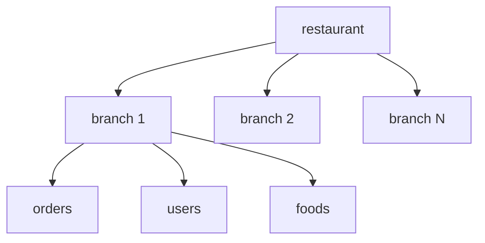
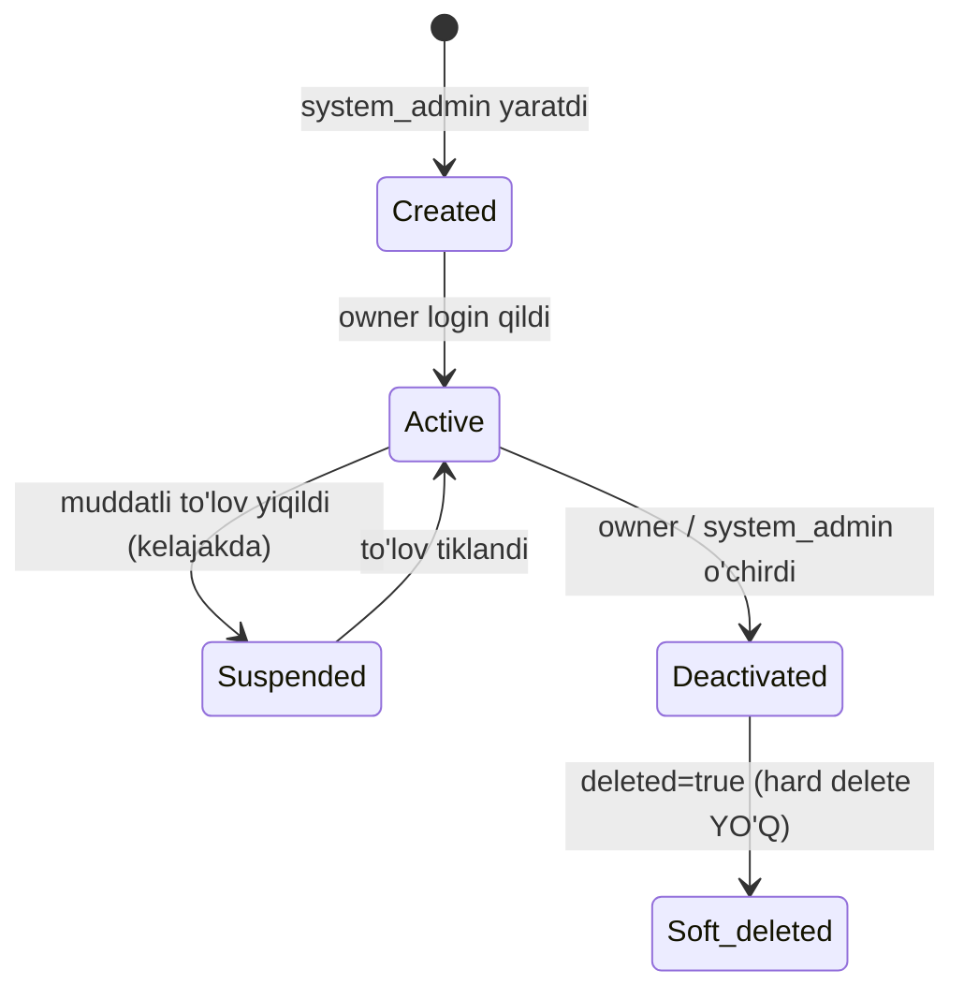

# Entity: restaurant

## Maqsadi

Restoran — tizim'dagi eng yuqori multi-tenant boundary. Har bir mijoz (sotib oluvchi) — bitta restaurant. Bitta restaurant'da bir nechta filial (branch) bo'lishi mumkin.

## Schema

```javascript
import mongoose from 'mongoose';

const restaurantSchema = new mongoose.Schema({
  // Asosiy
  brand: {
    type: String,
    required: true,
  },
  logo: {
    type: String,        // /uploads/xxx.jpg yoki public URL
    required: true,
  },

  // Egasi
  owner: {
    phone: { type: String, required: true },
    name: { type: String, required: true },
    password: { type: String, required: true },   // bcrypt hash
  },

  // Auth
  tokenVersion: {
    type: Number,
    default: 1,
  },

  // Valyuta — qaror 2026-05-29, har restoran bittadan (qarang [[../07-nozik-nuqtalar/pul-valyuta-yaxlitlash]])
  currency: {
    type: String,
    enum: ['UZS', 'KZT'],
    required: true,
    default: 'UZS',
    immutable: true,        // yaratilgach o'zgartirib bo'lmaydi
  },

  // Vaqt (qarang [[../07-nozik-nuqtalar/vaqt-va-soat]])
  timezone: {
    type: String,
    default: 'Asia/Tashkent',  // yoki Asia/Almaty
  },
  businessDayStartHour: {
    type: Number,
    default: 6,             // biznes kun 06:00 da boshlanadi
  },

  // Toggle tizimi
  features: {
    offline: {
      enabled: { type: Boolean, default: true },
      config: { type: Object, default: () => ({}) },
    },
    possiz: {
      enabled: { type: Boolean, default: false },
      config: { type: Object, default: () => ({}) },
    },
    sklad: {
      enabled: { type: Boolean, default: false },
      config: { type: Object, default: () => ({ lowStockAlert: 10, autoDeductOnOrder: true }) },
    },
    keldiKetti: {
      enabled: { type: Boolean, default: false },
      config: { type: Object, default: () => ({}) },
    },
    qrOrder: {
      enabled: { type: Boolean, default: false },
      config: { type: Object, default: () => ({ pendingExpiryMinutes: 5, autoApprove: false }) },
    },
    qrPay: {
      enabled: { type: Boolean, default: false },
      config: { type: Object, default: () => ({ provider: 'kaspi' }) },
    },
    keshbek: {
      enabled: { type: Boolean, default: false },
      config: { type: Object, default: () => ({ percent: 5, minOrderAmount: 1000 }) },
    },
    // Yangi tool'lar shu yerga qo'shiladi
  },

  // Installed feature versions (migration tracking)
  installedFeatureVersions: {
    type: Map,
    of: Number,
    default: () => new Map(),
  },

  // Metadata
  isActive: { type: Boolean, default: true },
  createdBy: { type: mongoose.Schema.Types.ObjectId, ref: 'system_admin' },

  // Sync metadata field'lari (qarang [[sync-metadata]])
  // restaurant lokal'ga sync bo'lmaydi, lekin field'lar bazaviy ehtiyot uchun
  deleted: { type: Boolean, default: false },
  deletedAt: Date,

}, {
  timestamps: true,    // createdAt, updatedAt
});

restaurantSchema.index({ 'owner.phone': 1 }, { unique: true });
restaurantSchema.index({ brand: 1 });
restaurantSchema.index({ deleted: 1 });
```

## Field'lar tafsiloti

| Field | Tur | Tavsif |
|---|---|---|
| `brand` | string | Restoran brand nomi |
| `logo` | string | Logo file path yoki URL |
| `owner.phone` | string | Unique — login uchun |
| `owner.name` | string | Restoran egasi ismi |
| `owner.password` | string | bcrypt hash (plain saqlamaymiz!) |
| `tokenVersion` | number | JWT bekor qilish uchun. Logout/parol change'da +1 |
| `features.X.enabled` | boolean | Tool yoqilganmi |
| `features.X.config` | object | Tool sozlamalari |
| `installedFeatureVersions` | Map<key, version> | Tool migration kuzatuv |
| `isActive` | boolean | Restoran ta'tildami? |
| `createdBy` | ObjectId | Tizim admini |
| `deleted` | boolean | Soft delete |

## Munosabatlar



- `1 restaurant → N branch`
- Boshqa entity'lar `branch` orqali bog'lanadi (`branch.restaurant` ref)
- Restoran o'chirilsa — cascade soft delete (yoki bo'shliqda qoldirish)

## Multi-tenant boundary

Restoran — **eng yuqori boundary**. Hech qachon ikki restoran ma'lumotlari aralashmaydi.

Har query'da:
```javascript
.where({ restaurantId: req.userData.restaurantId })
// yoki
.findInTenant(req.userData)
```

## Lokal backend bilan munosabati

Restoran entity'si **faqat global VPS'da yashaydi**. Lokal MongoDB'da mavjud emas (filial faqat o'zining ma'lumotlarini biladi).

Lokal'da kerakli bo'lganlar:
- `restaurant.brand`, `restaurant.logo` — POS UI uchun (lokal config'da cached)
- `restaurant.features` — toggle holatlari (lokal `feature-flags-cache.json`)

Bu cache global'dan sync bo'ladi — `restaurant.features_changed` socket event orqali.

## Hayot davri (lifecycle)



> [!note] Hard delete YO'Q
> Restoran o'chirilsa ham `deleted: true` — fizik o'chirilmaydi ([[../09-deployment/backup-pitr]]). Data + PITR backup abadiy qoladi.

## Yaratish (registration)

```javascript
POST /api/restaurants/create
{
  brand: 'Olov Mehmonxonasi',
  logo: <file>,
  owner: {
    phone: '+998901234567',
    name: 'Alisher Karimov',
    password: 'plain-text',
  }
}
```

Backend:
1. Validate
2. bcrypt hash password
3. Phone uniqueness check
4. Create restaurant (features default values)
5. **`restaurant.created` event** — boshqa servis'larga (analitika, email)
6. Email owner (welcome + login link)

## Login (yangi yo'l)

Qarang: [[../02-arxitektura/xavfsizlik/restoran-auth-tuzatish]]

`POST /api/restaurants/login` — phone + password → JWT (`type: 'owner'`)

## Feature toggle yoqish/o'chirish

```javascript
PATCH /api/restaurants/:id/features/:featureKey
Body: { enabled: true, config: {...} }
```

Server:
1. Tokenni tekshirish (owner role)
2. Feature registry'ni topish
3. Validate dependencies (requires/excludes)
4. Run lifecycle hooks (onEnable yoki onDisable)
5. Update `restaurant.features.X`
6. Broadcast `restaurant.features_changed` (lokal backendlarga)

## Field-level encryption (kelajakda)

`owner.phone` mijoz uchun emas, balki API uchun — lekin tarmoq sniffing himoyasiga ehtiyoj bor (HTTPS oraqali tarjima qilinadi).

Hozirgi `owner.password` allaqachon bcrypt — yaxshi.

## Sample document

```json
{
  "_id": "65f1a2b3c4d5e6f7a8b9c0d1",
  "brand": "Olov Mehmonxonasi",
  "logo": "/uploads/1717000000-olov-logo.png",
  "owner": {
    "phone": "+998901234567",
    "name": "Alisher Karimov",
    "password": "$2b$10$abcdefghijklmnopqrstuvwxyz1234567890ABCDEFGH"
  },
  "tokenVersion": 1,
  "features": {
    "offline": { "enabled": true, "config": {} },
    "possiz": { "enabled": false, "config": {} },
    "sklad": { "enabled": true, "config": { "lowStockAlert": 10, "autoDeductOnOrder": true } },
    "keldiKetti": { "enabled": false, "config": {} },
    "qrOrder": { "enabled": false, "config": {} },
    "qrPay": { "enabled": false, "config": {} },
    "keshbek": { "enabled": true, "config": { "percent": 5, "minOrderAmount": 1000 } }
  },
  "installedFeatureVersions": {
    "offline": 1,
    "sklad": 1,
    "keshbek": 1
  },
  "isActive": true,
  "deleted": false,
  "createdAt": "2026-01-15T08:00:00Z",
  "updatedAt": "2026-05-20T14:30:00Z"
}
```

## Bog'liq

- [[_MOC]]
- [[branch]]
- [[../03-tool-strategiyasi/feature-toggle-tizimi]]
- [[../02-arxitektura/xavfsizlik/restoran-auth-tuzatish]]
- [[../02-arxitektura/multi-tenant-xavfsizlik]]
