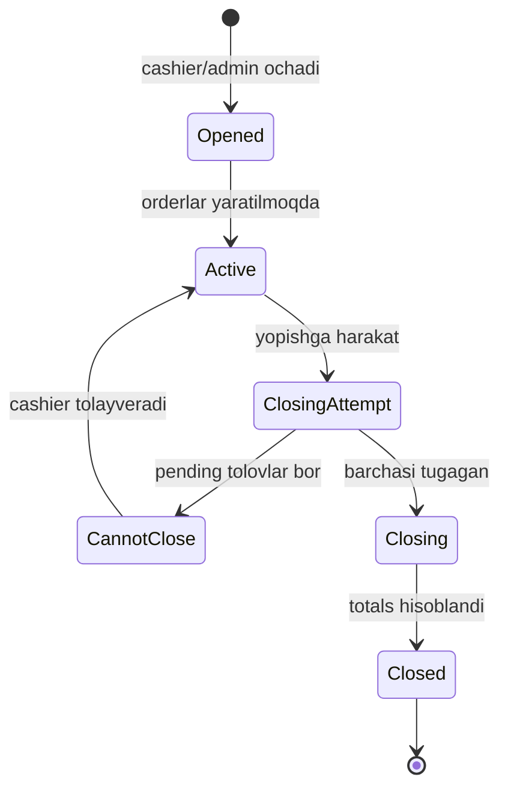

# Entity: shift (smena)

## Maqsadi

Filial smenasi — kassirlik smena (kun davomida ochiq, oxirida yopiladi). Smena ichida orderlar yaratiladi va to'lanadi. Smena yopilganda — sutkalik hisobot.

## Schema

```javascript
const shiftSchema = new mongoose.Schema({
  // Multi-tenant
  branch: {
    type: mongoose.Schema.Types.ObjectId,
    ref: 'branch',
    required: true,
    index: true,
  },
  restaurantId: {
    type: mongoose.Schema.Types.ObjectId,
    ref: 'restaurant',
    required: true,
    index: true,
  },

  // Hayot davri
  isActive: {
    type: Boolean,
    default: true,
    index: true,
  },
  openedBy: {
    type: mongoose.Schema.Types.ObjectId,
    ref: 'user',
    required: true,
  },
  openedAt: {
    type: Date,
    default: Date.now,
  },
  closedBy: {
    type: mongoose.Schema.Types.ObjectId,
    ref: 'user',
  },
  closedAt: Date,

  // Boshlang'ich qulda turgan kassa (smena ochilganda)
  openingCash: {
    type: Number,
    default: 0,
  },
  // Smena yopilganda real-da turgan kassa
  closingCash: Number,

  // Hisoblanadigan field'lar (smena yopilganda)
  totals: {
    ordersCount: { type: Number, default: 0 },
    revenue: { type: Number, default: 0 },         // total
    cashRevenue: { type: Number, default: 0 },
    cardRevenue: { type: Number, default: 0 },
    transferRevenue: { type: Number, default: 0 },
    kaspiRevenue: { type: Number, default: 0 },
    cashbackUsed: { type: Number, default: 0 },
    discountTotal: { type: Number, default: 0 },
    serviceTotal: { type: Number, default: 0 },
    cancelledOrders: { type: Number, default: 0 },
  },

  // Smena izoh
  notes: String,
  closingDiscrepancy: Number,    // kassa farqi (closingCash - expectedCash)

  // Sync metadata
  clientId: { type: String, sparse: true, unique: true },
  version: { type: Number, default: 1 },
  syncStatus: { type: String, default: 'synced' },
  lastModifiedAt: { type: Date, default: Date.now },
  lastModifiedBy: { userId: mongoose.Schema.Types.ObjectId, origin: String },
  deleted: { type: Boolean, default: false },

}, {
  timestamps: true,
});

shiftSchema.index({ branch: 1, isActive: 1 });
shiftSchema.index({ branch: 1, openedAt: -1 });
shiftSchema.index({ restaurantId: 1, openedAt: -1 });
```

## Field'lar tafsiloti

| Field | Tur | Tavsif |
|---|---|---|
| `branch` | ObjectId | Filial |
| `isActive` | boolean | Hozir ochiqmi |
| `openedBy` | ObjectId | Kassir/admin kim ochdi |
| `openedAt` | date | Qachon ochildi |
| `closedBy` | ObjectId | Kim yopdi |
| `closedAt` | date | Qachon yopildi |
| `openingCash` | number | Boshlanish kassa qoldig'i |
| `closingCash` | number | Yakuniy kassa (real) |
| `totals` | object | Hisoblangan jami qiymatlar |
| `notes` | string | Smena tugatish izohi |
| `closingDiscrepancy` | number | Real - kutilgan kassa farqi |

## Hayot davri



## Muhim qoidalar

### 1. Bir filialda — bir vaqtda bitta active smena
```javascript
async function openShift(branchId, userId, openingCash) {
  const existing = await shiftModel.findOne({ branch: branchId, isActive: true });
  if (existing) {
    throw new Error('Avval mavjud smenani yoping');
  }
  return shiftModel.create({ branch: branchId, openedBy: userId, openingCash, isActive: true });
}
```

### 2. Smena yopilmasligi mumkin agar pending tolov bo'lsa
```javascript
async function closeShift(shiftId, userId, closingCash, notes) {
  const pendingOrders = await orderModel.countDocuments({
    shift: shiftId,
    paymentStatus: { $in: ['pending', 'partiallyPaid'] },
    isCancel: false,
  });
  if (pendingOrders > 0) {
    throw new Error(`Tolov kutayotgan ${pendingOrders} ta order bor. Avval tolating yoki bekor qiling.`);
  }

  const totals = await calculateTotals(shiftId);
  const expectedCash = openingCash + totals.cashRevenue;
  const discrepancy = closingCash - expectedCash;

  return shiftModel.updateOne(
    { _id: shiftId },
    {
      isActive: false,
      closedBy: userId,
      closedAt: new Date(),
      closingCash,
      totals,
      closingDiscrepancy: discrepancy,
      notes,
    }
  );
}
```

### 3. Smena ochiq bo'lmasa — yangi order yaratilolmaydi
```javascript
async function createOrder(input) {
  const activeShift = await shiftModel.findOne({ branch: input.branch, isActive: true });
  if (!activeShift) {
    throw new Error('Faol smena yo\'q. Avval smenani oching.');
  }
  return orderModel.create({ ...input, shift: activeShift._id });
}
```

## Totals hisoblash

Smena yopilganda barcha order'lar bo'yicha sum:

```javascript
async function calculateTotals(shiftId) {
  const orders = await orderModel.find({ shift: shiftId, isCancel: false });
  let cashRevenue = 0, cardRevenue = 0, transferRevenue = 0, kaspiRevenue = 0;
  let cashbackUsed = 0, discountTotal = 0, serviceTotal = 0;

  for (const order of orders) {
    if (order.paymentStatus !== 'paid') continue;
    switch (order.paymentMethod) {
      case 'cash': cashRevenue += order.totalPrice; break;
      case 'card': cardRevenue += order.totalPrice; break;
      case 'transfer': transferRevenue += order.totalPrice; break;
      case 'kaspi': kaspiRevenue += order.totalPrice; break;
      case 'cashback':
        cashbackUsed += order.cashback?.amount || 0;
        cashRevenue += (order.totalPrice - cashbackUsed);
        break;
      case 'mixed':
        cashRevenue += order.mixed.cash || 0;
        cardRevenue += order.mixed.card || 0;
        transferRevenue += order.mixed.transfer || 0;
        break;
    }
    discountTotal += order.discountAmount || 0;
    // service ham hisoblansa
  }

  return {
    ordersCount: orders.length,
    revenue: cashRevenue + cardRevenue + transferRevenue + kaspiRevenue,
    cashRevenue, cardRevenue, transferRevenue, kaspiRevenue,
    cashbackUsed, discountTotal, serviceTotal,
    cancelledOrders: await orderModel.countDocuments({ shift: shiftId, isCancel: true }),
  };
}
```

## closingDiscrepancy (kassa farqi)

```
expectedCash = openingCash + cashRevenue
discrepancy = closingCash - expectedCash
```

- `discrepancy > 0` — kutilganidan ko'p (xato yoki tip)
- `discrepancy < 0` — yetishmaydi (kassir xatosi, yo'qotilgan)
- `discrepancy = 0` — to'g'ri

Katta discrepancy — alert.

## Offline rejimda

Smena lokal'da ochiladi va yopiladi. Sync paytida global'ga jo'natiladi.

Lekin **pending tolov tekshiruvi** ham lokal'da bajariladi (sync'gacha kutib turish'ga ehtiyoj yo'q).

## Possiz rejimda

Smena yopib bo'lmaydi (POS ishlamaydi). Yangi smena ochib bo'lmaydi.

Reconnect'da, possiz'da yaratilgan order'lar **mavjud active smena**'ga qo'shiladi.

## Multi-tenant guard

```javascript
shiftModel.findInTenant(req.userData)
  .where({ branch: req.userData.branchId });
```

## Sample document (yopilgan smena)

```json
{
  "_id": "65f8b9c0d1e2f3a4b5c6d7e8",
  "branch": "65f2b3c4d5e6f7a8b9c0d1e2",
  "restaurantId": "65f1a2b3c4d5e6f7a8b9c0d1",
  "isActive": false,
  "openedBy": "65f3...alisher",
  "openedAt": "2026-05-28T09:00:00Z",
  "closedBy": "65f3...alisher",
  "closedAt": "2026-05-28T23:30:00Z",
  "openingCash": 100000,
  "closingCash": 4500000,
  "totals": {
    "ordersCount": 145,
    "revenue": 4400000,
    "cashRevenue": 2800000,
    "cardRevenue": 1200000,
    "kaspiRevenue": 400000,
    "transferRevenue": 0,
    "cashbackUsed": 50000,
    "discountTotal": 120000,
    "serviceTotal": 264000,
    "cancelledOrders": 3
  },
  "notes": "Oddiy ish kuni, hech qanday muammo yo'q",
  "closingDiscrepancy": 0,
  "syncStatus": "synced",
  "version": 1
}
```

## Bog'liq

- [[_MOC]]
- [[order]]
- [[biznes-mantiq/shift-lifecycle]]
- [[../02-arxitektura/3-rejim]]
