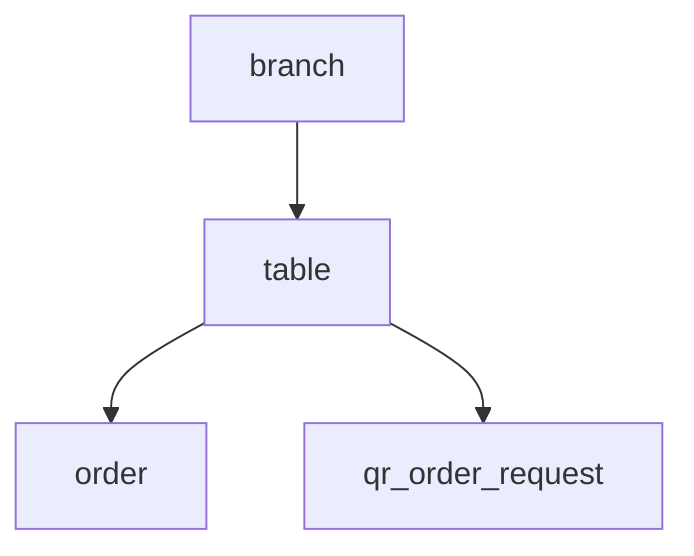

# Entity: table (stol)

## Maqsadi

Filial ichidagi fizik stollar. Har stolda raqam va nom bor. Stol uchun tariflar — masalan billiard stoli soatlik to'lov, oddiy stol — fixed yoki bepul.

QR Order toggle yoqilgan bo'lsa — har stol uchun QR kod generatsiya bo'ladi.

## Schema

```javascript
const tableSchema = new mongoose.Schema({
  number: {
    type: Number,
    required: true,
  },
  title: {
    type: String,
    required: true,
  },

  // Stol turi
  type: {
    type: String,
    default: 'normal',    // normal, billiard, vip, terrace, ...
  },

  // Tariflar
  tariffs: [{
    name: { type: String, required: true },      // "1 soat", "2 soat", "Tunlik"
    price: { type: Number, required: true, min: 0 },
    chargeType: {
      type: String,
      enum: ['hourly', 'fixed', 'daily'],
      default: 'fixed',
    },
    duration: Number,    // hourly uchun (minute), fixed uchun ignore
  }],

  // Multi-tenant
  branch: {
    type: mongoose.Schema.Types.ObjectId,
    ref: 'branch',
    required: true,
    index: true,
  },
  restaurantId: {
    type: mongoose.Schema.Types.ObjectId,
    ref: 'restaurant',
    required: true,
    index: true,
  },

  // QR Order (toggle'da yoqilgan bo'lsa)
  qrEnabled: { type: Boolean, default: false },
  qrSlug: {
    type: String,
    sparse: true,
    unique: true,
    index: true,
  },
  qrLastReset: Date,

  // Geometric (kelajakda — drag-drop layout)
  position: {
    x: Number,
    y: Number,
    width: Number,
    height: Number,
  },

  // Holat
  isActive: { type: Boolean, default: true },

  // Sync metadata
  clientId: { type: String, sparse: true, unique: true },
  version: { type: Number, default: 1 },
  syncStatus: { type: String, default: 'synced' },
  lastModifiedAt: { type: Date, default: Date.now },
  lastModifiedBy: { userId: mongoose.Schema.Types.ObjectId, origin: String },
  deleted: { type: Boolean, default: false },
  deletedAt: Date,

}, {
  timestamps: true,
});

tableSchema.index({ branch: 1, number: 1 }, { unique: true });
tableSchema.index({ branch: 1, type: 1 });
tableSchema.index({ restaurantId: 1, branch: 1 });
```

## Tariflar — chuqurroq

### chargeType: 'fixed'
- Stol uchun bir martalik to'lov
- Misol: VIP stol — 100,000 so'm
- `duration` ignore

### chargeType: 'hourly'
- Soatlik to'lov, masalan billiard
- `duration`: 60 (minut)
- Hisoblash: `Math.ceil(elapsed / duration) * price`
- Order'da `selectedTariff` snapshot bilan boshlangan vaqt saqlanadi

### chargeType: 'daily'
- Sutkalik to'lov
- Mehmonxona / VIP zal kabi

### Tariflar order'da snapshot

Order yaratilganda — `selectedTariff` snapshot olinadi:
```javascript
order.selectedTariff = {
  name: '1 soat',
  price: 50000,
  chargeType: 'hourly',
  duration: 60,
  startedAt: Date,    // kelajakda
};
```

Stol tarifi keyin o'zgarsa — eski order'da eski tarif qoladi.

## Munosabatlar



- Bitta stol — bir vaqtda **bitta active order** (yopilmagan)
- Order tugagach (paid/cancel) stol bo'shaydi

## Holat (current state)

Stol holati real-time hisoblanadi (entity'da saqlanmaydi):
```javascript
async function getTableStatus(tableId) {
  const activeOrder = await orderModel.findOne({
    table: tableId,
    paymentStatus: { $in: ['pending', 'partiallyPaid'] },
    isCancel: false,
  });
  if (!activeOrder) return 'free';
  return {
    status: 'occupied',
    orderId: activeOrder._id,
    waiterId: activeOrder.waiter,
    duration: now() - activeOrder.createdAt,
  };
}
```

Bu — query'dan derived. Stol'da `currentOrderId` field bo'lmagani sababli, real-time aniq.

## QR Order integratsiyasi

Stol'ga QR yopishtirilgan bo'lsa — qrSlug har stolga unique. Mijoz QR'ni skanerlasa:
```
https://order.aridai.com/{branchSlug}/{qrSlug}
```

Public endpoint menyu'ni qaytaradi. Order request — POS'da tasdiqlash kutadi.

Qarang: [[../04-toollar/qr-order]]

## Multi-tenant guard

```javascript
tableModel.findInTenant(req.userData)
  .where({ branch: req.userData.branchId, isActive: true })
  .sort({ number: 1 });
```

## Number uniqueness — branch ichida

```javascript
{ branch: 1, number: 1 }, { unique: true }
```

Bir filialda ikkita "Stol 5" bo'lmaydi.

## Sample document

```json
{
  "_id": "65f7a8b9c0d1e2f3a4b5c6d7",
  "number": 5,
  "title": "VIP Zal — 5",
  "type": "vip",
  "tariffs": [
    { "name": "1 soat", "price": 50000, "chargeType": "hourly", "duration": 60 },
    { "name": "Tunlik (8 soat)", "price": 300000, "chargeType": "fixed" }
  ],
  "branch": "65f2b3c4d5e6f7a8b9c0d1e2",
  "restaurantId": "65f1a2b3c4d5e6f7a8b9c0d1",
  "qrEnabled": true,
  "qrSlug": "v5tbl9k3",
  "qrLastReset": "2026-05-01T00:00:00Z",
  "isActive": true,
  "syncStatus": "synced",
  "version": 2,
  "deleted": false
}
```

## Bog'liq

- [[_MOC]]
- [[order]]
- [[../04-toollar/qr-order]]
- [[snapshot-strategiyasi]]
