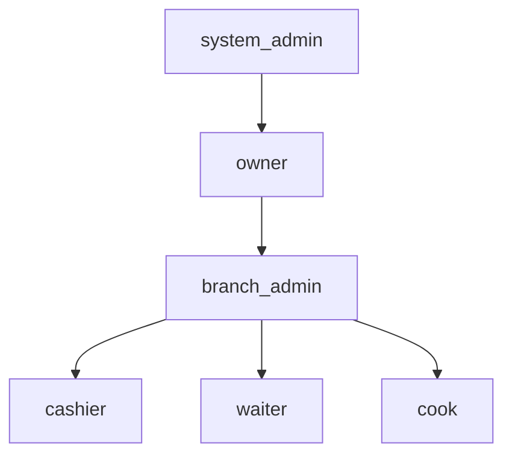

# Entity: user (xodim)

## Maqsadi

Filial xodimlari — admin, waiter, cashier, cook. Har xodim bitta filialga bog'langan, bitta role'ga ega. Login phone + password orqali.

## Schema

```javascript
const userSchema = new mongoose.Schema({
  // Identity
  name: {
    type: String,
    required: true,
  },
  phone: {
    type: String,
    required: true,
  },
  password: {
    type: String,
    required: true,
    select: false,    // default query'da chiqmaydi
  },
  image: String,

  // Multi-tenant
  branch: {
    type: mongoose.Schema.Types.ObjectId,
    ref: 'branch',
    required: true,
    index: true,
  },
  restaurantId: {
    type: mongoose.Schema.Types.ObjectId,
    ref: 'restaurant',
    required: true,
    index: true,
  },

  // RBAC
  role: {
    type: String,
    enum: ['system_admin', 'owner', 'branch_admin', 'cashier', 'waiter', 'cook'],
    required: true,
    index: true,
  },

  // Auth
  tokenVersion: {
    type: Number,
    default: 1,
  },
  isActive: {
    type: Boolean,
    default: true,
    index: true,
  },
  lastLoginAt: Date,
  lastLoginIp: String,

  // Sync metadata (qarang [[sync-metadata]])
  clientId: { type: String, sparse: true, unique: true },
  version: { type: Number, default: 1 },
  syncStatus: { type: String, enum: ['synced', 'pending', 'in_progress', 'rejected', 'conflict'], default: 'synced' },
  lastModifiedAt: { type: Date, default: Date.now },
  lastModifiedBy: { userId: mongoose.Schema.Types.ObjectId, origin: String, branchId: mongoose.Schema.Types.ObjectId },
  deleted: { type: Boolean, default: false },
  deletedAt: Date,
  deletedBy: mongoose.Schema.Types.ObjectId,

}, {
  timestamps: true,
});

userSchema.index({ phone: 1 }, { unique: true });
userSchema.index({ branch: 1, role: 1 });
userSchema.index({ restaurantId: 1, role: 1 });
userSchema.index({ restaurantId: 1, isActive: 1 });
```

## Field'lar tafsiloti

| Field | Tur | Tavsif |
|---|---|---|
| `name` | string | Xodim ismi |
| `phone` | string | Unique butun tizimda — login uchun |
| `password` | string | bcrypt hash |
| `image` | string | Avatar (ixtiyoriy) |
| `branch` | ObjectId | Qaysi filial |
| `restaurantId` | ObjectId | Denormalize — query speed va guard |
| `role` | enum | RBAC role |
| `tokenVersion` | number | Token revoke uchun |
| `isActive` | boolean | Vaqtinchalik bloklash |
| `lastLoginAt` | date | Oxirgi login |
| `lastLoginIp` | string | Anomaliya aniqlash |

## Role tafsilotlari

Qarang: [[../02-arxitektura/xavfsizlik/role-based-access|RBAC matrix]]



- `system_admin` — AridaiPos tizim admini (alohida login flow, web admin orqali)
- `owner` — restoran egasi (alohida login flow [restaurant.owner])
- `branch_admin`, `cashier`, `waiter`, `cook` — bu collection'da

## Muhim qoida

`system_admin` va `owner` `users` collection'ida bo'lmasligi mumkin:
- `system_admin` — alohida `system_admins` collection (kelajakda)
- `owner` — `restaurants.owner` ichida (joriy holat)

Bu yerda `users` faqat **filial xodimlari** uchun.

Lekin alternative — barchasini bitta `users` collection'ga birlashtirish va `role` orqali farqlash. Birlik soddaroq, lekin schema bo'shliq (system_admin'da `branchId` yo'q).

> [!todo] Qaror
> Hozircha — joriy holatni qoldiramiz: restoran egasi `restaurant.owner` ichida, xodimlar alohida. Tuzatish [[../02-arxitektura/xavfsizlik/restoran-auth-tuzatish]] da rejalashtirilgan.

## Munosabatlar

- `user.branch` → `branch._id`
- `user.restaurantId` → `restaurant._id` (denorm)
- `order.waiter` → `user._id` (snapshot bilan)
- `attendance.userId` → `user._id` (keldi-ketti)
- `payroll.userId` → `user._id`
- `salaryRule.userId` → `user._id`

## Multi-tenant guard

```javascript
// Filial admini boshqa filialdagi user'ni ko'rmaydi
await userModel.findInTenant(req.userData)
  .where({ branch: req.userData.branchId });
```

## Login oqimi

Qarang: [[../02-arxitektura/xavfsizlik/auth-strategiyasi#Login oqimi (user)]]

## Password hashing

```javascript
// Yaratishda
const hash = await bcrypt.hash(password, 10);
user.password = hash;

// Tekshirishda
const ok = await bcrypt.compare(plainPassword, user.password);
```

## tokenVersion increment paytlar

Quyidagilar paytida `tokenVersion +=1`:
- Logout (all devices)
- Parol o'zgartirildi
- Role o'zgartirildi
- Branch o'zgartirildi
- `isActive: false` qilindi
- Phone o'zgartirildi
- Hisob kompromiss aniqlandi (manual revoke)

```javascript
async function revokeAllTokens(userId) {
  await userModel.updateOne({ _id: userId }, { $inc: { tokenVersion: 1 } });
  audit.log({ kind: 'token_revoked', actor: { type: 'user', id: userId } });
}
```

## Xodim deactivation vs delete

- **Deactivation:** `isActive: false`. Login bloklanadi, tokenlar bekor. Data qoladi. Hisobotda ko'rinadi.
- **Soft delete:** `deleted: true`. Hisobotda ham faqat tarixiy ma'lumot.
- ~~Hard delete~~ — **YO'Q** (qaror 2026-05-29). GDPR right-to-be-forgotten → anonimizatsiya (ism/telefon olib tashlanadi, yozuv qoladi) — [[../07-nozik-nuqtalar/ochirish-cascade]]

## Snapshot semantikasi

Order entity'sida waiter ref bor. Hisobotda eski xodim ismini ko'rsatish kerak bo'lganda:
- Order'da `waiter` field'i — `{ waiterId, name, phone }` snapshot bo'lishi kerak (qarang [[snapshot-strategiyasi]])
- User ismini o'zgartirsa ham — eski order'da eski ism ko'rinadi

## Sync xulq-atvori

Xodim entity'si **ikkala tomonda** ham yashaydi:
- Global'da — admin web'dan boshqariladi
- Lokal'da — login uchun lokal cache (kelajakda, hozircha online'da login)

Lokal'da xodim yaratilmaydi (faqat global'da). Global'da yaratilgach lokal'larga sync.

## Sample document

```json
{
  "_id": "65f3c4d5e6f7a8b9c0d1e2f3",
  "name": "Alisher Karimov",
  "phone": "+998901112233",
  "password": "$2b$10$...",
  "image": "/uploads/avatars/alisher.jpg",
  "branch": "65f2b3c4d5e6f7a8b9c0d1e2",
  "restaurantId": "65f1a2b3c4d5e6f7a8b9c0d1",
  "role": "waiter",
  "tokenVersion": 1,
  "isActive": true,
  "lastLoginAt": "2026-05-28T10:00:00Z",
  "lastLoginIp": "188.166.10.20",
  "clientId": "uuid-v4-here",
  "version": 1,
  "syncStatus": "synced",
  "lastModifiedAt": "2026-05-28T08:00:00Z",
  "lastModifiedBy": { "userId": null, "origin": "global", "branchId": null },
  "deleted": false,
  "createdAt": "2026-01-15T08:00:00Z",
  "updatedAt": "2026-05-28T10:00:00Z"
}
```

## Test rejasi

- [ ] Phone uniqueness (global)
- [ ] Default query'da password chiqmaydi
- [ ] tokenVersion increment paytlar
- [ ] Soft delete query'lar
- [ ] Multi-tenant guard ishlaydi
- [ ] Role enum'i

## Bog'liq

- [[_MOC]]
- [[branch]]
- [[../02-arxitektura/xavfsizlik/auth-strategiyasi]]
- [[../02-arxitektura/xavfsizlik/role-based-access]]
- [[../04-toollar/keldi-ketti]]
