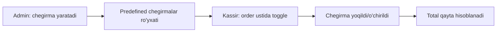

# Chegirma va service charge qo'llanishi

> [!important] Qaror (foydalanuvchi, 2026-05-29)
> Admin chegirmalarni oldindan yaratib qo'yadi. Kassir order ustida **toggle orqali** chegirmani yoqadi yoki o'chiradi. Kassir **qo'lda erkin** chegirma (% yoki summa) kirita olmaydi.

## Chegirma qo'llanishi



### Kassir UX
```
┌────────────────────────────────────┐
│ Order #YUN-...0042                   │
│ Subtotal: 100 000                    │
├────────────────────────────────────┤
│ Chegirmalar:                         │
│ ⬜ Doimiy mijoz 10%                  │
│ ✅ Happy hour 20%                    │ ← toggle yoqilgan
│ ⬜ Tug'ilgan kun 15%                 │
├────────────────────────────────────┤
│ Chegirma: −20 000                    │
│ Jami: 80 000 + service              │
└────────────────────────────────────┘
```

- Kassir faqat **admin yaratgan** chegirmalardan tanlaydi
- Toggle bosish → darhol total qayta hisob (optimistic UI)
- Qo'lda summa/% kiritish **yo'q** → fraud kam, audit oson

## Bir nechta chegirma (stacking)

> [!todo] Default qaror (revisable): bir order = bir chegirma
> Kassir toggle bilan bir nechta yoqishi mumkindek, lekin **double-discount** abuse'ni oldini olish uchun **default: bir vaqtda bitta chegirma** (yangi yoqilsa eski o'chadi — radio button kabi).
>
> Agar restoran ko'p chegirma stack qilishni xohlasa — `restaurant.config.allowDiscountStacking: true` (kelajak).

### Schema ta'siri
- `order.discount` — bitta snapshot ([[../05-data-model/discount]]) → default holatga mos
- Stacking yoqilsa → `order.discounts[]` array kerak (kelajak migration)

## Service charge bekor qilish

Ba'zan xizmat haqqi olib tashlanishi kerak (mijoz norozi, takeaway):

```javascript
// Kassir/admin order'da service'ni o'chiradi
order.service.waived = true;
order.service.amount = 0;
order.service.waivedBy = userId;
order.service.waiveReason = String;
```

- **RBAC:** service waive — kim qila oladi? Default: cashier+admin (qarang [[../02-arxitektura/xavfsizlik/role-based-access]])
- Audit log'ga yoziladi
- DineIn'da default service bor, waive bilan olib tashlanadi

## Chegirma + service tartibi

Hisoblash tartibi qat'iy ([[../05-data-model/biznes-mantiq/total-hisoblash]] — 31.05 yangilangan):
1. subTotal (taomlar)
2. service (subTotal'dan — chegirmadan OLDIN)
3. discount ((subTotal + service)'dan)
4. total

Chegirma toggle o'zgarsa — butun zanjir qayta hisoblanadi.

## Chegirma shartlari (admin yaratganda)

Admin chegirma yaratganda shartlar belgilaydi ([[../05-data-model/discount]]):
- minOrderAmount (min summa)
- timeRange (happy hour)
- daysOfWeek
- applyTo (dineIn/takeaway)

Kassir toggle qilganda — shart bajarilmasa **toggle disabled**:
```
⬜ Happy hour 20% (faqat 14:00-17:00, hozir mavjud emas)
```

## Manual chegirma YO'Q — lekin maxsus holat

Agar restoran kassirga moslashuvchanlik bermoqchi bo'lsa:
- Admin "Maxsus chegirma 5%", "Maxsus 10%", "Maxsus 15%" kabi **predefined** yaratadi
- Kassir shulardan tanlaydi
- Bu — manual'ning o'rnini bosadi, lekin nazorat ostida

## Audit

Har chegirma qo'llanishi audit log'ga:
- Katta chegirma (>30%) — warn ([[../02-arxitektura/xavfsizlik/audit-log]])
- Service waive — har doim log
- Anomaliya: bir kassir ko'p chegirma → alert

## Offline'da

Chegirmalar lokal'da cache (menyu kabi sync bo'ladi). Offline'da toggle ishlaydi (predefined ro'yxat lokal'da bor). Hech qanday muammo.

## Test rejasi

- [ ] Admin chegirma yaratadi
- [ ] Kassir toggle bilan yoqadi/o'chiradi
- [ ] Qo'lda % / summa kiritib bo'lmaydi
- [ ] Toggle → total qayta hisob
- [ ] Default: bitta chegirma (yangi yoqilsa eski o'chadi)
- [ ] Shart bajarilmasa toggle disabled (happy hour vaqti emas)
- [ ] Service waive (RBAC + audit)
- [ ] Katta chegirma → audit warn
- [ ] Offline toggle ishlaydi

## Bog'liq

- [[../05-data-model/discount]]
- [[../05-data-model/service]]
- [[../05-data-model/biznes-mantiq/total-hisoblash]]
- [[../02-arxitektura/xavfsizlik/audit-log]]
