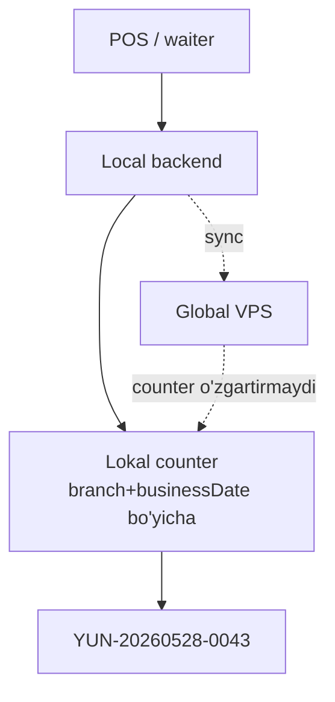

# Chek raqamlash

> [!important] Qaror (foydalanuvchi tasdiqlagan, 2026-05-29)
> Chek raqami formati: **filial prefiksi + biznes sana + ketma-ket raqam**
> Masalan: `YUN-20260528-0042`

## Muammo

Har order'ga inson o'qiy oladigan **ketma-ket raqam** kerak (ObjectId emas — `65fb1d2e3f4a...` mijozga ko'rsatib bo'lmaydi). Bu raqam:
- Unique bo'lishi shart
- **Offline'da yaratilgan order ham** raqam olishi kerak
- Online va offline raqamlar **to'qnashmasligi** shart
- Inson o'qiy oladigan, chek'da chiqadigan

## Format

```
{branchPrefix}-{businessDate}-{sequence}
   YUN      -  20260528    -  0042
```

| Qism | Tavsif | Misol |
|---|---|---|
| `branchPrefix` | Filial 3-belgili kod (configurable) | YUN, MRK, CHL |
| `businessDate` | Biznes sana (qarang [[vaqt-va-soat#Muammo 3]]) | 20260528 |
| `sequence` | Shu filial, shu biznes-kun ichida ketma-ket | 0042 |

## Nima uchun bu offline-safe

Asosiy nozik nuqta: **bitta filial bir vaqtda bitta rejimda** ([[../02-arxitektura/3-rejim]]). Demak:
- Filial online → orderlar online yaratiladi, sequence lokal counter'dan
- Filial offline → orderlar offline yaratiladi, **xuddi shu lokal counter'dan**
- Counter **lokal backend'da** yashaydi (global'da emas)

Filial hech qachon bir vaqtda ikki joyda order yaratmaydi (online POS + offline POS bir vaqtda emas). Shuning uchun **lokal counter yagona manba** → to'qnashuv yo'q.



> [!warning] Global counter'ni o'zgartirmaydi
> Sync paytida global order'larni qabul qiladi, lekin **receiptNumber'ni o'zgartirmaydi** — lokal bergan raqam yakuniy. Global faqat saqlaydi.

## Counter implementatsiyasi (lokal backend)

```javascript
// Lokal MongoDB — counters collection
{
  _id: 'YUN-20260528',   // branchPrefix + businessDate
  branchId: ObjectId,
  businessDate: '2026-05-28',
  seq: 42,
}

// Atomic increment
async function nextReceiptNumber(branchId, prefix) {
  const businessDate = getBusinessDate(new Date(), restaurant.businessDayStartHour);
  const counterId = `${prefix}-${businessDate.replace(/-/g, '')}`;

  const counter = await localCounters.findOneAndUpdate(
    { _id: counterId },
    { $inc: { seq: 1 }, $setOnInsert: { branchId, businessDate } },
    { upsert: true, returnDocument: 'after' }
  );

  const seq = String(counter.seq).padStart(4, '0');
  return `${prefix}-${businessDate.replace(/-/g, '')}-${seq}`;
}
```

`findOneAndUpdate` + `$inc` = **atomic**. Ikki POS (multi-POS kelajakda) bir vaqtda so'rasa ham, har biri unique raqam oladi.

## Schema

```javascript
// order.model.js
receiptNumber: {
  type: String,
  required: true,
  index: true,
}
// Compound unique — bir filialda takror bo'lmasin
orderSchema.index({ branch: 1, receiptNumber: 1 }, { unique: true });
```

## branchPrefix qayerdan

`branch.receiptPrefix` field:
```javascript
// branch.model.js
receiptPrefix: {
  type: String,
  maxLength: 4,
  uppercase: true,
  // default: branch.name dan generatsiya
}
```

Admin filial yaratganda kiritadi yoki avtomatik (nom birinchi 3 harfi). Restoran ichida unique bo'lishi tavsiya (lekin majburiy emas, chunki branchId ham bor).

## Multi-POS bir filialda (kelajak)

Bitta filialda 2 POS terminal. Counter **lokal backend'da** (bitta server PC'da), POS'lar HTTP orqali so'raydi. Demak counter baribir bitta — to'qnashuv yo'q.

## Sequence reset

Sequence har **biznes kun** boshida 0 ga qaytadi (yangi counter document). Eski counter'lar qoladi (tarixiy).

> [!note] Reset shift'da emas, businessDate'da
> Biznes kun (06:00-06:00) bo'yicha reset. Smena emas. Sabab: bir kunda bir nechta smena bo'lishi mumkin (kunduzgi + tungi), lekin chek raqami kun davomida ketma-ket bo'lishi tabiiy.

## Chek'da ko'rinishi

```
┌────────────────────────────────┐
│   OLOV MEHMONXONASI             │
│   Yunusobod filiali             │
│                                 │
│   Chek: YUN-20260528-0042       │
│   Sana: 28.05.2026  15:30       │
│   Kassir: Alisher               │
│   ...                           │
└────────────────────────────────┘
```

## Edge case: counter document yo'qolsa

Lokal Mongo crash, counter yo'qoldi:
- Yangi counter 1 dan boshlanadi → **duplikat xavfi** o'sha kun ichida
- Yechim: order yaratishda `branch + receiptNumber` unique index → duplikat bo'lsa retry (seq+1)

```javascript
async function createOrderWithReceipt(input, prefix) {
  for (let attempt = 0; attempt < 5; attempt++) {
    const receiptNumber = await nextReceiptNumber(input.branch, prefix);
    try {
      return await orderModel.create({ ...input, receiptNumber });
    } catch (err) {
      if (err.code === 11000) continue; // duplicate, retry
      throw err;
    }
  }
  throw new Error('Receipt number generatsiya fail (5 urinish)');
}
```

## Fiskal bilan munosabati

Hozircha fiskal yo'q ([[fiskal-soliq]]). Lekin KKM qo'shilsa — fiskal raqam **alohida** bo'ladi (davlat beradi), bizning `receiptNumber` ichki qoladi. Ikkalasi parallel.

## Test rejasi

- [ ] Format: PREFIX-YYYYMMDD-NNNN
- [ ] Atomic increment (concurrent so'rov unique)
- [ ] Offline'da raqam beriladi
- [ ] Online'ga sync — raqam o'zgarmaydi
- [ ] businessDate cutoff (00:00-06:00 oldingi kun)
- [ ] Sequence kun boshida reset
- [ ] Duplicate index → retry
- [ ] Multi-POS bitta counter

## Bog'liq

- [[vaqt-va-soat]] — businessDate
- [[fiskal-soliq]]
- [[../05-data-model/order]]
- [[../05-data-model/branch]]
- [[../02-arxitektura/3-rejim]]
