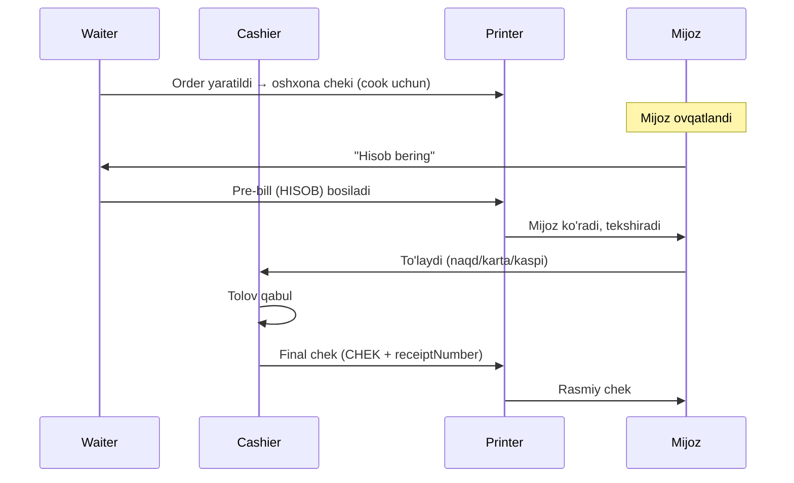

# Pre-bill, final chek, oshxona cheki

> [!important] Qaror (foydalanuvchi, 2026-05-29): pre-bill oqimi bor
> Dine-in'da: **hisob (pre-bill) → mijoz ko'radi → tolov → final chek**. Uch xil bosma hujjat: pre-bill, final chek, oshxona cheki.

## Uch xil bosma hujjat

| Hujjat | Qachon | Maqsad | Narx | Raqam |
|---|---|---|---|---|
| **Oshxona cheki** (kitchen) | Order yaratilganda | Cook uchun | ❌ yo'q | order ref |
| **Pre-bill** (hisob/счёт) | Mijoz so'raganda, tolovdan oldin | Mijoz ko'rib chiqadi | ✅ bor | "HISOB" (final emas) |
| **Final chek** (чек) | Tolovdan keyin | Rasmiy chek | ✅ bor | receiptNumber ([[chek-raqamlash]]) |

## Oqim



## 1. Oshxona cheki (kitchen ticket)

Order yaratilganda yoki taom qo'shilganda oshxona printeriga ([[hardware-nozikliklari#Nozik nuqta 2]]):

```
┌────────────────────────────┐
│ OSHXONA — Stol 5            │
│ Waiter: Alisher  14:00      │
│ Order: YUN-...0042          │
├────────────────────────────┤
│ 2x Osh                      │
│ 1x Mantı (piyozsiz!)        │
│ 1x Choy                     │
├────────────────────────────┤
│ Izoh: tez bo'lsin           │
└────────────────────────────┘
```

- **Narx yo'q** (cook'ga kerak emas)
- Izoh/allergiya ko'zga tashlanadi ([[order-operatsion-edge]])
- Possiz/cook-waiter rejimda — oshxona cheki o'rniga cook mobile push

## 2. Pre-bill (hisob / счёт)

Mijoz "hisob" so'raganda. **Final emas, fiskal emas:**

```
┌────────────────────────────┐
│ OLOV MEHMONXONASI           │
│ Yunusobod filiali           │
│                             │
│ ★ HISOB (CHEK EMAS) ★       │
│ Stol 5  ·  14:00-15:30      │
├────────────────────────────┤
│ 2x Osh           70 000     │
│ 1x Mantı         28 000     │
│ 1x Choy           5 000     │
├────────────────────────────┤
│ Subtotal:       103 000     │
│ Xizmat (6%):      6 180     │
│ Chegirma:        -10 000    │
│ ───────────────────────     │
│ JAMI:            99 180     │
├────────────────────────────┤
│ Bu hisob, rasmiy chek emas  │
└────────────────────────────┘
```

- "HISOB" deb aniq belgilangan
- receiptNumber **yo'q** (yoki vaqtinchalik) — final chek raqamini iste'mol qilmaydi
- Bir necha marta bosilishi mumkin (mijoz qo'shimcha so'rasa qayta)
- Mijoz ko'rib, rozimi tekshiradi
- Bu bosqichda order hali `pending`

## 3. Final chek (чек)

Tolovdan keyin:

```
┌────────────────────────────┐
│ OLOV MEHMONXONASI           │
│ Yunusobod filiali           │
│ Manzil, telefon             │
│                             │
│ CHEK: YUN-20260528-0042     │
│ 28.05.2026  15:30           │
│ Kassir: Dilshod             │
├────────────────────────────┤
│ 2x Osh           70 000     │
│ 1x Mantı         28 000     │
│ 1x Choy           5 000     │
├────────────────────────────┤
│ Subtotal:       103 000     │
│ Xizmat (6%):      6 180     │
│ Chegirma:        -10 000    │
│ JAMI:            99 180     │
│ To'lov: Naqd    100 000     │
│ Qaytim:             820     │
├────────────────────────────┤
│ [Keshbek QR]  (yoqilgan bo'lsa)│
│ Rahmat!                     │
│ [fiskal joy — kelajak]      │
└────────────────────────────┘
```

- `receiptNumber` ([[chek-raqamlash]])
- To'lov turi, qaytim ([[naqd-tolov-qaytim]])
- Keshbek QR (agar yoqilgan — [[../04-toollar/keshbek-tizimi]])
- Fiskal joy bo'sh (kelajak — [[fiskal-soliq]])
- `order.checkPrinted = true`

## Item o'zgarish → oshxona delta

> Foydalanuvchi qarori (2026-05-29): order'da **alohida taom** miqdori o'zgartirilsa (3 plov → 2), oshxonaga **delta check** bosiladi — stol, order#, qaysi taom, qanchaga +/− o'zgargani.

Order o'zgartirish ([[order-operatsion-edge]], [[../../02-arxitektura/xavfsizlik/firibgarlik-nazorati]]):
- **Taom qo'shildi** (+), **kamaytirildi** (−) — `order.foods[i].cancels[]` (inc/dec)
- Kitchen boshlangan taomni kamaytirish → **manager PIN**

Oshxonaga **faqat delta** (cook ortiqcha tayyorlamaydi yoki to'xtatadi):

```
┌────────────────────────────┐
│ OSHXONA — O'ZGARISH          │
│ Stol 5 · YUN-...0042  14:15  │
├────────────────────────────┤
│ Plov:    3 → 2   (−1)        │
│ Lag'mon: 0 → 1   (+1)        │
│ Sabab: mijoz o'zgartirdi     │
└────────────────────────────┘
```

- Faqat o'zgargan taomlar (butun order emas)
- +/− aniq, sabab bilan (`cancels.changeReason`)
- Possiz'da → cook mobile push (printer yo'q)

## Pre-bill schema ta'siri

Order'da yangi field:
```javascript
order.prebillPrintedAt: Date,    // hisob qachon bosildi
order.prebillPrintCount: Number, // necha marta
// checkPrinted, printCount — final chek uchun (mavjud)
```

## Pre-bill vs final — muhim farqlar

| | Pre-bill | Final chek |
|---|---|---|
| receiptNumber | yo'q | bor (iste'mol qiladi) |
| paymentStatus | pending | paid |
| Fiskal | hech qachon | kelajakda |
| Qayta bosish | erkin | "DUPLIKAT" ([[order-operatsion-edge]]) |
| Cash drawer | ochilmaydi | ochiladi (naqd) |

## Til

Chek tili — filial sozlamasi ([[../02-arxitektura/lokalizatsiya]]): uz/ru. Printer kirill/lotin qo'llab-quvvatlashi ([[hardware-nozikliklari]]).

## Possiz rejimda

- Oshxona cheki → cook mobile push (printer yo'q)
- Pre-bill / final chek → PDF (cashier mobile) — [[../02-arxitektura/rejimlar/possiz-rejim]]

## Test rejasi

- [ ] Order yaratildi → oshxona cheki (narxsiz)
- [ ] Pre-bill "HISOB" belgisi, receiptNumber yo'q
- [ ] Pre-bill qayta bosilishi mumkin
- [ ] Tolovdan keyin final chek (receiptNumber, qaytim)
- [ ] Final chek cash drawer ochadi (naqd)
- [ ] Order o'zgartirish → faqat yangi taom oshxonaga
- [ ] Til (uz/ru) chek'da
- [ ] Possiz: cook push + PDF chek

## Bog'liq

- [[chek-raqamlash]]
- [[naqd-tolov-qaytim]]
- [[order-operatsion-edge]]
- [[hardware-nozikliklari]]
- [[../05-data-model/order]]
- [[../05-data-model/biznes-mantiq/order-lifecycle]]
