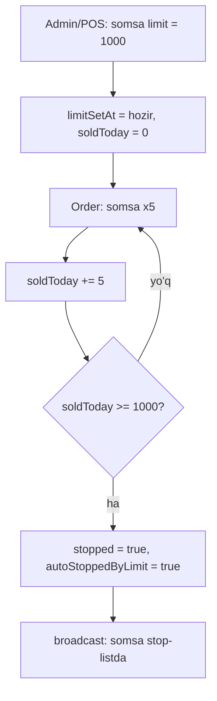
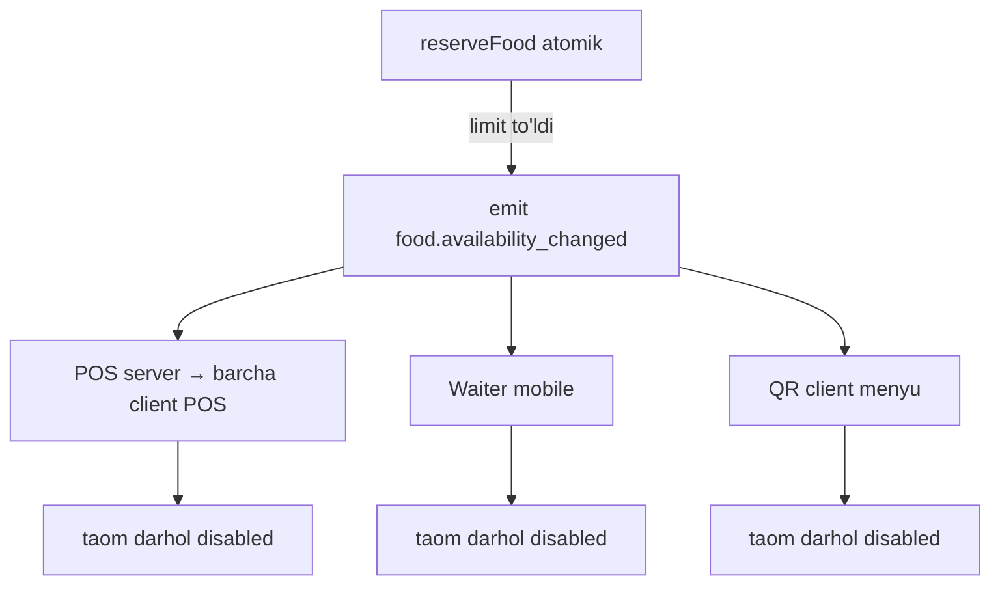

# Stop-list va kunlik limit

> [!important] Qaror (foydalanuvchi, 2026-05-29): real-time stop-list, 2 mexanizm
> 1. **Manual stop-list** — taom darhol menyudan yashiriladi (cook/cashier/admin)
> 2. **Limit-based avtomatik** — taomga kunlik limit qo'yiladi (somsa 1000 ta), limit to'lganda avto stop-list'ga tushadi

> [!important] O1 qaror — QATTIQ BLOK, oversell YO'Q (foydalanuvchi, 2026-05-29)
> Limitga yetganda **bironta ham ortiqcha qabul qilinmaydi**. Misol: 50 osh limiti, 48 sotildi (2 qoldi), mijoz 3 ta so'radi → faqat 2 tasini qo'shsa bo'ladi, 3-chisi **rad etiladi**. 2 tani tanlagach taom **darhol disabled** — POS, waiter mobile, QR (client telefoni) — **uchala kanalda ham bir vaqtda**.

## Muammo

Restoran kun davomida:
- Ba'zi taom tugaydi ("osh qolmadi") → darhol menyudan olib tashlash kerak
- Ba'zi taom cheklangan ("bugun 1000 ta somsa yopdik") → 1000 ta sotilgach to'xtatish kerak
- Bu `isActive` (doimiy o'chirish) va sklad'dan **boshqa** — bu **kunlik, tezkor, avtomatik**

## Schema (food modeliga qo'shimcha)

```javascript
// food.model.js — availability subdoc
availability: {
  // Manual stop-list
  stopped: { type: Boolean, default: false },
  stoppedAt: Date,
  stoppedBy: { type: mongoose.Schema.Types.ObjectId, ref: 'user' },
  stopReason: String,

  // Kunlik limit
  dailyLimit: { type: Number, default: null },   // null = limitsiz
  soldToday: { type: Number, default: 0 },         // limit qo'yilgandan beri sotilgan
  limitSetAt: Date,
  autoStoppedByLimit: { type: Boolean, default: false },
}
```

> [!note] Per-branch
> Stop-list/limit har **filial** uchun alohida (food allaqachon `branch`'ga bog'langan, har filial o'z menyusi — [[menyu-export-import]]). Somsa limiti shu filialning somsasi uchun. Offline'da ham ishlaydi (lokal counter).

## Mexanizm 1: Manual stop-list

```javascript
// Cook/cashier/admin "stop" bosadi
async function stopFood(foodId, actor, reason) {
  await foodModel.updateOne({ _id: foodId }, {
    'availability.stopped': true,
    'availability.stoppedAt': new Date(),
    'availability.stoppedBy': actor._id,
    'availability.stopReason': reason,
  });
  await emit('food.availability_changed', { foodId, stopped: true });
}

// Qaytarish
async function resumeFood(foodId, actor) {
  await foodModel.updateOne({ _id: foodId }, {
    'availability.stopped': false,
    'availability.autoStoppedByLimit': false,
  });
  await emit('food.availability_changed', { foodId, stopped: false });
}
```

- Kim: cook, cashier, admin ([[../02-arxitektura/xavfsizlik/role-based-access]])
- POS/mobile: taom ustida "Stop-list" tugmasi
- Real-time: barcha qurilmalarga broadcast → taom darhol disabled

## Mexanizm 2: Limit-based avtomatik



```javascript
// Limit qo'yish
async function setDailyLimit(foodId, limit, actor) {
  await foodModel.updateOne({ _id: foodId }, {
    'availability.dailyLimit': limit,
    'availability.soldToday': 0,
    'availability.limitSetAt': new Date(),
    'availability.autoStoppedByLimit': false,
    'availability.stopped': false,
  });
}

// Order yaratilganda — ATOMIK, oversell oldini oladi (O1)
async function reserveFood(item) {
  const qty = effectiveQuantity(item);
  // Atomik: faqat yetarli qolgan bo'lsa soldToday oshiriladi
  const result = await foodModel.findOneAndUpdate(
    {
      _id: item.foodId,
      'availability.stopped': false,
      $expr: { $lte: [ { $add: ['$availability.soldToday', qty] }, '$availability.dailyLimit' ] }
    },
    { $inc: { 'availability.soldToday': qty } },
    { returnDocument: 'after' }
  );

  if (!result) {
    // Yetarli emas yoki stop-listda → RAD ETILADI (oversell yo'q)
    throw new Error('STOP_LIST: bu taom tugagan yoki yetarli emas');
  }

  // Limit to'ldimi? → darhol disable + broadcast
  if (result.availability.soldToday >= result.availability.dailyLimit) {
    await foodModel.updateOne({ _id: item.foodId }, {
      'availability.stopped': true,
      'availability.autoStoppedByLimit': true,
      'availability.stoppedAt': new Date(),
    });
    await emit('food.availability_changed', { foodId: item.foodId, stopped: true, reason: 'limit' });
  }
}
```

> [!important] Oversell oldini olish — atomik tekshirish
> `findOneAndUpdate` **shart bilan** (`soldToday + qty <= dailyLimit`) atomik. Ikki POS bir vaqtda oxirgi 2 osh'ni so'rasa — faqat biri muvaffaqiyatli, ikkinchisi rad etiladi. Hech qanday oversell.

## Oversell oldini olish — barcha kanal, real-time

> [!important] O1: hech qanday kanal limitdan oshmaydi
> Limit (yoki ingredient) tugaganda — taom **bir vaqtda** disable bo'ladi:
> - **POS** (server + barcha client POS — [[../02-arxitektura/multi-pos]])
> - **Waiter mobile** (`branch:X` room)
> - **QR client** (mijoz telefoni — public menyu)



- **Mavjud son ko'rsatkichi:** "qolgan: 2/50" — real-time yangilanadi
- **2 qolганda:** mijoz 2 tagacha qo'sha oladi, 3-chisida `+` tugma disabled
- **0 qolганda:** taom kulrang, "Tugadi", qo'shib bo'lmaydi
- Bu — POS, waiter, QR — uchchovida bir xil (socket broadcast, lokal LAN + global)

> [!important] "limit ochilgan paytdan song" (foydalanuvchi so'zi)
> Counter `limitSetAt` dan boshlab sanaydi. Limit qo'yilishidan **oldingi** orderlar hisobga olinmaydi. `soldToday` faqat limit qo'yilgandan keyingi sotuvlar.

## Counter va cancel/void munosabati

- **Void** (oshxona boshlamagan, [[order-operatsion-edge]]) → `soldToday -= qty` (taom ishlatilmadi, qaytadi)
- **Cancel** (oshxona boshlagan) → `soldToday` o'zgarmaydi (taom ishlatildi/isrof)

```javascript
async function onOrderVoid(order) {
  for (const item of order.foods) {
    if (food.availability.dailyLimit) {
      await foodModel.updateOne({ _id: item.foodId }, {
        $inc: { 'availability.soldToday': -effectiveQuantity(item) }
      });
      // Agar limit tufayli stop bo'lgan bo'lsa va endi limitdan past → qayta ochish?
    }
  }
}
```

## Reset (counter qachon 0 ga qaytadi)

| Holat | Reset |
|---|---|
| **Biznes kun boshi** (06:00) | `soldToday = 0`, agar `autoStoppedByLimit` bo'lsa → qayta ochiladi ([[vaqt-va-soat]]) |
| **Manual "yangi partiya"** | Cook yangi partiya yopdi → reset + un-stop |
| **Limit o'zgartirildi** | Yangi limit qo'yilsa → counter reset |

```javascript
// Cron: biznes kun boshida
async function resetDailyLimits(branchId) {
  await foodModel.updateMany(
    { branch: branchId, 'availability.dailyLimit': { $ne: null } },
    {
      'availability.soldToday': 0,
      'availability.autoStoppedByLimit': false,
      // faqat avto-stop bo'lganlar ochiladi, manual stop qoladi
      ...{ 'availability.stopped': false }  // faqat autoStoppedByLimit=true bo'lganlar uchun
    }
  );
}
```

## UI

### POS / mobile menyu
- Stop-listdagi taom: kulrang, "Tugagan" belgisi, **order'ga qo'shib bo'lmaydi**
- Real-time: socket `food.availability_changed` → darhol yangilanadi
- Limit bor taomda: "qolgan: 234/1000" ko'rsatkich

### Cook/cashier tezkor stop
```
[Somsa]  qolgan: 234/1000   [⏸ Stop]
[Osh]    🔴 STOP-LIST       [▶ Ochish]
```

### Admin limit qo'yish
```
Somsa → tahrirlash → "Kunlik limit": [1000]  [Saqlash]
```

## Sklad bilan farqi

| | Sklad | Stop-list/limit |
|---|---|---|
| Nima | Ingredient (un, go'sht) | Tayyor taom (somsa) |
| Daraja | Retsept bo'yicha avto | Taom bo'yicha to'g'ridan-to'g'ri |
| Toggle | sklad feature | Har doim mavjud (core) |
| Reset | Yo'q (uzluksiz) | Kunlik |

Sklad yoqilgan bo'lsa — ikkalasi birga ishlaydi (ingredient tugasa ham, somsa limiti ham).

> [!note] Stop-list — core, toggle emas
> Stop-list/limit — asosiy funksiya (feature toggle emas). Har restoranда mavjud. Sklad esa alohida toggle.

## Offline'da

- Manual stop + limit counter **lokal'da ishlaydi** (per-branch, lokal MongoDB)
- Order yaratilganda lokal counter oshadi
- Limit to'lsa lokal'da stop bo'ladi
- Sync'da global'ga yetadi
- Hech qanday muammo (per-branch, additive counter)

## Real-time broadcast

```javascript
// Barcha shu filial qurilmalariga
io.to(`branch:${branchId}`).emit('food.availability_changed', {
  foodId, stopped, reason, soldToday, dailyLimit
});
```

POS, waiter mobile, cook mobile — hammasi darhol ko'radi.

## Test rejasi

- [ ] Manual stop → menyudan yo'qoladi (real-time)
- [ ] Manual resume → qaytadi
- [ ] Limit qo'yish → soldToday=0, limitSetAt
- [ ] Order → soldToday oshadi
- [ ] soldToday >= limit → avto stop + broadcast
- [ ] Limitdan oldingi orderlar sanalmaydi
- [ ] Void → counter qaytadi; Cancel → qaytmaydi
- [ ] Biznes kun boshi → reset + auto-stop ochiladi
- [ ] Manual stop biznes kun boshida ochilmaydi
- [ ] Offline'da counter ishlaydi
- [ ] Stop-listdagi taom order'ga qo'shilmaydi

## Bog'liq

- [[../05-data-model/food]]
- [[../04-toollar/sklad]]
- [[order-operatsion-edge]] — void vs cancel
- [[vaqt-va-soat]] — biznes kun reset
- [[../02-arxitektura/socket-sinxronizatsiya]]
