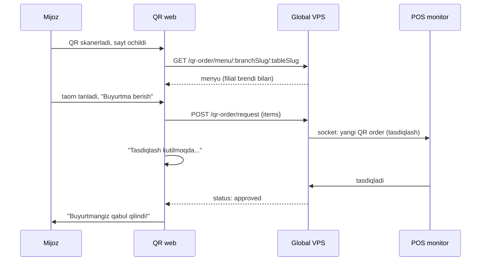

# Mijoz QR web

## Maqsadi

Stol QR'ni skanerlagan mijoz uchun yengil web sayt. Filial menyusini ko'rsatadi, buyurtma berish imkoni. **Auth yo'q** (public). QR Order toggle yoqilgan bo'lsa ishlaydi.

## Texnologiya

- **React + Vite** (yengil, tez yuklanadi — mijoz mobile internet)
- Minimal bundle (mijoz tez ochishi kerak)
- Global VPS public API
- PWA emas (oddiy sayt yetadi)

## URL

```
https://order.aridai.com/{branchSlug}/{tableQrSlug}
```

Tafsilot: [[../04-toollar/qr-order]]

## Oqim



## Sahifalar

```
/{branchSlug}/{tableSlug}     # menyu
  ├── Kategoriya tab'lari
  ├── Taomlar (rasm, nom, narx, tavsif)
  ├── Savatcha
  └── "Buyurtma berish"
/status/:requestId            # tasdiqlash kutish/natija
```

## Cheklovlar (POS tasdiqlash)

- Mijoz order → **POS tasdiqlash kutadi** (haqiqatan stolda odam bormi)
- Auto-expire 5 daqiqa
- Rate limit (spam oldini olish — [[../04-toollar/qr-order]])

## Brendlash

- Filial logosi, rangi (`restaurant.logo`, brand)
- Valyuta to'g'ri ([[../07-nozik-nuqtalar/pul-valyuta-yaxlitlash]])
- Til: mijoz brauzer tili yoki filial default ([[../02-arxitektura/lokalizatsiya]])

## QR Pay integratsiyasi (ixtiyoriy)

Agar qrPay ham yoqilgan bo'lsa — mijoz menyu'dan to'g'ridan-to'g'ri tolovga o'tishi mumkin (Kaspi). Lekin asosan POS'da tolanadi.

## Offline

- Filial offline bo'lsa — QR order **ishlamaydi** (v1)
- Sayt: "Hozir online buyurtma mavjud emas, ofitsiantni chaqiring"
- Kelajakda: lokal webserver ([[../04-toollar/qr-order]])

## Xavfsizlik

- Public, lekin rate-limited
- QR slug nadir (8 belgi base62)
- Mijoz ma'lumoti minimal (ixtiyoriy telefon — keshbek uchun)
- Hech qanday narx manipulyatsiya (server hisoblaydi)

## Phase bo'yicha

- **Phase 3:** QR Order toggle bilan birga

## Bog'liq

- [[_MOC]]
- [[../04-toollar/qr-order]]
- [[../04-toollar/qr-pay-kaspi]]
- [[umumiy-arxitektura]]
