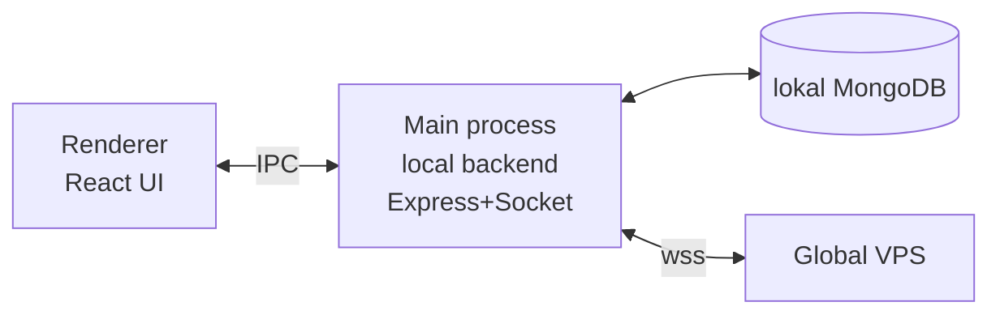

# POS Electron

## Maqsadi

Filial POS monitori — desktop ilova. Cashier va admin asosiy ish quroli. Order, tolov, smena, chek. Local backend bilan birga keladi (bir paket).

## Texnologiya

- **Electron** — main process (local backend) + renderer (UI)
- Renderer: **React + Vite** + TypeScript
- State: Zustand + lokal cache
- IPC: renderer ↔ main (local backend bilan aloqa)
- UI: katta tugmalar (touch-friendly, POS ekrani touch bo'lishi mumkin)

Arxitektura: [[../02-arxitektura/local-backend-stack]]

## Renderer ↔ Main ↔ Mongo



Renderer **lokal backend**'ga ulanadi (IPC yoki localhost HTTP), global'ga to'g'ridan-to'g'ri emas. Local backend global bilan sync qiladi.

> [!note] Phase 1'da soddalashtirilgan
> Phase 1 (MVP)'da local backend hali yo'q — renderer to'g'ridan-to'g'ri global REST'ga ulanadi. Phase 2'da local backend qo'shiladi va renderer unga o'tadi.

## Asosiy ekranlar

```
Login (filial xodimi)
├── Bosh ekran (POS)
│   ├── Stollar ko'rinishi (dineIn) — band/bo'sh
│   ├── Menyu (kategoriya tab'lari + taomlar grid)
│   ├── Joriy order (savatcha)
│   └── Tolov paneli
├── Orderlar ro'yxati (bugungi, filter)
├── Smena (ochish/yopish)
├── Sklad (toggle yoqilgan bo'lsa)
├── Hisobot (smena hisoboti)
├── Sozlamalar
│   ├── Sync holati (outbox, force sync)
│   ├── Hardware test (printer, drawer)
│   └── Mode indikatori
└── Status bar (online/offline/syncing, sync count, printer)
```

## Order yaratish oqimi (UI)

```
1. Stol tanlash (dineIn) yoki "Olib ketish" (takeaway)
2. Menyu'dan taom tanlash → savatga qo'shiladi
3. Miqdor, izoh
4. Discount/Service qo'llash (ixtiyoriy)
5. "Buyurtma berish" → order yaratiladi
   → Optimistic UI (darhol ko'rinadi)
   → Kitchen printer'ga (oshpaz uchun)
6. Tolov: "Hisob" → tolov paneli
   → cash/card/transfer/kaspi/cashback/mixed
   → "Tolandi" → chek bosiladi, drawer ochiladi (naqd)
```

## Status bar (doimo ko'rinadi)

```
┌──────────────────────────────────────────────────────────┐
│ 🟢 Online  📤 0  🖨️ tayyor  💰 Smena: ochiq  👤 Alisher │
└──────────────────────────────────────────────────────────┘
```

Mode'ga qarab rang: 🟢 online / 🟡 offline / 🔄 syncing / 🔴 possiz.

## Offline xulq-atvori

- Internet uzilsa → status 🟡, banner
- POS yozishni davom ettiradi (lokal Mongo)
- Outbox count ko'rsatiladi
- Reconnect → sync progress
- Tafsilot: [[../02-arxitektura/rejimlar/offline-rejim]]

## Hardware integratsiya

Main process'da ([[../07-nozik-nuqtalar/hardware-nozikliklari]]):
- Chek printer (ESC/POS)
- Cash drawer
- Barkod skaner (sklad)

Renderer IPC orqali: `window.hardware.printReceipt(order)`.

## Optimistic UI

POS — eng optimistic ([[umumiy-arxitektura#Optimistic UI]]). Har harakat darhol ko'rinadi. Local backend tez (lokal Mongo, ms-darajada).

## Touch-friendly UI

- Katta tugmalar (min 48px)
- Menyu grid (rasm + nom + narx)
- Raqam paneli (miqdor, tolov)
- Modal'lar (discount, cancel sabab)

## Auto-update

`electron-updater` — global VPS release server ([[../02-arxitektura/local-backend-stack#Update mexanizmi]]).

## Xavfsizlik

- Admin huquqida ochiladi (hardware)
- Lokal token (POS ↔ local backend)
- branchToken (local backend ↔ global)
- O'g'irlangan PC — token revoke ([[../07-nozik-nuqtalar/xavfsizlik-qoshimcha]])

## Phase bo'yicha

- **Phase 1:** basic POS, global REST'ga to'g'ridan-to'g'ri, chek printer
- **Phase 2:** local backend qo'shiladi, offline, sync UI
- **Phase 3:** tool UI'lari (sklad menyu, keshbek panel)
- **Phase 4:** multi-POS (client mode)

## Bog'liq

- [[_MOC]]
- [[umumiy-arxitektura]]
- [[../02-arxitektura/local-backend-stack]]
- [[../02-arxitektura/rejimlar/offline-rejim]]
- [[../07-nozik-nuqtalar/hardware-nozikliklari]]
