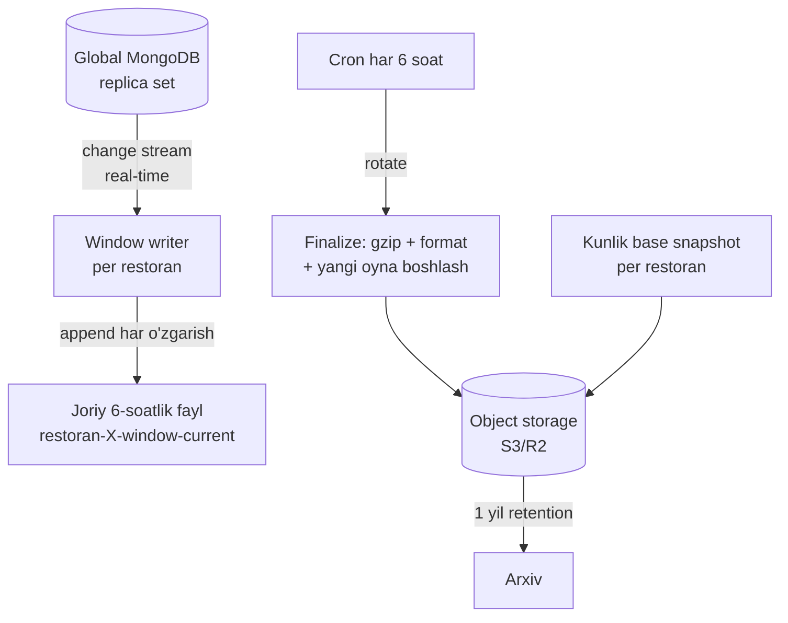

# Backup va Point-In-Time Recovery (PITR)

> [!important] Qaror (foydalanuvchi, 2026-05-29)
> 1. **Hard delete YO'Q** — hech qanday ma'lumot fizik o'chirilmaydi, faqat `deleted: true`
> 2. **Real-time backup** — 6 soatlik snapshot emas, balki uzluksiz yozib borish (1 daqiqa ham yo'qolmaydi)
> 3. **Har restoran alohida** 6 soatlik oynalar, **1 yilgacha** saqlanadi

## 1-asos: soft delete (fizik o'chirish emas)

> [!important] O'chirish = `isDeleted: true` + 1 oy tiklash (foydalanuvchi, 2026-05-29)
> Delete tugma bosilganda `findByIdAndDelete`/`deleteOne` **ishlatilmaydi** → `isDeleted: true`. 1 oy saqlanadi (tiklash uchun), hamma joydan yashirin. 1 oydan keyin tiklanmasa → fizik o'chiriladi. To'liq: [[../07-nozik-nuqtalar/ochirish-cascade#Soft delete + 1 oylik tiklash]]

- Query'lar default `isDeleted: { $ne: true }`
- 1 oydan keyin ham — PITR backup'da bor (global 1 yil, lokal 3 oy) → support tiklashi mumkin
- **Order/smena o'chirilmaydi** — bekor (isCancel) yoki arxiv (alohida retention)
- GDPR → anonimizatsiya
- Lokal POS prune (90 kun) — disk boshqaruvi, data global + backup'da bor

> [!note] Backup — uzoq muddatli safety net
> Soft delete 1 oy beradi. PITR backup undan uzoqroq (lokal 3 oy, global 1 yil) saqlaydi — 1 oydan keyin hard delete bo'lsa ham, backup'dan tiklash mumkin.

## Muammo: oddiy cron snapshot yetarli emas

```
Cron har 6 soatda mongodump:
  00:00 — backup
  06:00 — backup
  ...
Lekin 03:00 da MongoDB o'lsa → 00:00-03:00 oralig'idagi 3 soatlik data YO'QOLADI
```

Foydalanuvchi aniq ko'rsatdi: bu yetmaydi. **Real-time** kerak.

## Yechim: PITR = base snapshot + uzluksiz change capture



### Ikki qatlam

**A. Base snapshot (poydevor)**
- Har kuni (yoki har 6 soat) per-restoran to'liq `mongodump`
- `base-{restaurantId}-{timestamp}.gz`

**B. Uzluksiz change capture (real-time)**
- MongoDB **change stream** — har insert/update/delete real-time
- Har o'zgarish joriy **6-soatlik oyna fayli**ga append qilinadi (real-time)
- 6 soatdan keyin fayl finalize qilinadi (gzip, format, checksum), yopiladi, storage'ga yuklanadi
- Yangi oyna fayli boshlanadi, davom etadi

> [!note] Foydalanuvchi mental modeli bilan mos
> *"barcha collectionlar real time 6 soat davomida qabul qilib turadigan filega yuklanib boradi va olti soatdan song u kerakli formatga keltirilib yopiladi va yangisi davom etadi"* — aynan shu: change stream → joriy oyna fayli (real-time append) → 6 soatda rotate.

## Change stream implementatsiyasi

> [!important] Replica set kerak
> Change stream **replica set** talab qiladi. Global MongoDB **replica set** sifatida sozlanishi shart (lokal ham — [[../02-arxitektura/local-backend-stack]]).

```javascript
// Continuous backup writer
const resumeToken = await loadResumeToken();  // crash'dan keyin davom etish uchun
const changeStream = db.watch([], {
  fullDocument: 'updateLookup',
  resumeAfter: resumeToken,
});

changeStream.on('change', async (change) => {
  const restaurantId = extractRestaurantId(change);   // har o'zgarishdan
  const windowFile = currentWindowFile(restaurantId); // 6-soatlik oyna

  // Real-time append
  await appendLine(windowFile, serialize(change));

  // Resume token saqlash (crash recovery)
  await saveResumeToken(change._id);
});
```

### Real-time durability (1 daqiqa ham yo'qolmaydi)
- Har o'zgarish darhol faylga append
- Fayl tez-tez `fsync` (har bir necha o'zgarishda yoki har 1-2 sekundda)
- Change stream **resume token** — backup writer crash bo'lsa, oxirgi token'dan davom etadi (hech narsa o'tkazib yuborilmaydi)
- Oyna fayli **alohida diskda/storage'da** (MongoDB diski bilan bir joyda emas — disaster izolyatsiya)

## 6-soatlik oyna rotatsiyasi

```javascript
// Cron har 6 soat (00:00, 06:00, 12:00, 18:00)
async function rotateWindow(restaurantId) {
  const current = currentWindowFile(restaurantId);
  await flush(current);                    // oxirgi o'zgarishlar
  const finalized = await finalize(current); // gzip + BSON format + checksum
  await uploadToStorage(finalized);          // S3/R2
  await startNewWindow(restaurantId);        // yangi oyna real-time davom etadi
}
```

Rotatsiya **uzluksiz** — yangi oyna eski yopilishidan oldin boshlanadi (gap yo'q).

## Per-restaurant alohida

- Har o'zgarish `restaurantId` bilan teglanadi (change stream'dan ajratiladi)
- Har restoran o'z oyna fayllariga
- Bitta restoran'ni boshqalarga ta'sir qilmasdan restore qilish mumkin
- Storage struktura:
```
s3://aridai-backups/
  {restaurantId}/
    base/base-2026-05-29-00-00.gz
    windows/window-2026-05-29-00-00_06-00.gz
            window-2026-05-29-06-00_12-00.gz
            ...
```

## Retention: 1 yil

- 6-soatlik oyna fayllar **1 yil** saqlanadi
- 1 yildan eski **backup fayllar** o'chiriladi (lekin **live data** soft-delete bilan abadiy qoladi!)
- Base snapshot'lar ham 1 yil (eski'lari prune)

```javascript
// Cron: eski backup fayllarni tozalash (faqat BACKUP, live data emas)
const cutoff = Date.now() - 365 * 24 * 3600 * 1000;
await storage.deleteOlderThan(`${restaurantId}/windows/`, cutoff);
```

## Recovery (tiklash)

Istalgan daqiqaga tiklash:
```
1. Maqsad vaqtdan oldingi eng yaqin base snapshot'ni restore
2. Base vaqtidan maqsad vaqtigacha bo'lgan oyna fayllarini replay
3. Maqsad daqiqasida to'xtash
→ Aniq o'sha daqiqadagi holat tiklanadi
```

Misol: 14:23 dagi holatga tiklash kerak:
- Base: 12:00 snapshot restore
- Window: 12:00-18:00 oynasini 14:23 gacha replay
- Natija: 14:23 holati (1 daqiqa aniqlik)

## Disaster scenariolari (qarang [[../10-operatsiyalar/disaster-recovery]])

| Holat | Tiklash |
|---|---|
| MongoDB corruption | Base + windows replay (oxirgi daqiqagacha) |
| Bitta restoran data buzildi | Faqat o'sha restoran restore (boshqalar ta'sirlanmaydi) |
| Backup writer crash | Resume token'dan davom etadi (gap yo'q) |
| Tasodifan "delete" | Soft delete — data baribir bor (`deleted: true` ni qaytarish) |

## MongoDB Atlas alternativasi

Atlas **managed PITR** beradi (continuous backup, point-in-time restore). Self-hosted murakkabligini kamaytiradi.

- **Tavsiya:** boshlanish uchun Atlas (PITR avtomatik, 1 daqiqa granularity)
- Per-restaurant ajratish — Atlas'da bitta cluster, lekin restore'da filter yoki alohida logical backup
- Self-hosted: yuqoridagi change-stream dizayni

> [!note] Atlas vs self-hosted
> Atlas PITR — oson, lekin per-restaurant alohida fayl emas (butun cluster). Foydalanuvchi "har restoran alohida" xohlaydi → self-hosted change-stream dizayni yoki Atlas + qo'shimcha per-restaurant logical export. Qaror: boshlanish Atlas (umumiy PITR), keyin per-restaurant change-stream qo'shish.

## Lokal POS backup

Lokal (POS) ham change stream (lokal RS):
- Lokal data global'ga sync bo'ladi → asosiy himoya global'da
- Lokal backup — offline-pending data uchun (hali sync bo'lmagan)
- Lokal `mongodump` kunlik ([[../07-nozik-nuqtalar/data-osishi-arxivlash]])
- POS PC o'lsa — global'da deyarli hammasi bor (offline-pending'dan tashqari)

## Test rejasi

- [ ] Change stream real-time append (har o'zgarish faylga)
- [ ] fsync tez-tez (crash'da buferda yo'qolmaydi)
- [ ] Resume token (writer restart → davom)
- [ ] 6-soatlik rotate (gap yo'q, uzluksiz)
- [ ] Per-restaurant ajratish (restaurantId)
- [ ] Recovery: base + replay → aniq daqiqa
- [ ] 1 yil retention (eski backup o'chadi, live data qoladi)
- [ ] Bitta restoran restore (boshqalar ta'sirlanmaydi)
- [ ] ⭐ Oylik test restore (staging) — backup ishlashini tasdiqlash
- [ ] Hard delete hech qayerda yo'q (faqat soft delete)

## Bog'liq

- [[../05-data-model/sync-metadata]] — soft delete / tombstone
- [[../07-nozik-nuqtalar/ochirish-cascade]] — no hard delete, anonimizatsiya
- [[../07-nozik-nuqtalar/data-osishi-arxivlash]]
- [[../10-operatsiyalar/disaster-recovery]]
- [[../02-arxitektura/local-backend-stack]] — replica set
- [[../02-arxitektura/xavfsizlik/kritik-risklar]] — K4 payment durability, J6 backup
