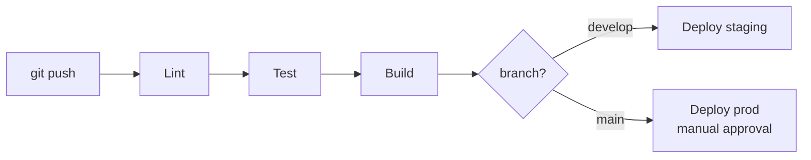

# CI/CD pipeline

## Maqsad

Har commit avtomatik test, har release avtomatik deploy. Qo'lda xato kamayadi.

## Texnologiya

**GitHub Actions** (yoki GitLab CI) — repo bilan integratsiya.

## Pipeline bosqichlari



## Global backend pipeline

```yaml
# .github/workflows/backend.yml
name: Backend CI
on:
  push:
    paths: ['global/backend/**']
jobs:
  test:
    runs-on: ubuntu-latest
    services:
      mongo: { image: mongo:7 }
      redis: { image: redis:7 }
    steps:
      - checkout
      - setup-node@20
      - run: npm ci
      - run: npm run lint
      - run: npm test
      - run: npm run test:e2e
  deploy-staging:
    needs: test
    if: github.ref == 'refs/heads/develop'
    steps:
      - SSH deploy to staging
  deploy-prod:
    needs: test
    if: github.ref == 'refs/heads/main'
    environment: production  # manual approval
    steps:
      - SSH deploy to prod
```

## Test bosqichi

- **Lint** — ESLint + Prettier
- **Unit test** — Jest (calc, money, phone, business logic)
- **Integration test** — API endpoint'lar (Mongo test instance)
- **E2E** — kritik oqimlar (order create→pay, shift open→close)
- Test coverage minimum (kelajak — 70%)

Tafsilot: [[../02-arxitektura/testing-strategiyasi]]

## Frontend pipeline

```yaml
# Web admin / QR web
- npm ci
- npm run lint
- npm run test
- npm run build
- deploy static → Nginx / CDN
```

## Mobile pipeline

```yaml
# Flutter
- flutter analyze
- flutter test
- flutter build apk --flavor prod   # Android
- flutter build ipa --flavor prod   # iOS
- upload → Play Store / App Store (fastlane)
```

## Electron (POS) pipeline

```yaml
# electron-builder
- npm ci
- npm test
- npm run build:electron   # .exe yaratish
- code sign (Windows sertifikat)
- upload → release server (electron-updater manifest)
```

Tafsilot: [[../02-arxitektura/local-backend-stack#Update mexanizmi]]

## Branch strategiyasi

```
main         → production (protected, PR + approval)
develop      → staging (auto-deploy)
feature/*    → PR'ga develop
hotfix/*     → main'ga tezkor
```

## Deploy approval

- Staging — avtomatik (develop'ga merge)
- Production — **qo'lda tasdiq** (GitHub environment protection)

## Rollback

- Docker image tag bilan — oldingi image'ga qaytish
- `docker compose up -d api:previous-tag`
- DB migration rollback — ehtiyot (alohida script)

## Migration CI'da

DB schema o'zgarsa — migration script:
- Test'da: migration ishga tushadi, tekshiriladi
- Deploy'da: migration avtomatik yoki qo'lda (ehtiyot bilan)
- Idempotent migration'lar

## Secrets CI'da

- GitHub Secrets (masked)
- Hech qachon log'da ko'rinmaydi ([[../02-arxitektura/xavfsizlik/secrets-management]])
- Deploy SSH key, env'lar

## Boshlanish (MVP) — sodda

Phase 1'da to'liq CI/CD shart emas. Sodda:
- GitHub Actions: lint + test (har PR)
- Deploy: qo'lda SSH (`git pull && docker compose up -d`)
- Keyinroq to'liq avtomatlashtirish

## Bog'liq

- [[_MOC]]
- [[environments]]
- [[vps-deploy]]
- [[../02-arxitektura/testing-strategiyasi]]
