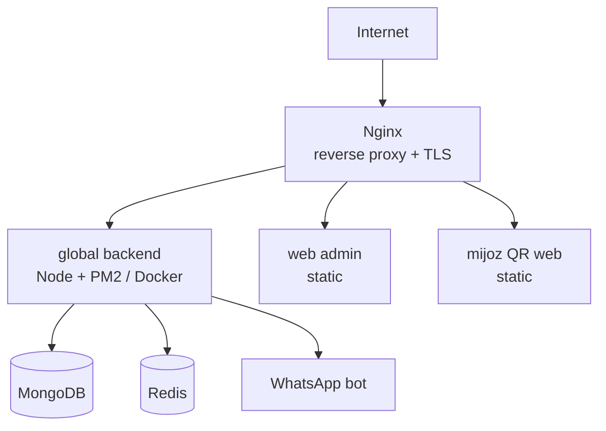

# Global VPS deploy

## VPS tanlovi

- **DigitalOcean / Hetzner / AWS** — boshlanish uchun DigitalOcean Droplet yoki Hetzner (arzon, ishonchli)
- Minimum: 2 vCPU, 4 GB RAM, 80 GB SSD (boshlanish)
- O'sgach: vertical scale yoki managed services
- Joylashuv: mijozlarga yaqin (UZ/KZ uchun Yevropa yoki Rossiya region — past latency)

## Stack



## Docker Compose (boshlanish)

```yaml
# docker-compose.yml
services:
  api:
    build: ./global/backend
    env_file: .env.production
    depends_on: [mongo, redis]
    restart: always
  mongo:
    image: mongo:7
    volumes: [mongo_data:/data/db]
    restart: always
  redis:
    image: redis:7
    restart: always
  nginx:
    image: nginx:alpine
    ports: ["80:80", "443:443"]
    volumes: [./nginx.conf:/etc/nginx/nginx.conf, ./certs:/certs]
    depends_on: [api]
volumes:
  mongo_data:
```

> [!note] MongoDB Atlas alternativa
> Self-hosted Mongo o'rniga **MongoDB Atlas** (managed) — backup, monitoring, scaling avtomatik. Boshlanish uchun arzon tier. Tavsiya — Atlas (operations yengillashadi).

## Nginx — reverse proxy + WebSocket

```nginx
server {
  listen 443 ssl;
  server_name api.aridai.com;
  ssl_certificate /certs/fullchain.pem;
  ssl_certificate_key /certs/privkey.pem;

  location / {
    proxy_pass http://api:4322;
    proxy_http_version 1.1;
    # WebSocket (socket.io) uchun
    proxy_set_header Upgrade $http_upgrade;
    proxy_set_header Connection "upgrade";
    proxy_set_header Host $host;
    proxy_set_header X-Real-IP $remote_addr;
  }
}
```

> [!important] WebSocket upgrade
> Socket.io uchun `Upgrade`/`Connection` header'lar majburiy. Aks holda socket ishlamaydi (faqat polling fallback).

## SSL

- **Let's Encrypt** (certbot) — bepul, auto-renew
- `wss://` majburiy ([[../02-arxitektura/xavfsizlik/socket-xavfsizligi#TLS majburiy]])
- HSTS header

## Domenlar

```
api.aridai.com          # global backend (REST + socket)
admin.aridai.com        # web admin (static)
order.aridai.com        # mijoz QR web (static)
```

## Process management

- **PM2** (Docker'siz) yoki **Docker restart: always**
- Cluster mode (PM2) — ko'p CPU core ishlatish
- Auto-restart crash'da
- Log rotation

## Deploy oqimi (boshlanish — sodda)

```bash
# Server'da
git pull
docker compose build api
docker compose up -d api
# yoki PM2
pm2 reload ecosystem.config.js
```

Kelajakda — CI/CD ([[ci-cd]]).

## Scaling (kelajak)

- Vertical: ko'proq RAM/CPU
- Horizontal: bir nechta API instance + load balancer + Redis (socket adapter)
- Socket.io Redis adapter — ko'p instance orasida room broadcast
- MongoDB replica set / sharding

## Backup

- MongoDB: har kuni `mongodump` → S3/R2 (kelajak)
- Atlas bo'lsa — avtomatik
- Retention: 30 kun

## Bog'liq

- [[_MOC]]
- [[environments]]
- [[monitoring]]
- [[../02-arxitektura/socket-sinxronizatsiya]]
- [[../02-arxitektura/xavfsizlik/secrets-management]]
