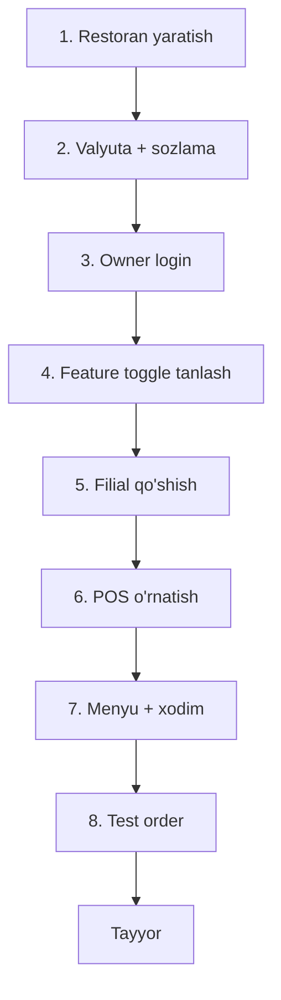

# Restoran onboarding

## Yangi restoran qo'shish

> system_admin tomonidan amalga oshiriladi.

### Qadamlar

1. **Restoran yaratish** (system_admin, web admin)
   - Brand, logo
   - Owner: ism, telefon, parol
   - **Valyuta:** UZS yoki KZT (o'zgartirib bo'lmaydi!) — [[../07-nozik-nuqtalar/pul-valyuta-yaxlitlash]]
   - Timezone, businessDayStartHour

2. **Feature toggle tanlash** (owner yoki system_admin)
   - Minimal: faqat offline + naqd tolov
   - Kerakli tool'larni yoqish ([[../03-tool-strategiyasi/feature-toggle-tizimi]])
   - Dependency tekshiriladi

3. **Owner login** — JWT ([[../02-arxitektura/xavfsizlik/restoran-auth-tuzatish]])

## Filial qo'shish

1. **Filial yaratish** (owner/admin, web)
   - Nom, manzil
   - **receiptPrefix** (masalan YUN) — [[../07-nozik-nuqtalar/chek-raqamlash]]
   - Working hours
   - allowedIps (ixtiyoriy)

2. **branchToken generatsiya**
   - Web admin "POS o'rnatish" → branchToken ko'rsatiladi
   - Bu token **bir marta** ko'rsatiladi (xavfsizlik)
   - Admin uni POS o'rnatishda kiritadi

3. **POS o'rnatish** (filial PC'da)
   - `aridaipos-setup.exe` yuklab olish
   - **Administrator sifatida** ochish ([[../02-arxitektura/local-backend-stack]])
   - Installer: MongoDB o'rnatadi, sozlaydi
   - branchToken kiritish
   - Birinchi sync ([[../02-arxitektura/sinxronizatsiya/boshlangich-sync]])

4. **Menyu sozlash** (admin, web yoki POS)
   - Kategoriyalar
   - Taomlar (rasm, narx)
   - Stollar (+ QR agar qrOrder yoqilgan)
   - Service %, discount'lar

5. **Xodim qo'shish** (admin)
   - Har xodim: ism, telefon, parol, role ([[../02-arxitektura/xavfsizlik/role-based-access]])
   - Mobile ilova yuklab olishadi (aridai_pos_app)

6. **Hardware ulash** ([[../07-nozik-nuqtalar/hardware-nozikliklari]])
   - Chek printer
   - Cash drawer
   - "Hardware test" sahifasi

7. **Test order**
   - Smena ochish
   - Test order yaratish → tolash → chek
   - Smena yopish → hisobot tekshirish

## Onboarding checklist

- [ ] Restoran yaratildi (valyuta to'g'ri)
- [ ] Feature toggle tanlandi
- [ ] Owner login ishlaydi
- [ ] Filial yaratildi (receiptPrefix)
- [ ] branchToken berildi
- [ ] POS o'rnatildi (admin huquqida)
- [ ] Birinchi sync muvaffaqiyatli
- [ ] Menyu to'ldirildi
- [ ] Stollar qo'shildi
- [ ] Xodimlar qo'shildi
- [ ] Hardware test o'tdi
- [ ] Test order → tolov → chek ishladi
- [ ] Smena ochish/yopish ishladi
- [ ] Xodimlar mobile o'rnatdi

## Tipik xatolar

| Xato | Sabab | Yechim |
|---|---|---|
| POS sync bo'lmadi | branchToken xato | Yangi token generatsiya |
| MongoDB o'rnatilmadi | Admin huquqi yo'q | Exe'ni admin sifatida qayta ochish |
| Chek bosilmadi | Printer ulanmagan | Hardware test, drayver |
| Valyuta noto'g'ri | Yaratishda xato | Restoran qayta yaratish (currency immutable) |

## Bog'liq

- [[_MOC]]
- [[../02-arxitektura/local-backend-stack]]
- [[../02-arxitektura/sinxronizatsiya/boshlangich-sync]]
- [[../03-tool-strategiyasi/feature-toggle-tizimi]]
- [[troubleshooting]]
